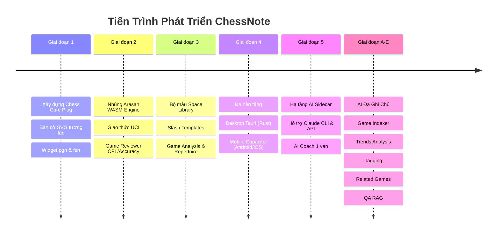

# Bộ Nhớ Ngữ Cảnh, Nhật Ký Quyết Định & Lịch Sử Phát Triển (MEMORY.md)

> **Mục tiêu**: Lưu giữ toàn bộ lịch sử tiến hóa của dự án, ngữ cảnh các cuộc thảo luận, nhật ký các quyết định kiến trúc quan trọng (Architectural Decision Records - ADRs), các bài học kinh nghiệm và lộ trình phát triển của **ChessNote**.

---

## 1. Lịch Sử Hình Thành & Các Giai Đoạn Phát Triển

Dự án **ChessNote** khởi đầu từ nền tảng ghi chú cá nhân **SilverBullet (v2.10.0)** mã nguồn mở, được tái thiết kế và nâng cấp chuyên sâu qua các giai đoạn lớn:



### Chi tiết các mốc phát triển:
1. **Phase 1 (Chess Core Plug)**: Hiện thực bộ render bàn cờ SVG thuần, bắt các khối mã ` ```pgn ` và ` ```fen `, hỗ trợ kéo thả và điều hướng nước đi.
2. **Phase 2 (Arasan WASM Engine)**: Tích hợp động cơ Arasan biên dịch WebAssembly chạy offline trên trình duyệt, giao thức UCI, tính toán đồ thị ưu thế và phân loại nước đi.
3. **Phase 3 (Space Library & Templates)**: Cung cấp bộ mẫu chuyên nghiệp: *Game Analysis, Lesson Plan, Opening Repertoire, Opponent Scouting, Tactics Puzzle Set*.
4. **Phase 4 (Multi-platform)**: Triển khai vỏ bọc Capacitor cho di động (Android/iOS) và Tauri cho máy tính (Desktop Windows/macOS/Linux).
5. **Phase 5 (AI Sidecar Infrastructure)**: Thiết lập tiến trình `ai-sidecar` Node.js độc lập để tận dụng Claude CLI / Claude Subscription cá nhân và API Key, ra mắt tính năng AI Coach giải thích nước đi và bình luận ván cờ.
6. **Phase A-E (Multi-note AI Expansion - Hoàn tất ngày 09/09/2026)**:
   - *Giai đoạn A*: Xây dựng **Chess Game Indexer** (`plugs/chess/index.ts`) đánh chỉ mục toàn bộ ván cờ vào `chess-game`.
   - *Giai đoạn B*: **Phân tích xu hướng (Trends Analysis)** trên nhiều ván cờ kết hợp cache review.
   - *Giai đoạn C*: **Gợi ý Tag & Tóm tắt (Smart Tagging)** cho ván đấu.
   - *Giai đoạn D*: **Gợi ý ván cờ liên quan (Related Games)** không dùng AI (rule-based, siêu nhanh).
   - *Giai đoạn E*: **Hỏi đáp tự do trên kho ván cờ (Chess QA / RAG)**.

---

## 2. Nhật Ký Quyết Định Kỹ Thuật (Architectural Decision Records - ADRs)

### 📌 ADR-001: Tách AI Sidecar thành Tiến Trình Độc Lập
* **Bối cảnh**: Sandbox Web Worker của PlugOS trên trình duyệt bị giới hạn bảo mật nghiêm ngặt (không có quyền truy cập shell, file hệ thống hoặc quản lý tiến trình Claude CLI).
* **Quyết định**: Xây dựng `ai-sidecar/` thành tiến trình Node.js riêng biệt tại cổng `127.0.0.1:3457`. PlugOS giao tiếp với Sidecar qua syscall `sandboxFetch.fetch` -> Rust Proxy endpoint `/.proxy/127.0.0.1:3457/` -> Node Sidecar.
* **Hệ quả**: Giữ nguyên tính bảo mật của Sandbox, không làm phức tạp hóa mã nguồn Rust, đồng thời hỗ trợ quản lý vòng đời tiến trình CLI Claude mượt mà (`kill-tree`, `utf8-stream`).

---

### 📌 ADR-002: Cache Kết Quả Game Review Bằng Object Index Thay Vì Frontmatter YAML
* **Bối cảnh**: Ban đầu dự kiến lưu cache kết quả phân tích ván đấu (`whiteStats`, `turningPoints`, `accuracy`) trực tiếp vào Frontmatter YAML của file Markdown ghi chú.
* **Vấn đề phát sinh**: Bộ xử lý YAML thủ công của hệ thống (`plug-api/lib/yaml.ts`) không đảm bảo an toàn với các cấu trúc dữ liệu mảng/đối tượng lồng nhau phức tạp, có nguy cơ làm hỏng định dạng file ghi chú của người dùng.
* **Quyết định**: Lưu toàn bộ cache phân tích vào **Object Index riêng** (`tag: chess-game-review`, sử dụng cùng `ref` với `chess-game`).
* **Hệ quả**: Hoàn toàn an toàn cho file ghi chú. Ngoài ra, khi người dùng sửa PGN trên trang, hệ thống tự động xóa cache cũ nhờ cơ chế `clearFileIndex` có sẵn mà không cần viết thêm logic theo dõi sửa đổi.

---

### 📌 ADR-003: Loại Bỏ Template Pages Khỏi Chỉ Mục Ván Cờ (`chess-game`)
* **Bối cảnh**: Khi quét toàn bộ space để đánh chỉ mục ván cờ, các file template có sẵn (`Library/Chess/Templates/*`) chứa các biến placeholder Space Lua như `${page.white}` trong header PGN.
* **Vấn đề phát sinh**: Trình đọc PGN phân tích ngoài luồng khởi tạo template làm các biến này bị hiểu là chuỗi lỗi Lua ("attempt to index a nil value"), gây ô nhiễm dữ liệu ván cờ.
* **Quyết định**: Bổ sung hàm `isTemplatePage()` trong `plugs/chess/index.ts` để tự động bỏ qua mọi trang có tag `meta/template*` hoặc nằm trong thư mục `Library/`.
* **Hệ quả**: Chỉ mục `chess-game` hoàn toàn trong sạch, chỉ chứa các ván cờ thực tế của người dùng.

---

### 📌 ADR-004: Áp Dụng Quy Tắc "Action-Driven" Cho Các Tác Vụ Tốn Kém
* **Bối cảnh**: Ban đầu cân nhắc tự động chạy AI Tagging và Game Review mỗi khi người dùng lưu trang (`page:saved`).
* **Vấn đề phát sinh**: Cơ chế tự động lưu (Autosave) của SilverBullet debounce chỉ 1 giây (`client/content_manager.ts`), khiến sự kiện `page:saved` kích hoạt liên tục khi người dùng đang gõ phím, dẫn tới cạn kiệt tài nguyên CPU và quota AI.
* **Quyết định**:
  - Tác vụ nhẹ (Index ván cờ `page:index`, tìm ván liên quan rule-based): Chạy tự động ngầm.
  - Tác vụ nặng (Chạy Arasan Engine review toàn bộ ván, gọi AI Sidecar): Bắt buộc người dùng bấm nút giao diện hoặc kích hoạt lệnh từ Command Palette.
* **Hệ quả**: Hiệu năng ứng dụng mượt mà, phản hồi tức thì, tiết kiệm chi phí và tài nguyên máy tính.

---

### 📌 ADR-005: Tách `plugs/chess/` Thành 6 Plug Độc Lập + Mirror Sang Repo GitHub Riêng
* **Bối cảnh**: Sau khi bổ sung tầng DBMS SQLite (xem `docs/plans/2026-09-11-dbms-sqlite-wasm-tich-hop.md`), `plugs/chess/` trở thành một plug độc khối quá lớn (bàn cờ, engine, AI, PDF export, repertoire đều gộp chung), khó cài đặt/gỡ từng phần và khó theo dõi thay đổi riêng biệt.
* **Quyết định**:
  - Tách thành 6 plug: `chess-themes`, `chess-engine`, `chess-pdf-export`, `chess-repertoire`, `chess-ai`, và `chess` (core — widget bàn cờ, chỉ mục ván cờ, ván liên quan, nền tảng mọi plug khác phụ thuộc vào).
  - Lời gọi xuyên plug đi qua **syscall** (đúng pattern `chess.engineEval` đã có sẵn) hoặc file `plug_api.ts` mỏng bọc syscall — không còn `import` TypeScript trực tiếp giữa các plug, để mỗi plug thực sự là 1 `.plug.js` độc lập.
  - Mỗi plug được mirror sang 1 repo GitHub riêng dưới tài khoản `covuaduongsinh`, tên `chessnote-plug-<tên>`: 5 repo **private** (`engine`, `pdf-export`, `repertoire`, `ai`, `core` — chỉ để quản lý version/source, README ghi rõ không cài độc lập được vì phụ thuộc syscall lõi `chessSql`/`chessEmbedding` chỉ có trong ChessNote) và 1 repo **public** (`themes` — plug duy nhất không phụ thuộc gì, có kèm sẵn `chess-themes.plug.js` đã build + trang Library, cài được thật qua lệnh "Library: Install" với URL `https://raw.githubusercontent.com/covuaduongsinh/chessnote-plug-themes/main/chess-themes-library.md`).
* **Lỗi kỹ thuật đã phát hiện & xử lý khi tách**: `EngineNotInstalledError` mất class identity khi đi qua ranh giới syscall Worker (chỉ `.message` sống sót) — sửa bằng cách so khớp message string (`isEngineNotInstalledError()` trong `chess-engine/plug_api.ts`) thay vì `instanceof`.
* **Hệ quả**: Repo `chessnote` chính vẫn là nơi build/phát triển thật; 5 repo private là bản mirror thủ công (không tự động đồng bộ — cần copy tay khi source đổi), `chessnote-plug-themes` là plug portable thật sự đầu tiên của dự án.

---

## 3. Lộ Trình Phát Triển Tương Lai (Future Roadmap)

* [ ] **Tích hợp Stockfish 17+ WASM NNUE**: Bổ sung thêm tùy chọn động cơ Stockfish mạnh mẽ song song với Arasan.
* [ ] **Tự động đồng bộ ván đấu từ Lichess / Chess.com**: Tự động kéo các ván đấu mới chơi về thành các trang ghi chú phân tích.
* [ ] **Bàn cờ 3D / Tùy biến Theme quân cờ**: Bổ sung thêm các bộ cờ đẹp mắt (Staunton, Wood, Neon).
* [ ] **Mã hóa đầu cuối (E2EE) cho Space Sync**: Tăng cường bảo mật khi đồng bộ dữ liệu qua máy chủ đám mây cá nhân.
