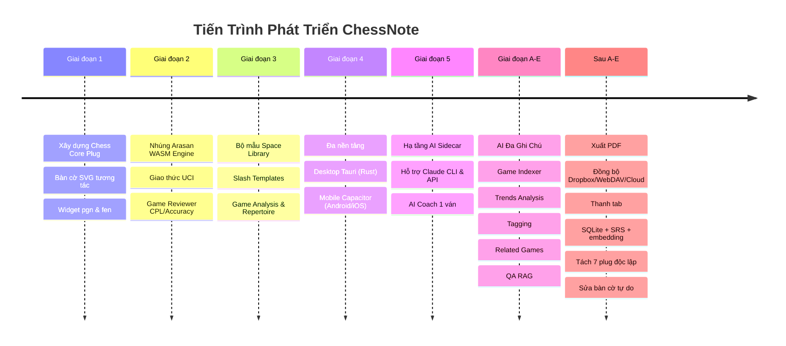

# Bộ Nhớ Ngữ Cảnh, Nhật Ký Quyết Định & Lịch Sử Phát Triển (MEMORY.md)

> **Mục tiêu**: Lưu giữ toàn bộ lịch sử tiến hóa của dự án, ngữ cảnh các cuộc thảo luận, nhật ký các quyết định kiến trúc quan trọng (Architectural Decision Records - ADRs), các bài học kinh nghiệm và lộ trình phát triển của **ChessNote**.

---

## 1. Lịch Sử Hình Thành & Các Giai Đoạn Phát Triển

Dự án **ChessNote** khởi đầu từ nền tảng ghi chú cá nhân **SilverBullet (v2.10.0)** mã nguồn mở, được tái thiết kế và nâng cấp chuyên sâu qua các giai đoạn lớn:


```mermaid
timeline
    title Tiến Trình Phát Triển ChessNote
    Giai đoạn 1 : Xây dựng Chess Core Plug : Bàn cờ SVG tương tác : Widget pgn & fen
    Giai đoạn 2 : Nhúng Arasan WASM Engine : Giao thức UCI : Game Reviewer CPL/Accuracy
    Giai đoạn 3 : Bộ mẫu Space Library : Slash Templates : Game Analysis & Repertoire
    Giai đoạn 4 : Đa nền tảng : Desktop Tauri (Rust) : Mobile Capacitor (Android/iOS)
    Giai đoạn 5 : Hạ tầng AI Sidecar : Hỗ trợ Claude CLI & API : AI Coach 1 ván
    Giai đoạn A-E : AI Đa Ghi Chú : Game Indexer : Trends Analysis : Tagging : Related Games : QA RAG
    Sau A-E : Xuất PDF : Đồng bộ Dropbox/WebDAV/Cloud : Thanh tab : SQLite + SRS + embedding : Tách 7 plug độc lập : Sửa bàn cờ tự do
```

### Chi tiết các mốc phát triển:
1. **Phase 1 (Chess Core Plug)**: Hiện thực bộ render bàn cờ SVG thuần, bắt các khối mã ` ```pgn ` và ` ```fen `, hỗ trợ kéo thả và điều hướng nước đi.
2. **Phase 2 (Arasan WASM Engine)**: Tích hợp động cơ Arasan biên dịch WebAssembly chạy offline trên trình duyệt, giao thức UCI, tính toán đồ thị ưu thế và phân loại nước đi.
3. **Phase 3 (Space Library & Templates)**: Cung cấp bộ mẫu chuyên nghiệp: *Game Analysis, Lesson Plan, Opening Repertoire, Opponent Scouting, Tactics Puzzle Set*.
4. **Phase 4 (Multi-platform)**: Triển khai vỏ bọc Capacitor cho di động (Android/iOS) và Tauri cho máy tính (Desktop Windows/macOS/Linux).
5. **Phase 5 (AI Sidecar Infrastructure)**: Thiết lập tiến trình `ai-sidecar` Node.js độc lập để tận dụng Claude CLI / Claude Subscription cá nhân và API Key, ra mắt tính năng AI Coach giải thích nước đi và bình luận ván cờ.
6. **Phase A-E (Multi-note AI Expansion - Hoàn tất ngày 09/09/2026)**:
   - *Giai đoạn A*: Xây dựng **Chess Game Indexer** (`plugs/chess/index.ts`) đánh chỉ mục toàn bộ ván cờ vào `chess-game`.
   - *Giai đoạn B*: **Phân tích xu hướng (Trends Analysis)** trên nhiều ván cờ kết hợp cache review.
   - *Giai đoạn C*: **Gợi ý Tag & Tóm tắt (Smart Tagging)** cho ván đấu.
   - *Giai đoạn D*: **Gợi ý ván cờ liên quan (Related Games)** không dùng AI (rule-based, siêu nhanh).
   - *Giai đoạn E*: **Hỏi đáp tự do trên kho ván cờ (Chess QA / RAG)**.

---

## 2. Nhật Ký Quyết Định Kỹ Thuật (Architectural Decision Records - ADRs)

### 📌 ADR-001: Tách AI Sidecar thành Tiến Trình Độc Lập
* **Bối cảnh**: Sandbox Web Worker của PlugOS trên trình duyệt bị giới hạn bảo mật nghiêm ngặt (không có quyền truy cập shell, file hệ thống hoặc quản lý tiến trình Claude CLI).
* **Quyết định**: Xây dựng `ai-sidecar/` thành tiến trình Node.js riêng biệt tại cổng `127.0.0.1:3457`. PlugOS giao tiếp với Sidecar qua syscall `sandboxFetch.fetch` -> Rust Proxy endpoint `/.proxy/127.0.0.1:3457/` -> Node Sidecar.
* **Hệ quả**: Giữ nguyên tính bảo mật của Sandbox, không làm phức tạp hóa mã nguồn Rust, đồng thời hỗ trợ quản lý vòng đời tiến trình CLI Claude mượt mà (`kill-tree`, `utf8-stream`).
* **[Cập nhật sau ADR-006]**: sidecar chỉ còn là **tuỳ chọn nâng cao** (`chess.ai.mode = "subscription"`); chế độ mặc định `api_key` gọi thẳng `api.anthropic.com` qua `/.proxy/`, không cần sidecar.

---

### 📌 ADR-002: Cache Kết Quả Game Review Bằng Object Index Thay Vì Frontmatter YAML
* **Bối cảnh**: Ban đầu dự kiến lưu cache kết quả phân tích ván đấu (`whiteStats`, `turningPoints`, `accuracy`) trực tiếp vào Frontmatter YAML của file Markdown ghi chú.
* **Vấn đề phát sinh**: Bộ xử lý YAML thủ công của hệ thống (`plug-api/lib/yaml.ts`) không đảm bảo an toàn với các cấu trúc dữ liệu mảng/đối tượng lồng nhau phức tạp, có nguy cơ làm hỏng định dạng file ghi chú của người dùng.
* **Quyết định**: Lưu toàn bộ cache phân tích vào **Object Index riêng** (`tag: chess-game-review`, sử dụng cùng `ref` với `chess-game`).
* **Hệ quả**: Hoàn toàn an toàn cho file ghi chú. Ngoài ra, khi người dùng sửa PGN trên trang, hệ thống tự động xóa cache cũ nhờ cơ chế `clearFileIndex` có sẵn mà không cần viết thêm logic theo dõi sửa đổi.

---

### 📌 ADR-003: Loại Bỏ Template Pages Khỏi Chỉ Mục Ván Cờ (`chess-game`)
* **Bối cảnh**: Khi quét toàn bộ space để đánh chỉ mục ván cờ, các file template có sẵn (`Library/Chess/Templates/*`) chứa các biến placeholder Space Lua như `${page.white}` trong header PGN.
* **Vấn đề phát sinh**: Trình đọc PGN phân tích ngoài luồng khởi tạo template làm các biến này bị hiểu là chuỗi lỗi Lua ("attempt to index a nil value"), gây ô nhiễm dữ liệu ván cờ.
* **Quyết định**: Bổ sung hàm `isTemplatePage()` trong `plugs/chess/index.ts` để tự động bỏ qua mọi trang có tag `meta/template*` hoặc nằm trong thư mục `Library/`.
* **Hệ quả**: Chỉ mục `chess-game` hoàn toàn trong sạch, chỉ chứa các ván cờ thực tế của người dùng.

---

### 📌 ADR-004: Áp Dụng Quy Tắc "Action-Driven" Cho Các Tác Vụ Tốn Kém
* **Bối cảnh**: Ban đầu cân nhắc tự động chạy AI Tagging và Game Review mỗi khi người dùng lưu trang (`page:saved`).
* **Vấn đề phát sinh**: Cơ chế tự động lưu (Autosave) của SilverBullet debounce chỉ 1 giây (`client/content_manager.ts`), khiến sự kiện `page:saved` kích hoạt liên tục khi người dùng đang gõ phím, dẫn tới cạn kiệt tài nguyên CPU và quota AI.
* **Quyết định**:
  - Tác vụ nhẹ (Index ván cờ `page:index`, tìm ván liên quan rule-based): Chạy tự động ngầm.
  - Tác vụ nặng (Chạy Arasan Engine review toàn bộ ván, gọi AI Sidecar): Bắt buộc người dùng bấm nút giao diện hoặc kích hoạt lệnh từ Command Palette.
* **Hệ quả**: Hiệu năng ứng dụng mượt mà, phản hồi tức thì, tiết kiệm chi phí và tài nguyên máy tính.

---

### 📌 ADR-005: Tách `plugs/chess/` Thành 6 Plug Độc Lập + Mirror Sang Repo GitHub Riêng
* **Bối cảnh**: Sau khi bổ sung tầng DBMS SQLite (xem `docs/plans/2026-09-11-dbms-sqlite-wasm-tich-hop.md`), `plugs/chess/` trở thành một plug độc khối quá lớn (bàn cờ, engine, AI, PDF export, repertoire đều gộp chung), khó cài đặt/gỡ từng phần và khó theo dõi thay đổi riêng biệt.
* **Quyết định**:
  - Tách thành 6 plug: `chess-themes`, `chess-engine`, `chess-pdf-export`, `chess-repertoire`, `chess-ai`, và `chess` (core — widget bàn cờ, chỉ mục ván cờ, ván liên quan, nền tảng mọi plug khác phụ thuộc vào).
  - Lời gọi xuyên plug đi qua **syscall** (đúng pattern `chess.engineEval` đã có sẵn) hoặc file `plug_api.ts` mỏng bọc syscall — không còn `import` TypeScript trực tiếp giữa các plug, để mỗi plug thực sự là 1 `.plug.js` độc lập.
  - Mỗi plug được mirror sang 1 repo GitHub riêng dưới tài khoản `covuaduongsinh`, tên `chessnote-plug-<tên>`: 5 repo **private** (`engine`, `pdf-export`, `repertoire`, `ai`, `core` — chỉ để quản lý version/source, README ghi rõ không cài độc lập được vì phụ thuộc syscall lõi `chessSql`/`chessEmbedding` chỉ có trong ChessNote) và 1 repo **public** (`themes` — plug duy nhất không phụ thuộc gì, có kèm sẵn `chess-themes.plug.js` đã build + trang Library, cài được thật qua lệnh "Library: Install" với URL `https://raw.githubusercontent.com/covuaduongsinh/chessnote-plug-themes/main/chess-themes-library.md`).
* **Lỗi kỹ thuật đã phát hiện & xử lý khi tách**: `EngineNotInstalledError` mất class identity khi đi qua ranh giới syscall Worker (chỉ `.message` sống sót) — sửa bằng cách so khớp message string (`isEngineNotInstalledError()` trong `chess-engine/plug_api.ts`) thay vì `instanceof`.
* **Hệ quả**: Repo `chessnote` chính vẫn là nơi build/phát triển thật; 5 repo private là bản mirror thủ công (không tự động đồng bộ — cần copy tay khi source đổi), `chessnote-plug-themes` là plug portable thật sự đầu tiên của dự án.
* **[Đã lỗi thời — xem ADR-006]**: 5 repo không còn private, và không còn đúng là "không cài độc lập được" — ADR-006 giải quyết dứt điểm cả 2 điểm này.

---

### 📌 ADR-006: Làm Cả 7 Plug Cờ Vua Cài Độc Lập Được Lên SilverBullet Gốc
* **Bối cảnh**: ADR-005 để lại 5/6 plug không cài độc lập được (phụ thuộc `chessSql`/`chessEmbedding` — syscall lõi chỉ ChessNote có) — cản trở mục tiêu thương mại hóa (bán/phân phối plug độc lập). Khảo sát lại phát hiện giả định "phải đặt SQLite/embedding model ở lõi `client/`" là **sai lúc lên kế hoạch DBMS ban đầu**, không phải giới hạn kỹ thuật thật: `plugs/chess-engine/arasan_engine.ts` đã chứng minh WASM chạy tốt thẳng trong Worker sandbox của 1 plug, không cần lõi.
* **Quyết định — 4 giai đoạn** (file kế hoạch `docs/plans/2026-09-12-lam-plug-co-vua-cai-dat-doc-lap.md` được dẫn ở đây **không có trong repo** khi rà soát 2026-09-29 — nội dung ADR này là nguồn duy nhất còn lại):
  1. **Tách `chessSql`/`chessEmbedding`** (vốn ở `client/data/*.ts`, đăng ký qua `client_system.ts`) thành plug mới `chess-db`, tự khai báo syscall (giữ nguyên tên `chessSql.*`/`chessEmbedding.*`) — không cần sửa lõi/client nào khác.
  2. **Xóa sạch import xuyên plug còn lại** (rộng hơn phạm vi ADR-005 tưởng đủ) — mỗi plug giờ có `external_syscalls.ts` riêng bọc `syscall()` cho MỌI phụ thuộc plug khác, kể cả phụ thuộc vào plug **lõi chuẩn** `index` (dùng syscall công khai `index.extractFrontmatter` thay vì import thẳng `plugs/index/frontmatter.ts` — file đó không nằm trong SDK public dù `index` luôn có sẵn trong mọi bản SilverBullet).
  3. **`chess-ai` thêm chế độ `chess.ai.mode = "api_key"`** (mặc định mới) — gọi thẳng `api.anthropic.com` qua cơ chế `/.proxy/` chuẩn (đã xác nhận proxy Rust generic, không giới hạn host) — không cần `ai-sidecar/` nữa. `"subscription"` (qua sidecar + gói thuê bao cá nhân) giữ làm tùy chọn nâng cao.
  4. **Build lại + publish thật cả 7 plug** (bao gồm `chess-db` mới) lên 7 repo GitHub `covuaduongsinh/chessnote-plug-*`, **tất cả đều public**, mỗi repo có `.plug.js` đã build + trang Library `.md` (`tags: meta/library`) + README nêu rõ thứ tự cài phụ thuộc.
* **2 lỗi kỹ thuật phát hiện khi làm Phase 1** (không phải bug "state không persist" như nghi ngờ ban đầu — đó là hướng điều tra sai):
  - `@sqlite.org/sqlite-wasm`'s `sqlite3InitModule()` throw `TypeError: Invalid URL` ngay khi khởi tạo bên trong Worker của plug (dù đã truyền `wasmBinary` để bỏ qua fetch mạng): thư viện vẫn luôn tính `wasmBinaryFile` qua `new URL("sqlite3.wasm", import.meta.url)` trừ khi có `Module.locateFile` — và `import.meta.url` không phải URL hợp lệ khi module này bị esbuild bundle rồi chạy trong ngữ cảnh `blob:` URL của worker sandbox. Lỗi bị nuốt trong `.catch()` của constructor `ChessSqlStore`, khiến `this.db` mãi `undefined` → mọi hàm ghi/đọc no-op im lặng, trông giống hệt bug persistence. **Sửa**: truyền thêm `locateFile: (path) => path` để né hẳn nhánh `new URL()` đó.
  - `searchGames()`'s FTS5 query dùng `bm25(f)` (alias) thay vì `bm25(chess_games_fts)` (tên bảng thật) — lỗi `no such column: f` chỉ lộ ra SAU KHI sửa xong bug init ở trên (lần đầu tiên code này thực sự chạy tới DB thật).
  - **Bài học công cụ**: `read_console_messages` của Claude-in-Chrome KHÔNG thấy được console.log/error từ bên trong Worker thread của plug — phải route lỗi qua giá trị trả về của syscall (thêm field debug tạm) để chẩn đoán được.
  - **Bài học khác**: sau khi rebuild plug, điều hướng lại trang KHÔNG chắc nạp lại bundle mới — phải gọi syscall `system.reloadPlugs` để chắc chắn client dùng bản build mới nhất khi test qua console.
- `arasan.wasm`/`arasanv8-20260906.nnue` (2 file binary ~26MB của `chess-engine`) KHÔNG nhúng được vào bundle như `chess-db`'s SQLite WASM (quá lớn) — vẫn phải cài qua Library asset riêng, đặt đúng `Library/Chess/arasan.wasm`/`Library/Chess/arasanv8-20260906.nnue` (đường dẫn cứng trong `arasan_engine.ts`) bằng cách đặt trang Library meta-page của `chessnote-plug-engine` tại `Library/Chess/Chess Engine` và liệt kê cả 2 file binary trong `files:`.
* **GitHub secret-scanning false positive**: publish `chessnote-plug-db` bị GitHub chặn push vì nhận nhầm 1 chuỗi hex 32 ký tự trong code đã minify của `@huggingface/transformers` (cạnh tên class `Mistral3ForConditionalGeneration`) thành "Mistral AI API Key" — chủ tài khoản phải tự vào trang secret-scanning của GitHub tích "It's a false positive" mới push được (agent tự chặn việc mở link đó, đúng như thiết kế an toàn).
* **Hệ quả**: Cả 7 plug giờ cài được thật lên 1 SilverBullet Space rỗng theo đúng thứ tự phụ thuộc (`chess-themes`/`chess-engine`/`chess-db` → `chess` (core) → `chess-pdf-export`/`chess-repertoire`/`chess-ai`), không cần fork lõi SilverBullet nào — sẵn sàng cho mục tiêu thương mại hóa.

---

## 2b. Nhật Ký Các Đợt Phát Triển Sau Phase A-E (rút từ git log và comment mã)

> Danh sách đầy đủ từng commit: [docs/modules/LICH-SU-COMMIT.md](docs/modules/LICH-SU-COMMIT.md) (sinh tự động, 53 commit từ 2026-09-06 đến 2026-09-13).

| Ngày | Đợt | Nội dung chính |
|---|---|---|
| 2026-09-07 | Audit + Giai đoạn 0–2 | Audit phát hiện "vỏ giao diện": bàn cờ không đi được, engine giả, AI Gateway là code chết, Dropbox mồ côi. Sửa: bàn cờ chơi được thật, puzzle chấm thật, **Arasan WASM thật** nối vào Engine Eval và Game Review (`docs/plans/2026-09-07-danh-gia-va-ke-hoach-hoan-thien-chessnote.md`) |
| 2026-09-08 | Giai đoạn 3, Dropbox, Desktop, AI Coach | `ai-sidecar` (subscription-bridge), Dropbox Sync thật (OAuth2 PKCE), ứng dụng Desktop Tauri v2, AI giải thích nước đi + bình luận ván |
| 2026-09-09 | AI phạm vi rộng A–E, xuất PDF | Chess Game Indexer, xu hướng, gắn tag, ván liên quan, hỏi đáp; xuất PDF bàn cờ tĩnh; ẩn tính năng cần server trên mobile |
| 2026-09-10 | Triển khai | Dockerfile đa tầng, cấu hình Dokploy; sửa healthcheck; cô lập thư mục dữ liệu Chrome ở `/tmp`; PDF ép tỉ lệ 1:1 cho bàn cờ; đồng bộ Dropbox/WebDAV + ChessNote Cloud (Phase 0, A, B) |
| 2026-09-11 | Giao diện, triển khai VPS | Thanh tab tài liệu; bộ quân + màu bàn + mặc định toàn cục; bộ cấu hình Docker VPS/Dokploy cho `chessnote.dsc.edu.vn`; sửa cú pháp Traefik v3 |
| 2026-09-12 | DBMS, tách plug, plug độc lập | SQLite WASM + FTS5 + SRS + embedding; tách 6 plug (ADR-005); 7 plug cài độc lập (ADR-006); Dropbox chẩn đoán; sửa sync loại trừ `Library/Std`; Android 1.3 / Desktop 1.3.0; FEN thiếu vua |
| 2026-09-13 | Hiệu năng + sửa bàn cờ | Bàn cờ sửa tự do → nhập thành/en-passant → kéo-thả → "Lưu vào trang"; cache `WebAssembly.Module` của Arasan; giới hạn tiến trình `claude` đồng thời; sync: checkpoint theo lô, delta cursor Dropbox, hiện backoff 429, debounce tín hiệu đẩy; sửa chiều cao widget; giới hạn số mục con mỗi thư mục trong cây |

**Các "giai đoạn" hiệu năng đánh số trong comment mã (2026-09-13)**: 1.1 checkpoint đồng bộ theo lô; 1.2a/b debounce tín hiệu đẩy (client 3 s, server gộp 800 ms); 2.1 liệt kê delta Dropbox bằng cursor; 2.2 giới hạn đồng thời `ai-sidecar`; 3.1 cache `WebAssembly.Module` Arasan. Mục tiêu chung: giảm "quá tải" của phần mềm.

---

## 2c. Bài Học Kỹ Thuật Rút Từ Comment Trong Mã (đáng đọc trước khi sửa)

* **`quit` cùng lô UCI làm engine dừng ở độ sâu 1** (`plugs/chess-engine/arasan_engine.ts`): để hàng đợi `stdin` hết → EOF → engine tự thoát sạch.
* **Lỗi `Invalid URL` của SQLite WASM trong Worker** do `import.meta.url` ở ngữ cảnh `blob:`; lỗi bị nuốt khiến `db` mãi `undefined` (ADR-006).
* **Vòng lặp xung đột vô tận dưới `Library/Std`** (sự cố sync 2026-09-13): chỉ loại theo `perm === "ro"` là chưa đủ, phải loại theo tiền tố đường dẫn.
* **Bug nhánh xoá của sync**: so `remoteChanged || localChanged` để "phát hiện xoá" làm nhánh xoá bị khoá; dùng `prior` để biết chắc.
* **`nativeFetch` không timeout từng treo vô hạn** và làm mất tiến độ cả lượt sync → thêm timeout 30 s + checkpoint.
* **Tiêu đề API Dropbox chứa tên file tiếng Việt** vi phạm quy định header → `toAsciiSafeHeaderJson`.
* **`SIGKILL` lúc CLI ghi credentials có thể cụt file token** → `killTree` TERM → chờ → KILL; Windows cần `taskkill /T` giết cả cây tiến trình.
* **Prompt qua stdin dạng byte** (tránh trần 32.767 ký tự dòng lệnh Windows và việc `\n` bị dịch thành `\r\n`).
* **Request AI mang tool** từng bị một số tài khoản subscription trả "out of extra usage" → khoá tool chặt (`--restricted`, `--disallowedTools …`).
* **Chrome/Edge thoát exit 21 trên Windows** khi thư mục dữ liệu mặc định nằm sâu trong Space → `SB_CHROME_DATA_DIR`.
* **Biến khai báo sau lần vẽ đầu (TDZ)** làm sập script trình sửa bàn cờ (commit `0d884883`).
* **`Page.printToPDF` không tôn trọng ổn định `break-inside: avoid` trong bố cục nhiều cột** (hạn chế Blink) → từng làm tiền phân trang phía server; hiện working tree đã bỏ (xem [docs/modules/05-chess-pdf-export.md](docs/modules/05-chess-pdf-export.md)).

---

## 2d. Phát Hiện Khi Rà Soát Toàn Bộ Module (2026-09-29)

Chi tiết, mức độ và **trạng thái xử lý** ở [docs/modules/README.md](docs/modules/README.md). Đợt xử lý cùng ngày 2026-09-29 đã sửa mục 1–4 (test đơn vị xanh, chưa thử trên trình duyệt); tóm tắt:

1. ✅ Chữ `đ` mất khi tách từ khoá (đã tái hiện bằng node) → sửa `normalize` (`đ→d`) + 3 test.
2. ✅ Lịch SRS mất khi tải lại (SQLite `:memory:`) → bền hoá ra `_chess/repertoire-srs.json` (`plugs/chess-db/srs_persist.ts`); embedding vẫn mất.
3. ✅ Đồng bộ lần đầu file trùng tên: từng ghi đè remote không dấu vết → nay giống nhau thì ghi state, khác thì `.conflict` (+2 test).
4. ✅ Mật khẩu mặc định ghi cứng trong compose → bỏ, `${VAR:?}`; **cần đặt `SYNC_USERS` trên Dokploy; mật khẩu cũ còn trong lịch sử git**.
5. `great` không bao giờ được gán; ngưỡng CPL trong comment ≠ mã; các số "theo giai đoạn/ECO" chỉ đếm trong 10 bước ngoặt mỗi ván.
6. `docs/CHESS_MODULES.md` bản cũ sai nhiều hằng số → đã viết lại.
7. Working tree lệch HEAD ở module PDF (xoá phân trang, chưa commit, chưa rõ ý định).

---

## 2e. Nhật Ký Tương Tác Có Ý Nghĩa Với Người Duy Trì

* **Ràng buộc quy trình đã chốt** (bản bàn giao 2026-09-07): mô hình AI chỉ dùng cá nhân + công tắc chuyển API key; engine là Arasan WASM thật; chỉ dùng phần mềm giấy phép MIT hoặc tương đương; tài liệu kế hoạch lưu ở `docs/plans/` tên `YYYY-MM-DD-mo-ta-ngan.md`; giao tiếp bằng tiếng Việt.
* **2026-09-29 (đợt 2) — xử lý phát hiện**: sửa `plugs/chess/text_normalize.ts`; thêm `plugs/chess-db/srs_persist.ts` (+ `applyRepertoireState`, `getRepertoireLinesForPage` trong `sqlite_store.ts`, nối vào `index.ts`); sửa `plugs/sync/sync_engine.ts` (nhánh không `prior`, tách `resolveConflict`, `bytesEqual`); bỏ mật khẩu mặc định (`docker-compose.*.yml`, `.env.vps.example`, `scripts/deploy-vps.sh`); `ai-sidecar/src/server.ts` đọc `AI_SIDECAR_PORT`/`AI_SIDECAR_HOST`; sửa comment ngưỡng CPL ở `game_reviewer.ts`. Kiểm: `tsc --noEmit` sạch, 41 file / 394 test xanh, `npm run build:plugs` thành công. **Không đụng** thay đổi PDF chưa commit của chủ dự án.
* **2026-09-29 — Đợt tài liệu hoá toàn bộ module**: tạo `docs/modules/` (11 tài liệu hai tầng + 2 file sinh tự động), `docs/NHAN-BAN.md`, script `scripts/gen_module_reference.py`; viết lại `CLAUDE.md`, `AGENTS.md`, `TECH.md`, `SKILLS.md`, `docs/CHESS_MODULES.md`; cập nhật `README.md` và `MEMORY.md`. Ghi kế hoạch/nhật ký ở `docs/plans/2026-09-29-tai-lieu-hoa-toan-bo-module.md`. Chạy kiểm: 40 file, 382 test xanh (chỉ phạm vi cờ vua + sync + dịch vụ Node).

---

## 3. Lộ Trình Phát Triển Tương Lai (Future Roadmap)

* [ ] **Tích hợp Stockfish 17+ WASM NNUE**: Bổ sung thêm tùy chọn động cơ Stockfish mạnh mẽ song song với Arasan.
* [ ] **Tự động đồng bộ ván đấu từ Lichess / Chess.com**: Tự động kéo các ván đấu mới chơi về thành các trang ghi chú phân tích.
* [ ] **Bàn cờ 3D** (phần Theme quân cờ/màu bàn đã làm ở `chess-themes`, 6 bộ quân + 8 màu bàn; bộ **Neon** chưa có): Bổ sung thêm các bộ cờ đẹp mắt (Staunton, Wood, Neon).
* [x] **Mã hóa đầu cuối (E2EE) cho Space Sync**: Đã có (`plugs/sync/e2ee.ts`, PBKDF2 + AES-GCM) — xem [docs/modules/08-sync.md](docs/modules/08-sync.md); còn hạn chế salt cố định.
* [x] ~~Bền hoá lịch SRS~~ (xong 2026-09-29). [ ] **Bền hoá embedding** (còn nằm trong SQLite `:memory:`) — xem [docs/modules/03-chess-db.md](docs/modules/03-chess-db.md).
* [x] ~~Sửa chuẩn hoá tiếng Việt `đ→d`~~ (xong).
* [x] ~~Bỏ mật khẩu mặc định ghi cứng~~ (xong; còn: đổi mật khẩu cũ, đặt `SYNC_USERS` trên Dokploy).
* [ ] **Thử tay trên trình duyệt**: ôn 1 biến khai cuộc → F5 → xác nhận lịch còn; sync lần đầu với thiết bị đã có file trùng tên.
* [ ] `diagnoseSync` (Dropbox chẩn đoán) chưa báo xung đột trường hợp không `prior`.
* [ ] Compose: `chessnote-ai` cần `AI_SIDECAR_HOST=0.0.0.0` + `AUTH_SIDECAR_TOKEN` và image có CLI `claude` (hoặc bỏ service nếu chỉ dùng `api_key`).
* [ ] **Quyết định về module phân trang PDF** (working tree đang xoá, chưa commit).
* [ ] **Rà soát giấy phép** các bộ quân cờ SVG, engine Arasan và mạng NNUE trước khi thương mại hoá.
