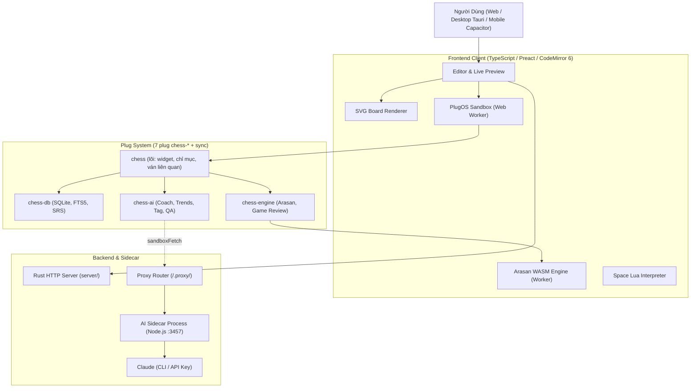

# ChessNote ♟️

> **ChessNote** là hệ thống ghi chú cá nhân và quản lý tri thức cờ vua thông minh (Personal Knowledge Management for Chess), kết hợp sức mạnh ghi chép Markdown khả lập trình của **SilverBullet** với động cơ cờ vua WebAssembly (**Arasan Engine**), trợ lý **AI Coach & Multi-note AI**, và kiến trúc đa nền tảng (**Web, Desktop Tauri, Mobile Android/iOS**).

---

## 🌟 Các Tính Năng Nổi Bật

* **♟️ Bàn Cờ Tương Tác Sống Động (Interactive Live Boards)**:
  - Tự động nhận diện khối mã ` ```pgn ` và ` ```fen ` để dựng bàn cờ tương tác SVG thuần không cần thư viện nặng.
  - Hỗ trợ di chuyển quân cờ, xem lại từng nước đi, lật bàn cờ, phóng to/thu nhỏ responsive, và highlight nước đi.
* **⚡ Động Cơ Cờ Vua Arasan (WASM Engine)**:
  - Tích hợp trực tiếp động cơ Arasan biên dịch WebAssembly chạy ngay trên thiết bị người dùng (offline-first).
  - Phân tích nước đi chuyên sâu, đánh giá điểm số Centipawns ($cp$), tính toán cơ hội thắng ($Win\%$), gợi ý nước đi tốt nhất và vẽ đồ thị ưu thế trực quan.
* **📊 Đánh Giá & Xem Lại Ván Đấu (Game Review)**:
  - Tự động phân loại chất lượng từng nước đi: *Brilliant (!!), Great (!), Best, Good, Inaccuracy (?!), Mistake (?), Blunder (??), Book*.
  - Tính toán độ chính xác ván đấu (Accuracy %) cho cả bên Trắng và Đen, nhận diện các điểm ngoặt (Turning Points) của ván cờ.
* **🤖 Trợ Lý AI Chuyên Biệt & Phân Tích Đa Ghi Chú (AI Coach & Multi-note AI)**:
  - **AI Coach**: Giải thích cặn kẽ ý đồ chiến lược và nguyên nhân sai lầm của từng nước đi.
  - **Phân tích xu hướng (Trends Analysis)**: Quét toàn bộ ván cờ trong thư viện ghi chú, phân loại điểm yếu theo giai đoạn ván (Khai cuộc / Trung cuộc / Tàn cuộc) và mã ECO.
  - **Tự động gắn tag & tóm tắt (Smart Tagging)**: Đọc diễn biến và metadata ván cờ để gắn nhãn chiến thuật và tóm tắt ngắn gọn.
  - **Hỏi đáp thư viện cờ (Chess QA / RAG)**: Trả lời tự do các câu hỏi dựa trên toàn bộ các ván cờ đã lưu.
  - **Ván cờ liên quan (Related Games)**: Tự động gợi ý các ván đấu tương tự về khai cuộc hoặc đối thủ trong kho ghi chú.
* **✏️ Sửa Bàn Cờ Tự Do & Lưu Vào Trang**: Thêm/xoá/kéo-thả quân bất kể luật, chọn bên đi, quyền nhập thành, ô bắt tốt qua đường; bấm "💾 Lưu vào trang" để ghi ngược vào ghi chú.
* **🎨 Giao Diện Bàn Cờ**: 6 bộ quân (Merida, Alpha, Leipzig, Maestro, Cburnett, Spatial) và 8 màu bàn (Textbook, Wood, Green, Blue, Maple, Monochrome, Parchment, Dark); đặt mặc định cho mọi tài liệu.
* **🗃️ Cơ Sở Dữ Liệu SQLite Trong Trình Duyệt**: Thống kê khai cuộc bằng SQL, tìm kiếm toàn văn FTS5, tìm theo ngữ nghĩa (embedding), lưu chú thích AI có cấu trúc.
* **📖 Sổ Tay Khai Cuộc & Ôn Tập Ngắt Quãng (SRS)**: Viết hệ thống khai cuộc theo mẫu, ôn tập theo thuật toán SM-2.
* **🖨️ Xuất PDF**: Bàn cờ tĩnh, 1–2 cột, cỡ bàn cờ tuỳ chỉnh, chọn thế cờ hiển thị của ván PGN.
* **🔄 Đồng Bộ Đa Thiết Bị**: Dropbox, WebDAV hoặc **ChessNote Cloud** tự host (đẩy tín hiệu gần thời gian thực), mã hoá đầu cuối tuỳ chọn (AES-GCM).
* **📱 Đa Nền Tảng (Cross-Platform)**:
  - **Web**: Chạy trên mọi trình duyệt hiện đại với tính năng PWA / Offline storage.
  - **Desktop App**: Đóng gói nhẹ và nhanh bằng **Tauri (Rust)**.
  - **Mobile App**: Ứng dụng native di động cho **Android** và **iOS** qua **Capacitor**.
* **📝 Khả Năng Lập Trình Cao (Space Lua & Templates)**:
  - Kế thừa toàn bộ hệ thống Space Lua, Custom Slash Commands, Page Templates và Live Query (SLIQ) của SilverBullet.

---

## 🏛️ Kiến Trúc Hệ Thống (High-Level Architecture)


```mermaid
graph TD
    User["Người Dùng (Web / Desktop Tauri / Mobile Capacitor)"]
    
    subgraph Frontend["Frontend Client (TypeScript / Preact / CodeMirror 6)"]
        UI["Editor & Live Preview"]
        Board["SVG Board Renderer"]
        WasmWorker["Arasan WASM Engine (Worker)"]
        SpaceLua["Space Lua Interpreter"]
        PlugOS["PlugOS Sandbox (Web Worker)"]
    end

    subgraph Plugs["Plug System (7 plug chess-* + sync)"]
        ChessPlug["chess (lõi: widget, chỉ mục, ván liên quan)"]
        GameIndexer["chess-db (SQLite, FTS5, SRS)"]
        Reviewer["chess-engine (Arasan, Game Review)"]
        AIBidge["chess-ai (Coach, Trends, Tag, QA)"]
    end

    subgraph Backend["Backend & Sidecar"]
        RustServer["Rust HTTP Server (server/)"]
        Proxy["Proxy Router (/.proxy/)"]
        AISidecar["AI Sidecar Process (Node.js :3457)"]
        LLM["Claude (CLI / API Key)"]
    end

    User --> UI
    UI --> Board
    UI --> PlugOS
    PlugOS --> ChessPlug
    ChessPlug --> Reviewer
    Reviewer --> WasmWorker
    ChessPlug --> GameIndexer
    ChessPlug --> AIBidge
    AIBidge -.->|sandboxFetch| Proxy
    Proxy --> AISidecar
    AISidecar --> LLM
    UI --> RustServer
```

---

## 🚀 Hướng Dẫn Cài Đặt & Phát Triển (Getting Started)

### 1. Yêu cầu môi trường
* [Node.js](https://nodejs.org/) 24+ và npm 10+
* [Rust](https://www.rust-lang.org/tools/install) stable (cài đặt qua `rustup`)
* Hệ điều hành: Windows, macOS, hoặc Linux

### 2. Cài đặt Dependencies
```bash
make setup
# hoặc: npm install
```

### 3. Xây dựng ứng dụng (Build)
```bash
# Build toàn bộ Frontend Client và các Plugs (7 plug chess-* + sync + plug lõi của SilverBullet)
npm run build

# Build binary Rust Server (Release)
make
```

### 4. Chạy ứng dụng trong môi trường phát triển (Development)
```bash
# 1. Chạy Rust Server (Debug) với một thư mục ghi chú cụ thể:
cargo run <DUONG_DAN_THU_MUC_SPACE>

# 2. (Tùy chọn) Khởi động AI Sidecar — CHỈ cần nếu dùng chess.ai.mode = "subscription"
#    (mặc định "api_key" gọi thẳng api.anthropic.com, không cần sidecar):
cd ai-sidecar
npm start
```
Truy cập trình duyệt tại địa chỉ: `http://localhost:3000`.

---

## 📱 Phát Triển Đa Nền Tảng (Mobile & Desktop)

### Ứng dụng Di Động (Android / iOS)
```bash
# Build bundle dành cho Mobile và đồng bộ Capacitor
npm run mobile:build

# Chạy trực tiếp trên thiết bị/máy ảo Android
npm run mobile:run:android

# Hoặc mở dự án trong Android Studio / Xcode
npm run mobile:android
npm run mobile:ios
```

### Ứng dụng Máy Tính (Desktop Tauri)
```bash
# Chạy Desktop App trong chế độ phát triển
npm run desktop:dev

# Đóng gói Desktop App thành file cài đặt (.exe / .dmg / .deb)
npm run desktop:build
```

---

## 🧪 Kiểm Thử & Đảm Bảo Chất Lượng (Testing)

```bash
# Chạy Unit Tests (Vitest)
npm test

# Kiểm tra kiểu dữ liệu TypeScript (Typecheck)
npm run check

# Kiểm tra định dạng & Linter (Biome)
npm run lint
npm run fmt:check

# Chạy E2E Tests (Playwright)
npm run test:e2e
```

---

## 📚 Tài Liệu Kỹ Thuật Chi Tiết

**Tài liệu tổng:**

* 🤖 [AGENTS.md](AGENTS.md): Quy chuẩn dành cho AI Coding Agents.
* ⚡ [CLAUDE.md](CLAUDE.md): Tóm tắt lệnh nhanh và quy trình phát triển.
* 🏗️ [TECH.md](TECH.md): Kiến trúc kỹ thuật, luồng dữ liệu, PlugOS, Datastore.
* 🛠️ [SKILLS.md](SKILLS.md): Kịch bản vận hành, thêm module mới, nhân bản ứng dụng.
* 🧠 [MEMORY.md](MEMORY.md): Nhật ký quyết định kiến trúc (ADR), lịch sử phiên, lộ trình.
* ♟️ [docs/CHESS_MODULES.md](docs/CHESS_MODULES.md): Tóm tắt giải thuật các module cờ vua.

**Tài liệu chi tiết từng module (hai tầng: chức năng + kỹ thuật):**

* 📂 [docs/modules/README.md](docs/modules/README.md): Mục lục, bản đồ phụ thuộc, tổng hợp phát hiện khi rà soát.
* 🔎 [docs/modules/TRA-CUU-TU-DONG.md](docs/modules/TRA-CUU-TU-DONG.md): Lệnh, syscall, sự kiện, khoá cấu hình, bảng SQL — **sinh tự động từ mã nguồn**.
* 🕘 [docs/modules/LICH-SU-COMMIT.md](docs/modules/LICH-SU-COMMIT.md): Lịch sử commit các giai đoạn ChessNote — **sinh tự động**.
* 🧬 [docs/NHAN-BAN.md](docs/NHAN-BAN.md): Hướng dẫn thêm module và nhân bản sang lĩnh vực khác.

---

## 📄 Bản Quyền & Giấy Phép (License)
ChessNote được phát triển trên nền tảng mã nguồn mở SilverBullet (Giấy phép MIT). Thông tin chi tiết xem tại [LICENSE.md](LICENSE.md).
