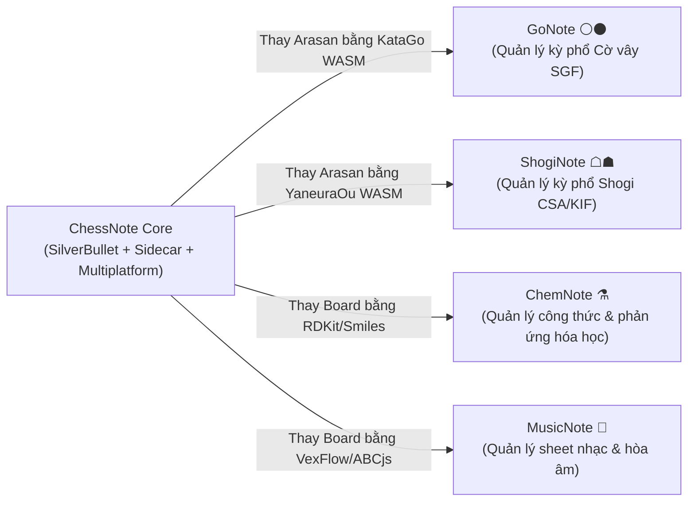

# Kỹ Năng Vận Hành, Kịch Bản Phát Triển & Nhân Bản (SKILLS.md)

> **Mục tiêu**: Bảng tra cứu các kỹ năng (Skills), kịch bản thao tác chuẩn hóa (Recipes), quy trình chẩn đoán lỗi (Debugging), và hướng dẫn từng bước để **tạo thêm module mới** hoặc **nhân bản (clone/fork)** dự án ChessNote sang các lĩnh vực tri thức khác.

---

## 1. Bảng Tra Cứu Lệnh Vận Hành (Developer Commands Cheatsheet)

### 1.1. Xây Dựng & Kiểm Thử
```bash
# Cài đặt toàn bộ dependencies
make setup

# Build toàn bộ frontend client và plugs
npm run build

# Build binary server Rust (Release)
make

# Chạy toàn bộ Unit Tests (TypeScript)
npm test

# Chạy toàn bộ Tests với vitest giao diện web
npx vitest --ui

# Kiểm tra kiểu dữ liệu tĩnh TypeScript
npm run check

# Kiểm tra và tự động sửa định dạng code (Biome)
npm run fmt
npm run lint

# Chạy E2E Tests trên Chromium
npm run test:e2e
```

### 1.2. Môi Trường Mobile & Desktop
```bash
# Đồng bộ mã nguồn web sang thư mục Mobile Capacitor
npm run mobile:build

# Mở dự án trong Android Studio
npm run mobile:android

# Chạy ứng dụng trên máy ảo/thiết bị Android đang kết nối
npm run mobile:run:android

# Khởi chạy ứng dụng Desktop (Tauri) ở chế độ phát triển
npm run desktop:dev

# Đóng gói bộ cài đặt Desktop (Tauri)
npm run desktop:build
```

---

## 2. Kịch Bản Chẩn Đoán & Sửa Lỗi (Debugging Recipes)

### 2.1. Debugging Web Worker Sandbox của Plugs
1. Mở Chrome DevTools (`F12` hoặc `Ctrl+Shift+I`).
2. Chuyển sang tab **Sources** -> chọn mục **Threads** ở thanh bên phải.
3. Tìm Worker có tên tương ứng với Plug (ví dụ: `chess.plug.js`).
4. Đặt Breakpoint trong mã nguồn TypeScript đã được map sourcemap.

### 2.2. Kiểm Tra & Chẩn Đoán AI Sidecar
1. Kiểm tra trạng thái Sidecar đang chạy:
   ```bash
   curl http://127.0.0.1:3457/api/status
   ```
2. Nếu gặp lỗi cổng `3457` bị chiếm dụng (EADDRINUSE):
   ```bash
   # Tìm và tắt tiến trình cũ chiếm cổng 3457 trên Windows:
   netstat -ano | findstr :3457
   taskkill /PID <PID_TIM_THAY> /F
   ```
3. Xem log luồng gọi AI trong cửa sổ terminal đang chạy `ai-sidecar`.

### 2.3. Reset & Kiểm Tra Dữ Liệu IndexedDB Cục Bộ
1. Trong Chrome DevTools, mở tab **Application**.
2. Chọn mục **Storage** -> **IndexedDB**.
3. Các cơ sở dữ liệu quan trọng:
   - `data_space`: Chứa toàn bộ file và KV documents.
   - `index_space`: Chứa Object Index (`chess-game`, `chess-game-review`, `task`, `page`).
4. Nếu cần xóa trắng để kiểm tra khởi tạo ban đầu: bấm nút **Clear site data**.

---

## 3. Kịch Bản Tạo Mới Module / Tính Năng (New Module Recipe)

### Kịch bản A: Thêm 1 Plug Mới vào Hệ Thống
1. **Tạo thư mục**: `plugs/<ten_plug>/` (ví dụ: `plugs/tactics/`).
2. **Tạo file cấu hình Manifest**: `plugs/<ten_plug>/<ten_plug>.plug.yaml`:
   ```yaml
   name: tactics
   functions:
     practiceTactics:
       command:
         name: "Tactics: Luyện tập chiến thuật"
         key: "Alt-Shift-T"
       code: ./index.ts:practiceTactics
     tacticsWidget:
       code: ./index.ts:tacticsWidget
       events:
         - "widget:tactics"
   ```
3. **Hiện thực logic**: Viết mã TypeScript trong `plugs/<ten_plug>/index.ts` sử dụng các Syscalls từ `@silverbulletmd/silverbullet/syscalls`.
4. **Đăng ký Plug**: Khai báo plug trong `plugs/builtin_plugs.ts` để được tự động đóng gói khi chạy `npm run build:plugs`.
5. **Viết Unit Test**: Tạo `plugs/<ten_plug>/index.test.ts` và chạy `npm test` để xác minh.

### Kịch bản B: Thêm 1 Slash Template Hoặc Page Template Cờ Vua
1. Tạo file Markdown trong `client_bundle/base_fs/Library/Chess/Slash_Templates/<ten-lenh>.md`.
2. Định nghĩa frontmatter với `tags: [template, slash-template]`.
3. Sử dụng cú pháp Space Lua `${...}` để điền động dữ liệu.
4. Chạy `npm run build:client` để nhúng template vào bộ phân phối mặc định.

---

## 4. Hướng Dẫn Nhân Bản & Mở Rộng Ứng Dụng (Software Cloning Guide)

ChessNote có kiến trúc module hoá cao, cho phép nhân bản thành các ứng dụng quản lý tri thức chuyên biệt khác (ví dụ: **GoNote** cho cờ vây, **ShogiNote** cho cờ tướng Nhật, **ChemNote** cho hóa học, **MusicNote** cho ký âm âm nhạc):



### Các bước từng bước để nhân bản:
1. **Thay thế / Thêm Plug Nghiệp Vụ (`plugs/<domain>/`)**:
   - Thay `board_renderer.ts` bằng bộ renderer tương ứng của lĩnh vực (ví dụ: WGo.js / SVG Go board, RDKit canvas, ABCjs sheet renderer).
   - Thay `engine/arasan_engine.ts` bằng WebAssembly engine tương ứng (ví dụ: KataGo WASM cho Cờ vây, RDKit WASM cho Hóa học).
2. **Định nghĩa Object Index Mới (`index.ts`)**:
   - Thay tag `chess-game` bằng tag lĩnh vực (ví dụ: `go-game`, `chemical-compound`, `music-score`).
3. **Điều chỉnh AI Prompts & Sidecar Bridge**:
   - Cập nhật prompt templates trong `plugs/<domain>/ai/` để hướng dẫn AI phân tích theo thuật ngữ chuyên ngành.
4. **Cập nhật Giao Diện & Templates Mặc Định**:
   - Cập nhật icon, tiêu đề ứng dụng trong `client/` và các template mẫu trong `client_bundle/base_fs/Library/<Domain>/`.
5. **Đóng gói Đa Nền Tảng**:
   - Cập nhật `capacitor.config.ts` (App ID, App Name) và `desktop/src-tauri/tauri.conf.json` để phát hành bản cài đặt độc lập.
