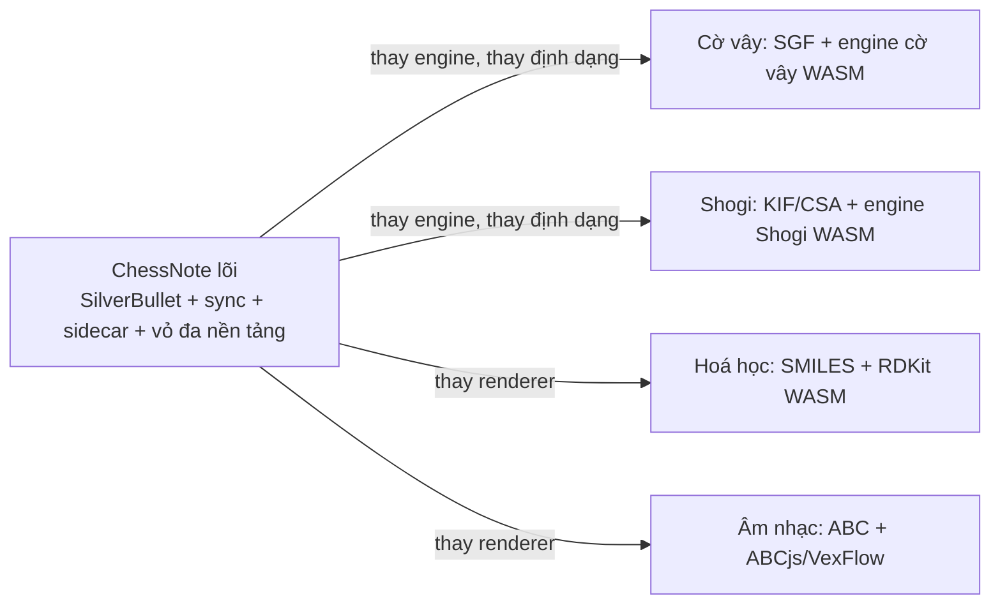

# Kỹ Năng Vận Hành, Kịch Bản Phát Triển & Nhân Bản (SKILLS.md)

> **Mục tiêu**: Bảng tra cứu kịch bản thao tác chuẩn hoá (recipes), quy trình chẩn đoán lỗi (debugging) và hướng dẫn **tạo module mới** hoặc **nhân bản** ChessNote sang lĩnh vực khác.
> Đã đối chiếu với mã nguồn tại commit `383bab47be` (2026-09-13). Bản đầy đủ của phần thêm module/nhân bản: [docs/NHAN-BAN.md](docs/NHAN-BAN.md). Chi tiết từng module: [docs/modules/README.md](docs/modules/README.md).

---

## 1. Bảng Tra Cứu Lệnh Vận Hành

### 1.1. Xây Dựng & Kiểm Thử
```bash
make setup                 # npm install + playwright install
npm run build              # build plugs + client
make                       # build server Rust (Release) + CLI sb
npm test                   # vitest toàn repo
npx vitest --ui            # vitest có giao diện web
npm run check              # tsc --noEmit
npm run fmt                # biome format --write (fmt:check chỉ kiểm)
npm run lint               # biome lint
npm run test:e2e           # Playwright (chromium)
cargo check --workspace    # khi sửa Rust
python scripts/gen_module_reference.py   # cập nhật bảng tra cứu tự động của tài liệu
```

### 1.2. Mobile, Desktop, Dịch vụ phụ
```bash
npm run mobile:build            # build bundle mobile + npx cap sync
npm run mobile:android          # mở Android Studio
npm run mobile:run:android      # chạy trên thiết bị/máy ảo
npm run desktop:dev             # Tauri dev
npm run desktop:build           # đóng gói bộ cài
cd ai-sidecar && npm start      # sidecar (cổng 3457) — chỉ khi chess.ai.mode = "subscription"
cd cloud-server && npm run dev  # ChessNote Cloud (cần CHESSNOTE_CLOUD_USERS)
```

---

## 2. Kịch Bản Chẩn Đoán & Sửa Lỗi (Debugging Recipes)

### 2.1. Debug Web Worker Sandbox của Plugs
1. Mở Chrome DevTools (`F12`), tab **Sources** → **Threads**, tìm Worker của plug (ví dụ `chess.plug.js`), đặt breakpoint (có sourcemap).
2. ⚠️ **`console.log` bên trong Worker của plug không thấy được** qua công cụ đọc console của Chrome tự động hoá (`read_console_messages`). Muốn chẩn đoán: trả thông tin qua **giá trị trả về của syscall** (thêm trường debug tạm), hoặc xem trong DevTools thủ công.
3. Sau khi build lại plug, điều hướng lại trang **không chắc** nạp bundle mới: gọi syscall `system.reloadPlugs` (hoặc lệnh reload plug) rồi mới thử lại.
4. Lỗi bị nuốt trong `.catch()` thường làm chức năng "im lặng không làm gì" (ví dụ `chess-db` từng mãi `db = undefined`): đọc mục "Điểm cần lưu ý" trong tài liệu module tương ứng trước khi nghi "dữ liệu không bền".

### 2.2. Kiểm Tra AI Sidecar (chỉ chế độ `subscription`)
1. Sống hay không: `curl http://127.0.0.1:3457/healthz` → `{"ok":true}` (không cần token).
2. Trạng thái đăng nhập: `curl -H "Authorization: Bearer <token>" http://127.0.0.1:3457/auth/status` (bỏ header nếu không đặt `AUTH_SIDECAR_TOKEN`).
3. Cổng bị chiếm (EADDRINUSE) trên Windows: `netstat -ano | findstr :3457` rồi `taskkill /PID <PID> /F`.
4. `429` từ `/ai/generate` = hàng đợi đầy (mặc định tối đa 2 tiến trình song song, 10 chờ; đổi bằng `AI_SIDECAR_MAX_CONCURRENCY`, `AI_SIDECAR_MAX_QUEUE`).
5. Chế độ `api_key` không qua sidecar: kiểm `chess.ai.apiKey`, `chess.ai.model` (phải là ID model API hợp lệ) trong Configuration Manager.

### 2.3. Chẩn đoán SQLite (chess-db)
* Lệnh **`Chess: Kiểm tra dữ liệu SQLite (debug)`** xuất nội dung các bảng. DB là `:memory:`, dựng lại từ PGN mỗi lần tải — sau F5 phải chờ đánh chỉ mục lại.
* Hai lỗi lịch sử: `Invalid URL` khi khởi tạo trong Worker (đã sửa bằng `locateFile`), và `no such column: f` do bí danh `bm25` (đã sửa).

### 2.4. Chẩn đoán đồng bộ
* Lệnh **`Chess: Chẩn đoán đồng bộ Dropbox (không ghi gì)`** chỉ đọc; **`Chess: Trạng thái đồng bộ`** xem trạng thái tự động.
* File trạng thái nằm trong Space: `_dropbox/sync-state.json`, `_dropbox/sync-cursor.json`, `_sync/<provider>-state.json`, `_sync/<provider>-cursor.json`.
* Dropbox trả HTTP 400 dù đã đăng nhập: chưa tick quyền ở tab Permissions của Dropbox App (phải làm trước khi đăng nhập).
* Xuất PDF thoát mã 21 trên Windows: đặt `SB_CHROME_DATA_DIR` tới đường dẫn tuyệt đối đơn giản.

### 2.5. Reset dữ liệu IndexedDB cục bộ
DevTools → **Application** → **Storage** → **IndexedDB** để xem; **Clear site data** để xoá trắng và kiểm khởi tạo ban đầu. (Tên cơ sở dữ liệu cụ thể xem `client/data/`.)

---

## 3. Kịch Bản Tạo Mới Module / Tính Năng (New Module Recipes)

### Kịch bản A: Thêm một Plug mới

Mẫu tối thiểu, đối chiếu với `plugs/chess-repertoire/chess-repertoire.plug.yaml`:

1. **Tạo thư mục** `plugs/<tên>/` và manifest `plugs/<tên>/<tên>.plug.yaml`:
   ```yaml
   name: tactics
   functions:
     indexTactics:
       path: ./index.ts:indexTactics
       events:
         - page:index
     practiceTacticsCommand:
       path: ./trainer.ts:commandPractice
       command:
         name: "Chess: Luyện chiến thuật"
     tacticsWidget:
       path: ./widget.ts:tacticsWidget
       codeWidget: tactics
       renderMode: iframe
     tacticsSomeSyscall:
       path: ./api.ts:something
       syscall:
         name: chess.tactics.something
         description: Mô tả ngắn.
         parameters:
           - { name: fen, type: string }
         returns:
           - { type: object }
   ```
   (Khoá là **`path:`** — không phải `code:`; widget khai báo bằng **`codeWidget:`** — không phải `events: widget:…`.)
2. **Gọi plug khác**: tạo `external_syscalls.ts` bọc `syscall("…")`; không `import` mã plug khác.
3. **Khoá cấu hình**: `config.define("chess.<nhóm>.<khoá>", {...})` trong hàm nghe `editor:init`.
4. **Đăng ký**: thêm tên vào `builtinPlugNames` ở `plugs/builtin_plugs.ts` (build đọc `./plugs/<tên>/<tên>.plug.yaml` cho mọi tên trong danh sách).
5. **Test**: `plugs/<tên>/*.test.ts`, chạy `npm test`. Tách logic thuần khỏi syscall để test không cần mock.
6. **Việc đắt** (engine, AI): chỉ chạy khi người dùng bấm, không gắn vào `page:saved`.
7. **Tài liệu**: thêm `docs/modules/NN-<tên>.md`, cập nhật `docs/modules/README.md`, chạy `python scripts/gen_module_reference.py`.

### Kịch bản B: Thêm Slash Template hoặc Page Template cờ vua

Nguồn nằm ở **`libraries/Library/Chess/`** (không sửa trong `client_bundle/`, đó là thư mục sinh ra khi build).

* **Slash template** (`libraries/Library/Chess/Slash_Templates/<tên>.md`): frontmatter mẫu từ `insert-fen.md`:
  ```yaml
  ---
  description: "Chèn bàn cờ thế cờ FEN tương tác"
  tags: meta/template/slash
  exceptContexts:
  - "FencedCode"
  - "LuaDirective"
  ---
  ```
* **Page template** (`libraries/Library/Chess/Templates/<tên>.md`): `suggestedName`, `description`, `confirmName`, `tags: meta/template/page`, và khối `frontmatter: |` chứa frontmatter của trang được tạo (xem `Game_Analysis.md`, `Opening_Repertoire.md`).
* Trang mẫu **không** vào chỉ mục ván (`isTemplatePage`: tag `meta/template*` hoặc nằm dưới `Library/`); trang tag `repertoire` đi vào chỉ mục khai cuộc riêng.
* Xong chạy `npm run build:plugs` (sao chép `libraries/Library` vào `client_bundle/base_fs`).

### Kịch bản C: Thêm nhà cung cấp đồng bộ mới

Cài `SyncProvider` (`plugs/sync/sync_provider.ts`: `listEntries`, `download`, `upload`, `delete`; báo race bằng `RemoteConflictError`), thêm bridge (đăng nhập, cấu hình, lệnh) theo mẫu `webdav_bridge.ts`, đăng ký lệnh trong `sync.plug.yaml` và thêm vào `runAllConfiguredSyncs` (`auto_trigger.ts`). Thuật toán đồng bộ (`sync_engine.ts`) dùng chung, không phải sửa.

---

## 4. Nhân Bản & Mở Rộng Ứng Dụng (Software Cloning Guide)

ChessNote tách khá rõ phần **chung** (SilverBullet, `sync`, `cloud-server`, `ai-sidecar`, vỏ đa nền tảng) khỏi phần **riêng cờ vua** (`chess.js`, Arasan, FEN/PGN/ECO, prompt cờ vua), nên nhân bản được sang các lĩnh vực có "trạng thái + chuỗi diễn biến + thước đo chất lượng":


```mermaid
graph LR
    Core["ChessNote lõi<br/>SilverBullet + sync + sidecar + vỏ đa nền tảng"]
    Core -->|"thay engine, thay định dạng"| Go["Cờ vây: SGF + engine cờ vây WASM"]
    Core -->|"thay engine, thay định dạng"| Shogi["Shogi: KIF/CSA + engine Shogi WASM"]
    Core -->|"thay renderer"| Chem["Hoá học: SMILES + RDKit WASM"]
    Core -->|"thay renderer"| Music["Âm nhạc: ABC + ABCjs/VexFlow"]
```

(Các ví dụ WASM ở sơ đồ là **ý tưởng thay thế**, chưa được thử trong dự án.)

Quy trình từng bước, bảng nhãn hiệu cần đổi (Capacitor, Tauri, Android, Docker…), bảng đối chiếu khái niệm, điều kiện pháp lý và bộ kiểm bắt buộc: **[docs/NHAN-BAN.md](docs/NHAN-BAN.md)**.
