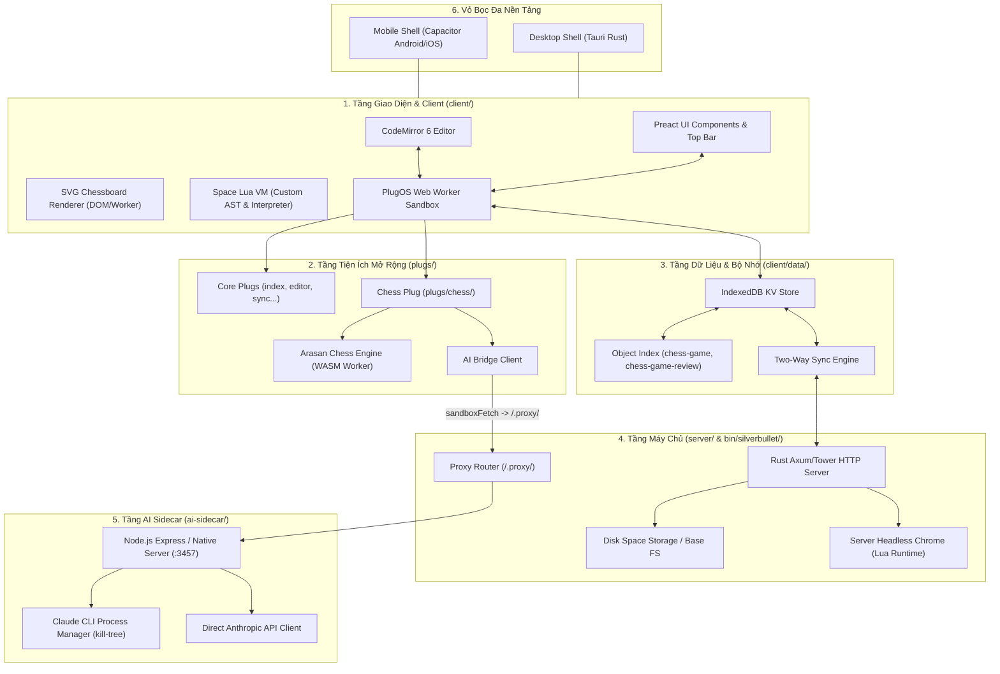

# Kiến Trúc Kỹ Thuật Chi Tiết (TECH.md)

> **Mục tiêu**: Cung cấp bức tranh toàn cảnh và chi tiết về mặt kỹ thuật của ChessNote, bao gồm các lớp hệ thống (Subsystems), luồng dữ liệu (Data Flows), cơ chế sandbox, mô hình lưu trữ, hạ tầng AI, và kiến trúc đa nền tảng.

---

## 1. Sơ Đồ Kiến Trúc Hệ Thống Tổng Thể



---

## 2. Các Phân Hệ Kỹ Thuật Chính (Subsystems)

### 2.1. Frontend Client (`client/`)
* **Trình soạn thảo văn bản (CodeMirror 6)**:
  - Hệ thống Live Preview: Tự động phân tích cây cú pháp Lezer Markdown để render các khối nhúng widget (như ` ```pgn `, ` ```fen `, ` ```query `).
  - Kiến trúc Extension: Các module autocompletion, fold, decorations, keymaps đều được cấu trúc dạng CodeMirror extensions.
* **Không gian kịch bản Space Lua (`client/space_lua/`)**:
  - Trình thông dịch Space Lua được viết bằng TypeScript thuần.
  - Cho phép người dùng viết các lệnh tùy biến (Custom Commands), hàm tính toán, và tạo giao diện widget động bằng Lua ngay trong ghi chú Markdown.
* **Giao diện người dùng (Preact)**:
  - Khung ứng dụng gọn nhẹ, render thanh điều hướng (Top Bar), bảng lệnh (Command Palette), bộ chọn trang (Page Picker), và modal thông báo.

### 2.2. PlugOS & Hệ Thống Plugin (`plug-api/`, `plugs/`)
* **Cơ chế Web Worker Sandboxing**:
  - Mỗi Plug chạy trong một Web Worker riêng biệt để cách ly hoàn toàn lỗi logic và bảo vệ luồng chính (Main UI Thread).
* **Giao tiếp qua Syscalls (RPC Pattern)**:
  - Plug không thể truy cập trực tiếp DOM hoặc biến toàn cục của trình duyệt.
  - Mọi thao tác tương tác đều đi qua hệ thống **Syscalls**:
    - `editor.*`: Thao tác vị trí con trỏ, chèn văn bản, hiển thị thông báo (`editor.flashNotification`), mở panel.
    - `space.*`: Đọc, ghi, liệt kê các file trong Space.
    - `index.*`: Đánh chỉ mục (`index.indexObjects`), truy vấn (`index.queryLuaObjects`).
    - `config.*`: Đọc/ghi cấu hình người dùng.
    - `clientStore.*`: Lưu trữ tạm thời trạng thái giao diện phía client.
    - `sandboxFetch.fetch`: Thực hiện HTTP Request thông qua proxy của Server.

### 2.3. Plug Cờ Vua (`plugs/chess/`)
* **Board Renderer (`board_renderer.ts`)**:
  - Render bàn cờ và quân cờ dưới dạng đồ họa vector SVG thuần, tối ưu hóa hiệu năng render và tương thích trên màn hình Retina / High-DPI.
  - Xử lý kéo thả quân cờ (Drag-and-drop), cảm ứng chạm trên Mobile (Touch events), hỗ trợ highlight nước đi, và lật bàn cờ (Flip).
* **Arasan WASM Engine (`engine/arasan_engine.ts`, `uci_protocol.ts`)**:
  - Động cơ cờ vua Arasan được biên dịch thành WebAssembly (`.wasm`), chạy trong Web Worker chuyên biệt.
  - Giao tiếp qua chuẩn **UCI (Universal Chess Interface)**: Gửi lệnh `position fen <FEN>`, `go depth <D>`, nhận kết quả `info depth ... score cp ... pv ...`.
* **Game Reviewer (`engine/game_reviewer.ts`)**:
  - Đánh giá toàn bộ ván cờ, tính Centipawn Loss ($CPL$), phân loại nước đi (Best, Good, Inaccuracy, Mistake, Blunder), tính điểm độ chính xác (Accuracy %) và xác định điểm ngoặt.
* **Game Indexer (`index.ts`)**:
  - Bắt sự kiện `page:index` của PlugOS, quét toàn bộ AST Markdown để phát hiện các khối ` ```pgn `.
  - Trích xuất metadata (White, Black, Result, Date, Event, ECO) và lưu trữ vào Object Index với tag `chess-game`.

### 2.4. Lưu Trữ & Đồng Bộ (Datastore & Sync)
* **IndexedDB KV Storage (`client/data/`)**:
  - Lưu trữ toàn bộ dữ liệu ghi chú, tệp đính kèm và chỉ mục cục bộ trên trình duyệt. Đảm bảo ứng dụng hoạt động 100% không cần kết nối mạng (Offline-first).
* **Space Object Index**:
  - Cho phép truy vấn dữ liệu có cấu trúc từ Markdown thông qua Space Lua hoặc cú pháp query `${query[[from g = index.objects("chess-game") ...]]}`.
  - Phân tách chỉ mục ván cờ (`chess-game`) và chỉ mục kết quả phân tích (`chess-game-review`).
* **Hai Chiều Đồng Bộ (Two-Way Sync Engine)**:
  - Đồng bộ hoá tự động giữa IndexedDB cục bộ và thư mục tệp trên máy chủ Rust qua giao thức HTTP REST API / WebSocket.

### 2.5. Hạ Tầng AI Sidecar (`ai-sidecar/`)
* **Mục đích**: Tách biệt luồng xác thực và gọi LLM (Claude CLI / Claude Subscription / API Key) khỏi Sandbox của trình duyệt.
* **Kiến trúc**:
  - Tiến trình Node.js độc lập chạy tại cổng `http://127.0.0.1:3457`.
  - Quản lý phiên đăng nhập CLI Claude cá nhân thông qua quản lý tiến trình con (`kill-tree`, `utf8-stream`).
  - Hỗ trợ cả 2 chế độ: `subscription` (dùng tài khoản cá nhân qua CLI) và `api_key` (dùng `ANTHROPIC_API_KEY`).
* **Luồng gọi AI chống Hallucination**:
  1. Frontend / Plug chạy Engine WASM thật để lấy số liệu đánh giá ($cp$, $CPL$, $Accuracy$, $Turning Points$).
  2. Gom số liệu có cấu trúc và gửi qua `AIBridge` -> Rust Proxy `/.proxy/127.0.0.1:3457/api/...` -> `ai-sidecar`.
  3. `ai-sidecar` gọi Claude và trả kết quả đã phân tích theo cấu trúc nghiêm ngặt về cho Plug hiển thị.

---

## 3. Kiến Trúc Đa Nền Tảng (Cross-Platform)

### 3.1. Mobile Application (Capacitor)
* **Vỏ bọc (Native Shell)**: Sử dụng **Capacitor 8.5** cho Android và iOS.
* **Cơ chế phục vụ (Asset Serving)**: Bundle tĩnh được đóng gói vào thư mục `android/app/src/main/assets/public/`.
* **Tích hợp phần cứng**: Sử dụng các plugin `@capacitor/keyboard`, `@capacitor/splash-screen`, `@capacitor/status-bar`, `@capacitor/filesystem`.

### 3.2. Desktop Application (Tauri)
* **Vỏ bọc (Desktop Shell)**: Sử dụng **Tauri 2.0 (Rust)**.
* **Ưu điểm**: Dung lượng siêu nhẹ (< 15MB), sử dụng Webview hệ thống (WebView2 trên Windows, WebKit trên macOS/Linux), tối ưu hóa bộ nhớ RAM vượt trội so với Electron.

---

## 4. Bản Đồ Giao Thức Mạng & Cổng (Network & Ports)

| Dịch vụ | Cổng mặc định | Giao thức | Vai trò |
|---|---|---|---|
| **ChessNote Rust Server** | `3000` | HTTP / WS | Phục vụ Client Bundle, File API, Proxy Router |
| **AI Sidecar Process** | `3457` | HTTP / JSON | Quản lý phiên Claude CLI và Direct API |
| **Rust Proxy Endpoint** | `/.proxy/<host:port>/...` | HTTP Proxy | Cầu nối an toàn từ Sandbox Worker sang Sidecar |
