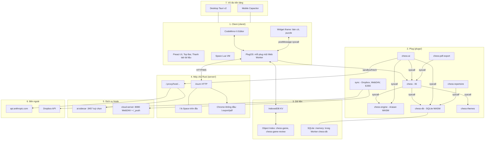

# Kiến Trúc Kỹ Thuật Chi Tiết (TECH.md)

> **Mục tiêu**: Bức tranh toàn cảnh về kỹ thuật của ChessNote: các lớp hệ thống, luồng dữ liệu, cơ chế sandbox, mô hình lưu trữ, hạ tầng AI, đồng bộ và kiến trúc đa nền tảng.
> Đã đối chiếu với mã nguồn tại commit `383bab47be` (2026-09-13). Số liệu/công thức chi tiết nằm ở [docs/modules/](docs/modules/README.md); bảng tra cứu sinh tự động: [docs/modules/TRA-CUU-TU-DONG.md](docs/modules/TRA-CUU-TU-DONG.md).

---

## 1. Sơ Đồ Kiến Trúc Hệ Thống Tổng Thể


```mermaid
graph TB
    subgraph UI_Layer["1. Client (client/)"]
        CM6["CodeMirror 6 Editor"]
        PreactUI["Preact UI, Top Bar, Thanh tab tài liệu"]
        IframeW["Widget iframe: bàn cờ, puzzle"]
        LuaVM["Space Lua VM"]
        PlugOS["PlugOS: mỗi plug một Web Worker"]
    end

    subgraph Plug_Layer["2. Plug (plugs/)"]
        Core["chess - lõi"]
        Engine["chess-engine - Arasan WASM"]
        DB["chess-db - SQLite WASM"]
        AI["chess-ai"]
        Pdf["chess-pdf-export"]
        Rep["chess-repertoire"]
        Themes["chess-themes"]
        Sync["sync - Dropbox, WebDAV, E2EE"]
    end

    subgraph Data_Layer["3. Dữ liệu"]
        KV["IndexedDB KV"]
        ObjIdx["Object Index: chess-game, chess-game-review"]
        Sql["SQLite :memory: trong Worker chess-db"]
    end

    subgraph Backend_Layer["4. Máy chủ Rust (server/)"]
        Rust["Axum HTTP"]
        Proxy["/.proxy/host/..."]
        Fs["/.fs Space trên đĩa"]
        Chrome["Chrome không đầu: /.export/pdf"]
    end

    subgraph Aux["5. Dịch vụ Node"]
        Sidecar["ai-sidecar :3457 tuỳ chọn"]
        Cloud["cloud-server :8080 WebDAV + /_push"]
    end

    subgraph Ext["6. Bên ngoài"]
        Anthropic["api.anthropic.com"]
        Dropbox["Dropbox API"]
    end

    subgraph Shells["7. Vỏ đa nền tảng"]
        Tauri["Desktop Tauri v2"]
        Cap["Mobile Capacitor"]
    end

    CM6 <--> PlugOS
    IframeW <-->|"postMessage syscall"| PlugOS
    PlugOS --> Core
    Core -->|"syscall"| Themes
    Core -->|"syscall"| Engine
    Core -->|"syscall"| DB
    AI -->|"syscall"| Core
    AI -->|"syscall"| Engine
    AI -->|"syscall"| DB
    Pdf -->|"syscall"| Core
    Rep -->|"syscall"| DB
    DB --- Sql
    PlugOS <--> KV
    KV <--> ObjIdx
    PlugOS <-->|"HTTP/WS"| Rust
    Rust --- Fs
    Rust --> Chrome
    AI -->|"sandboxFetch"| Proxy
    Proxy --> Anthropic
    Proxy --> Sidecar
    Sync --> Dropbox
    Sync --> Cloud
    Tauri --- UI_Layer
    Cap --- UI_Layer
```

---

## 2. Các Phân Hệ Kỹ Thuật Chính

### 2.1. Client (`client/`) — kế thừa SilverBullet
* **CodeMirror 6**: Live Preview parse cây Lezer Markdown để dựng widget cho khối ` ```fen `, ` ```pgn `, ` ```puzzle `, ` ```query `…
* **Space Lua** (`client/space_lua/`): trình thông dịch Lua viết bằng TypeScript; dùng cho lệnh tuỳ biến, template, widget động và cả lệnh xuất PDF (`libraries/Library/Std/Infrastructure/Export.md`).
* **Thanh tab tài liệu** (ChessNote thêm, 2026-09-11): `client/components/tab_bar.tsx`; phím `Alt-]`, `Alt-[`, `Alt-w`.
* **Cầu nối widget** (`client/components/panel_html.ts`): iframe nhận `html` + `script` qua `postMessage` rồi `eval`; hai cầu ngược: `syscall(...)` và `replaceWidgetBody(cũ, mới)` (cha chỉ áp dụng khi `cũ` còn khớp). Chiều cao dùng `ResizeObserver` suốt vòng đời.

### 2.2. PlugOS & Plug (`plug-api/`, `plugs/`)
* Mỗi plug một Web Worker; giao tiếp qua **syscall** (RPC): `editor.*`, `space.*`, `index.*`, `config.*`, `clientStore.*`, `system.*`, `markdown.*`, `sandboxFetch.fetch`…
* Manifest `<tên>.plug.yaml`: `functions.<hàm>.path`, `events`, `command`, `codeWidget` + `renderMode`, `syscall`.
* 15 plug dựng sẵn (`plugs/builtin_plugs.ts`): 7 của SilverBullet (`core, editor, index, emoji, image-viewer, configuration-manager, object-graph`), `sync`, và 7 plug cờ vua.
* **Plug độc lập (ADR-005/006)**: lời gọi xuyên plug qua syscall; mỗi plug có `external_syscalls.ts`. Mỗi plug publish được thành `.plug.js` riêng (repo `covuaduongsinh/chessnote-plug-*`).

### 2.3. Bảy plug cờ vua

| Plug | Vai trò | Tài liệu |
|---|---|---|
| `chess` | Widget `fen`/`pgn`/`puzzle`; chế độ sửa bàn cờ; chỉ mục `chess-game` (`page:index`); ván liên quan; luật cờ qua `chess.legalMoves/applyMove/applySan` (chess.js) | [01](docs/modules/01-chess-core.md) |
| `chess-engine` | `evalPosition` (UCI, Arasan NNUE WASM), `reviewGame`, `buildMoveList` | [02](docs/modules/02-chess-engine.md) |
| `chess-db` | SQLite WASM trong bộ nhớ: `chess_games`, FTS5, `ai_annotations`, `repertoire_lines`, `game_embeddings`; embedding `multilingual-e5-small` | [03](docs/modules/03-chess-db.md) |
| `chess-ai` | Cầu nối AI hai chế độ; giải thích nước; bình luận ván; xu hướng; gắn tag; hỏi đáp (semantic → FTS5); thống kê khai cuộc | [04](docs/modules/04-chess-ai.md) |
| `chess-pdf-export` | `chess.renderPageForPdf`: khối → bàn cờ tĩnh, CSS in A4, 1–2 cột | [05](docs/modules/05-chess-pdf-export.md) |
| `chess-repertoire` | Trích biến khai cuộc, `Chess: Ôn tập khai cuộc`, SM-2 | [06](docs/modules/06-chess-repertoire.md) |
| `chess-themes` | 6 bộ quân SVG, 8 màu bàn | [07](docs/modules/07-chess-themes.md) |

Điểm kỹ thuật cốt lõi:
* **Engine**: `arasan.wasm` (~925 KB) + `.nnue` (~25 MB) ở `libraries/Library/Chess/`, nhúng vào binary server làm lớp nền chỉ đọc (RustEmbed). `evalPosition` tạo instance Emscripten mới mỗi lần, `stdin` là hàng đợi đồng bộ, **không** gửi `quit`; cache `WebAssembly.Module` đã compile.
* **Game Review**: N+1 lần `evalPosition` tuần tự; `cpl = max(0, điểm trước − điểm sau)` theo bên vừa đi; phân loại `book` (6 nửa nước đầu) / `best` / `brilliant` (ăn quân và |điểm| > 300) / `good ≤ 30` / `inaccuracy ≤ 85` / `mistake ≤ 180` / `blunder`; accuracy = `clamp(100 − avg(winLoss) × 2,2 ; 40 ; 99,5)`, `winChance(cp) = 100/(1+exp(−0,00368208·cp))`.
* **Chỉ mục ván**: mỗi khối ` ```pgn ` hợp lệ → object `chess-game` (`ref = trang@vị trí`); bỏ qua trang template (`meta/template*`, dưới `Library/`) và trang `repertoire`.

### 2.4. Lưu trữ
* **IndexedDB KV** (`client/data/`): ghi chú, tệp, chỉ mục phía client (offline-first).
* **Object Index**: `chess-game` (từ `plugs/chess/index.ts`), `chess-game-review` (cache review, ADR-002; tự vô hiệu khi trang lưu lại nhờ `index.clearFileIndex`).
* **SQLite `:memory:`** trong Worker của `chess-db`: cache dựng lại từ PGN mỗi lần tải. Lịch SRS (`repertoire_lines`) được bền hoá ra `_chess/repertoire-srs.json` trong Space (khoá theo trang + chuỗi nước, khôi phục sau mỗi lần dựng lại DB, được `sync` đồng bộ); ⚠️ `game_embeddings` vẫn mất khi tải lại (chi tiết: [03](docs/modules/03-chess-db.md)).
* **Không** ghi cấu trúc lồng nhau vào frontmatter (ADR-002).

### 2.5. Đồng bộ (`plugs/sync`, `cloud-server/`)
* `sync_engine.ts`: thuật toán hai chiều dùng chung, dựa `prior = {localMtime, remoteRev}`; xung đột thật (kể cả path có ở cả hai bên mà chưa có `prior` và nội dung khác nhau) → **local thắng**, remote bị thay thế lưu vào `<tên>.conflict-<thời điểm>.md`; nhánh xoá theo `prior`; checkpoint theo lô (20 path hoặc 2 giây); loại trừ `Library/`, `Repositories/`, `perm: ro`.
* Nhà cung cấp: Dropbox (OAuth2 PKCE, delta cursor, backoff 429), WebDAV (`If-Match`/`If-None-Match`, ETag). E2EE: PBKDF2-SHA256 600.000 vòng + AES-GCM-256, salt cố định, mã hoá nội dung không mã hoá tên file, fail-closed.
* Tự chạy: interval (`chess.sync.autoIntervalMinutes`, mặc định 5), 30 giây sau lưu trang, khi quay lại app. Kênh đẩy: WebSocket `/_push` (debounce 3 giây phía client, gộp 800 ms phía server).
* ChessNote Cloud: server WebDAV tối giản (ETag = sha1 nội dung, cách ly theo user, chặn path traversal). Chi tiết: [08](docs/modules/08-sync.md), [10](docs/modules/10-cloud-server.md).

### 2.6. Hạ tầng AI
* `chess.ai.mode`: **`api_key`** (mặc định) → plug gọi thẳng `https://api.anthropic.com/v1/messages` qua `/.proxy/`; **`subscription`** → `ai-sidecar` (`:3457`, spawn `claude -p --restricted …`, prompt qua stdin, `Semaphore` 2 song song / 10 chờ, `429` khi đầy).
* **Chống hallucination**: engine tính số liệu thật → gói có cấu trúc → prompt kèm `ANTI_HALLUCINATION_RULE` → AI diễn giải. Nhiều ván: AI chỉ thấy số liệu đã gộp, không thấy PGN. Chi tiết: [04](docs/modules/04-chess-ai.md), [09](docs/modules/09-ai-sidecar.md).

### 2.7. Máy chủ Rust
* Axum; route chính: `/.fs`, `/.events`, `/.revisions`, `/.proxy/{*path}`, `/.runtime/*`, `/.export/pdf`, `/.auth*`, `/.ping`, `/.client/manifest.json`, `/metrics`.
* `/.proxy/`: `http://` cho `localhost`/IP/`host.docker.internal`, `https://` cho host còn lại; header chuyển tiếp qua `X-Proxy-Header-*`; không giới hạn host; `405` khi server chỉ đọc.
* Chrome không đầu (`server-runtime-chrome`): xuất PDF và runtime Lua; Windows cần `SB_CHROME_DATA_DIR` đơn giản.

---

## 3. Kiến Trúc Đa Nền Tảng

* **Mobile (Capacitor)**: `appId com.chessnote.app`, `webDir client_bundle/client/.client`; Android `versionName 1.3` (`versionCode 4`); offline-first (IndexedDB); ẩn tính năng cần server (`system.isCapacitor()`).
* **Desktop (Tauri v2)**: `productName ChessNote`, `version 1.3.0`; lệnh Tauri `get_app_info`, `export_pdf` (một `ChromePool` toàn app).
* Chi tiết và lệnh chạy: [11](docs/modules/11-nen-tang-va-trien-khai.md).

---

## 4. Bản Đồ Cổng & Giao Thức

| Dịch vụ | Cổng mặc định | Giao thức | Vai trò |
|---|---|---|---|
| ChessNote Rust Server | `3000` (`SB_PORT`) | HTTP / WS | Client bundle, File API, Proxy, xuất PDF |
| AI Sidecar (tuỳ chọn) | `3457` | HTTP / JSON, chỉ `127.0.0.1` | Phiên Claude CLI |
| ChessNote Cloud | `8080` (`CHESSNOTE_CLOUD_PORT`) | WebDAV + WebSocket `/_push` | Đồng bộ tự host |
| Rust Proxy | `/.proxy/<host:port>/…` | HTTP | Cầu nối Worker → dịch vụ ngoài |

Triển khai: `docker-compose.dokploy.yml` (3 service, Traefik, `chessnote.dsc.edu.vn`), `docker-compose.vps.yml` + `Caddyfile` (VPS), `scripts/deploy-vps.sh`.

---

## 5. Kiểm Thử

`npm test` (vitest), `npm run check`, `npm run test:e2e` (Playwright), `cargo check --workspace`. Phạm vi cờ vua + sync + `cloud-server` + `ai-sidecar`: 41 file, 394 test, xanh ngày 2026-09-29 (`npx vitest run plugs/chess … ai-sidecar`).
