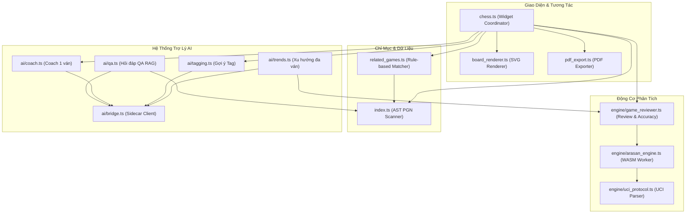

# Đặc Tả Giải Thuật & Chi Tiết Các Module Cờ Vua (CHESS_MODULES.md)

> **Mục tiêu**: Tài liệu kỹ thuật chuyên sâu mô tả chi tiết giải thuật, cấu trúc dữ liệu, công thức toán học và nguyên lý hoạt động của toàn bộ các module trong hệ sinh thái cờ vua của **ChessNote** (`plugs/chess/`).

---

## 1. Bản Đồ Tổng Quan Các Module (`plugs/chess/`)



---

## 2. Module Render Bàn Cờ Vector SVG (`board_renderer.ts`)

### 2.1. Nguyên lý Thiết kế
* **SVG Thuần Túy**: Bàn cờ và quân cờ được dựng 100% bằng vector SVG chuẩn, không phụ thuộc thư viện bên ngoài như Chessground hay Canvas nặng nề.
* **Tương thích Mọi Kích Thước (Responsive)**: Tự động co giãn theo chiều rộng container của CodeMirror 6 widget.

### 2.2. Giải thuật Tính Tọa Độ & Đặt Quân
Mỗi ô cờ $(col, row)$ với $col \in [0..7]$ và $row \in [0..7]$ được tính toán theo góc nhìn (Bên Trắng hoặc Bên Đen):
* Nếu `flipped == false` (Trắng ở dưới):
  $$x = col \times squareSize, \quad y = (7 - row) \times squareSize$$
* Nếu `flipped == true` (Đen ở dưới):
  $$x = (7 - col) \times squareSize, \quad y = row \times squareSize$$

### 2.3. Các Lớp Đồ Họa (Render Layers)
1. **Lớp Nền Ô Cờ (Square Background)**: Tô màu ô sáng (`#f0d9b5`) và ô tối (`#b58863`).
2. **Lớp Highlight Nước Đi Trước (Last Move)**: Đổi màu ô xuất phát và ô đích của nước đi vừa thực hiện với sắc thái xanh nhạt.
3. **Lớp Nước Đi Hợp Lệ (Legal Move Dots)**: Vẽ các chấm tròn bán kính nhỏ tại các ô quân cờ đang chọn có thể di chuyển tới.
4. **Lớp Quân Cờ (Piece SVGs)**: Nhúng các biểu tượng quân cờ SVG sắc nét.
5. **Lớp Mũi Tên Đánh Giá (Engine Arrow)**: Vẽ mũi tên chỉ hướng nước đi tốt nhất (`bestMove`) gợi ý bởi động cơ cờ vua.

---

## 3. Module Động Cơ Cờ Vua Arasan & Giao Thức UCI (`engine/`)

### 3.1. Giao Thức UCI qua WebAssembly (`uci_protocol.ts`, `arasan_engine.ts`)
* Động cơ Arasan chạy trong Web Worker độc lập. Giao tiếp hai chiều thông qua chuỗi lệnh UCI:
  - Khởi tạo: `uci` $\to$ `isready` $\to$ `readyok`.
  - Thiết lập thế cờ: `position fen <FEN_STRING>`.
  - Bắt đầu tính toán: `go depth <MAX_DEPTH>` (hoặc `go movetime <MS>`).
  - Dừng tính toán: `stop`.

### 3.2. Công Thức Tính Xác Suất Thắng (Win Probability)
Để chuẩn hóa điểm Centipawns ($cp$) phi tuyến tính sang thang đo xác suất thắng $Win\% \in [0..100]$, hệ thống áp dụng hàm Sigmoid chuẩn của FIDE / Lichess:

$$Win\%(cp) = \frac{100}{1 + e^{-0.003682 \times cp}}$$

* Nếu $cp = 0$ (Cân bằng): $Win\% = 50\%$.
* Nếu $cp = +300$ (+3 tốt / 1 quân nhẹ): $Win\% \approx 75.1\%$.
* Nếu $cp = +1000$ (+10 tốt / 1 Xe): $Win\% \approx 97.5\%$.
* Trong trường hợp Chiếu hết (Mate in $N$ nước):
  $$cp = \text{sign} \times (100000 - |N| \times 1000)$$

---

## 4. Module Đánh Giá Ván Đấu & Độ Chính Xác (`engine/game_reviewer.ts`)

### 4.1. Giải Thuật Tính Centipawn Loss ($CPL$)
Đối với mỗi nước đi từ thế cờ $i$ sang thế cờ $i+1$:
1. Động cơ tính điểm đánh giá tối ưu của thế cờ trước nước đi: $score_{before}$.
2. Động cơ tính điểm đánh giá sau khi người chơi thực hiện nước đi: $score_{after}$.
3. Chuyển đổi sang xác suất thắng từ góc nhìn của bên đang đi:
   $$Win_{before} = Win\%(score_{before}), \quad Win_{after} = Win\%(score_{after})$$
4. Mức độ tổn thất Centipawn Loss được xác định bằng:
   $$CPL = \max(0, Win_{before} - Win_{after})$$

### 4.2. Bảng Phân Loại Nước Đi (Move Classification)

| Phân loại | Ký hiệu | Điều kiện $CPL$ / Tiêu chí | Mô tả |
|---|:---:|---|---|
| **Brilliant** | `!!` | Hi sinh quân chủ động, đem lại ưu thế vượt trội ($CPL = 0$) | Nước cờ thiên tài |
| **Great** | `!` | Nước cờ tối ưu duy nhất trong thế cờ hiểm nghèo | Nước cờ xuất sắc |
| **Best** | `★` | Nước cờ trùng khớp với gợi ý hàng đầu của Engine | Nước cờ tốt nhất |
| **Good** | `✓` | $0 < CPL \le 30$ | Nước cờ tốt |
| **Inaccuracy** | `?!` | $30 < CPL \le 75$ | Nước cờ thiếu chính xác |
| **Mistake** | `?` | $75 < CPL \le 150$ | Sai lầm |
| **Blunder** | `??` | $CPL > 150$ | Sai lầm nghiêm trọng |
| **Book** | `📖` | Nước cờ thuộc cơ sở dữ liệu khai cuộc chuẩn | Nước cờ lý thuyết |

### 4.3. Công Thức Tính Độ Chính Xác Ván Đấu (Accuracy Percentage)
Độ chính xác của mỗi người chơi trong toàn bộ $N$ nước đi được tính theo hàm phân rã mũ:

$$Accuracy = \frac{1}{N} \sum_{i=1}^{N} \max\left(0, \min\left(100, 103.1668 \times e^{-0.04354 \times CPL_i} - 3.1669\right)\right)$$

### 4.4. Nhận Diện Điểm Ngoặt (Turning Points)
Một nước đi được đánh dấu là **Điểm ngoặt trận đấu** khi thỏa mãn một trong hai tiêu chí:
1. $CPL \ge 100$ (Thay đổi đột ngột $\ge 10\%$ cơ hội thắng).
2. Làm đảo chiều cán cân từ thế Thắng ($Win\% > 60\%$) sang thế Thua ($Win\% < 40\%$).

---

## 5. Module Chỉ Mục Ván Cờ Đa Ghi Chú (`index.ts`)

### 5.1. Cơ Chế Quét Cú Pháp AST
1. Đăng ký sự kiện `page:index` trong `chess.plug.yaml`.
2. Khi trang được lưu hoặc lập chỉ mục, hàm quét cây cú pháp Markdown tìm tất cả các code block có language là `pgn`.
3. Kiểm tra trang thông qua `isTemplatePage(pageName)`: Loại bỏ toàn bộ các trang mẫu để tránh lỗi placeholder Lua.
4. Sử dụng Regex Parser trích xuất các trường header PGN:
   - `[White "..."]`, `[Black "..."]`, `[Result "..."]`, `[Date "..."]`, `[Event "..."]`, `[ECO "..."]`.
5. Đóng gói thành đối tượng `chess-game`:
   ```typescript
   interface ChessGameObject {
     ref: string;       // "pageName@pos"
     tag: "chess-game";
     page: string;
     white: string;
     black: string;
     result: string;
     date: string;
     eco: string;
     event: string;
   }
   ```
6. Ghi vào Datastore thông qua syscall `index.indexObjects()`.

---

## 6. Hệ Thống AI Nâng Cao Đa Ghi Chú (`ai/`)

### 6.1. Cầu Nối AI Bridge (`ai/bridge.ts`)
* Kết nối an toàn từ Sandbox Worker tới `ai-sidecar` qua syscall `sandboxFetch.fetch` -> Rust route `/.proxy/127.0.0.1:3457/api/chat`.
* Tự động đính kèm Bearer Token xác thực nếu được cấu hình.

### 6.2. Phân Tích Xu Hướng Nhiều Ván (`ai/trends.ts`)
* **Bước 1**: Truy vấn toàn bộ ván cờ qua `index.queryLuaObjects("chess-game", {})`.
* **Bước 2**: Đối với mỗi ván, kiểm tra cache `chess-game-review`. Nếu chưa có, kích hoạt động cơ Arasan chạy phân tích ngầm và lưu cache.
* **Bước 3**: Gom nhóm số liệu theo:
  - Giai đoạn ván đấu: *Khai cuộc (Nước 1-15)*, *Trung cuộc (Nước 16-40)*, *Tàn cuộc (Nước 41+)*.
  - Mã phân loại khai cuộc ECO (A00-E99).
  - Tỷ lệ sai lầm (Blunder/Mistake/Inaccuracy).
* **Bước 4**: Nạp toàn bộ bảng số liệu tổng hợp (không nạp PGN thô) cho Claude AI phân tích điểm mạnh, điểm yếu và gợi ý bài học rèn luyện.
* **Bước 5**: Tự động tạo trang báo cáo `Chess/Trends/<YYYY-MM-DD-HHmm>.md` và mở cho người dùng.

### 6.3. Tự Động Gắn Tag & Tóm Tắt (`ai/tagging.ts`)
* Phân tích ván đấu hiện tại, gửi tóm tắt metadata và 10 nước khai cuộc cho AI.
* AI phản hồi theo định dạng nghiêm ngặt:
  ```
  TAGS: Sicilian_Defense, Tactical_Sharp, Endgame_Win
  TOMTAT: Ván đấu kịch tính trong phòng thủ Sicilian, Trắng mắc sai lầm ở trung cuộc dẫn tới mất Xe.
  ```
* Sau khi người dùng xác nhận, hệ thống hợp nhất tag mới vào Frontmatter YAML một cách an toàn mà không làm mất các tag cũ.

### 6.4. Tìm Kiếm Ván Cờ Tương Tự (`related_games.ts`)
* **Thuật toán Rule-based**: Hoạt động tức thì mà không cần gọi AI hoặc tốn tài nguyên mạng.
* Tính điểm tương đồng $Score$ giữa ván $A$ và ván $B$:
  $$Score = S_{ECO} + S_{Opponent} + S_{Result}$$
  - Cùng mã $ECO$: $+50$ điểm.
  - Cùng nhóm khai cuộc (ký tự đầu ECO, ví dụ `B`): $+20$ điểm.
  - Cùng tên đối thủ: $+30$ điểm.
  - Cùng kết quả trận đấu: $+10$ điểm.
* Lọc ra Top 3 ván cờ có điểm số cao nhất và hiển thị trực tiếp trong widget.

### 6.5. Hỏi Đáp Trên Toàn Bộ Kho Ván Cờ (`ai/qa.ts` - Chess QA RAG)
* Người dùng nhập câu hỏi tự do (ví dụ: *"Tôi thường thua bằng khai cuộc nào nhất khi cầm quân Đen?"*).
* Hệ thống trích xuất toàn bộ ván cờ liên quan từ chỉ mục `chess-game`, trích xuất số liệu thống kê thắng/thua/hòa và nạp vào ngữ cảnh của Claude để sinh câu trả lời chính xác, trung thực, có dẫn chứng cụ thể từng ván cờ.

---

## 7. Xuất Bản & Trích Xuất Dữ Liệu (`pdf_export.ts`)

* Chuyển đổi toàn bộ ván cờ Markdown thành trang in PDF đạt chuẩn ấn bản cờ vua FIDE.
* Nhúng trực tiếp sơ đồ thế cờ vector SVG tại các vị trí bước ngoặt quan trọng của trận đấu.
* Định dạng danh sách nước đi 2 cột song song với font chữ chuẩn hỗ trợ đầy đủ ký hiệu cờ vua quốc tế.
