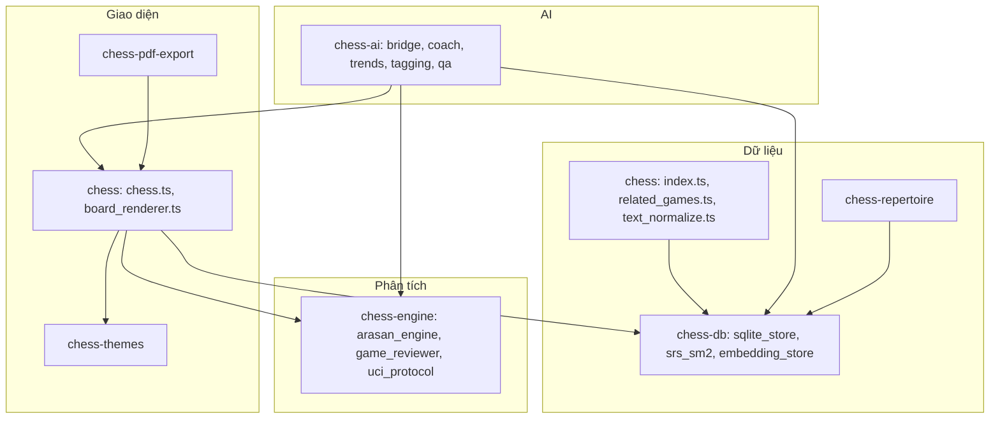

# Đặc Tả Giải Thuật Các Module Cờ Vua (CHESS_MODULES.md)

> **Mục tiêu**: Bản tóm lược các giải thuật, công thức và cấu trúc dữ liệu của hệ sinh thái cờ vua trong **ChessNote**, để tra nhanh khi rà soát hoặc nhân bản.
> **Đã viết lại hoàn toàn** theo mã nguồn tại commit `383bab47be` (2026-09-13). Bản cũ mô tả cấu trúc `plugs/chess/{engine,ai}/` (trước khi tách plug, ADR-005) và **có nhiều công thức/hằng số không khớp mã** (ví dụ ngưỡng CPL, công thức accuracy, điểm ván liên quan, giai đoạn ván) — đừng dùng lại số liệu từ bản cũ.
> Bản đầy đủ có mermaid, phần chức năng, hạn chế: [docs/modules/README.md](modules/README.md).

---

## 1. Bản Đồ Module


```mermaid
graph TD
    subgraph UI["Giao diện"]
        Core["chess: chess.ts, board_renderer.ts"]
        Themes["chess-themes"]
        Pdf["chess-pdf-export"]
    end
    subgraph Analysis["Phân tích"]
        Engine["chess-engine: arasan_engine, game_reviewer, uci_protocol"]
    end
    subgraph Data["Dữ liệu"]
        Idx["chess: index.ts, related_games.ts, text_normalize.ts"]
        DB["chess-db: sqlite_store, srs_sm2, embedding_store"]
        Rep["chess-repertoire"]
    end
    subgraph AI["AI"]
        AIp["chess-ai: bridge, coach, trends, tagging, qa"]
    end
    Core --> Themes
    Core --> Engine
    Core --> DB
    Pdf --> Core
    Rep --> DB
    AIp --> Engine
    AIp --> DB
    AIp --> Core
    Idx --> DB
```

Tất cả lời gọi xuyên plug đi qua **syscall** (`external_syscalls.ts`), không import chéo.

---

## 2. Render Bàn Cờ (`plugs/chess/board_renderer.ts`, `chess.ts`)

* Bàn cờ dựng bằng HTML/CSS lưới 8×8 với SVG quân cờ (không dùng Chessground/Canvas). Bộ quân và màu bàn do `chess-themes` cung cấp; màu áp dụng qua 6 biến CSS `--sq-light`, `--sq-dark`, `--board-border`, `--sq-select`, `--sq-highlight`, `--sq-dest`.
* Hướng nhìn: với `orientation = white` ô hiển thị `(displayRow, displayCol)` ứng với `row = displayRow`, `col = displayCol`; với `black` thì `row = 7 − displayRow`, `col = 7 − displayCol`. Ô sáng khi `(col + (rank − 1)) % 2 === 1`, với `rank = 8 − row`.
* Render tĩnh cho in: `renderStaticBoardHtml(fen, {orientation, title, showFen, pieceSet, boardTheme})`; FEN mở bằng `openChessLenient` (chấp nhận thiếu vua).
* Luật cờ do `chess.js` xử lý; plug chỉ bọc thành syscall `chess.legalMoves`, `chess.applyMove`, `chess.applySan`.
* Chế độ sửa bàn cờ: `boardMap` → FEN; quyền nhập thành chỉ hợp lệ khi vua và xe còn ở ô gốc; ô bắt tốt qua đường suy từ vị trí tốt/bên đi; "Lưu vào trang" thay đúng dòng FEN qua `replaceWidgetBody`.

Chi tiết: [modules/01](modules/01-chess-core.md), [modules/07](modules/07-chess-themes.md).

---

## 3. Động Cơ Arasan & UCI (`plugs/chess-engine/`)

* Mỗi `evalPosition(fen, depth = 12)` tạo instance Emscripten mới; `stdin` = `uci\nisready\nposition fen <FEN>\ngo depth <D>\n`; **không** gửi `quit` (sẽ ngắt tìm kiếm ở độ sâu 1). Thế hết nước đi được xử lý cục bộ.
* `parseUciOutput`: lấy `bestmove`, và từ dòng `info … pv` cuối cùng lấy `depth`, `score cp X` hoặc `score mate X` (mate ghi đè cp), `pv`. Điểm theo góc nhìn bên đang đi.
* Xác suất thắng (Lichess): 

  ```text
  winChance(cp) = 100 / (1 + exp(−0,00368208 × cp))
  ```

  (`cp = 0` → 50; `+300` → ≈ 75,1; `+1000` → ≈ 97,5 — tính lại từ công thức.)
* Điểm mate trong Game Review quy về **±10.000** (không dùng công thức mate cũ trong bản trước).

Chi tiết: [modules/02](modules/02-chess-engine.md).

---

## 4. Game Review (`plugs/chess-engine/game_reviewer.ts`)

Với ván N nước: N+1 lần `evalPosition` **tuần tự**. Với nước `i`:

```text
cpl (Trắng đi) = max(0, scoreBeforeWhite − scoreAfterWhite)
cpl (Đen đi)   = max(0, scoreAfterWhite − scoreBeforeWhite)         // đơn vị centipawn
winLoss        = max(0, winChance(trước) − winChance(sau))            // góc nhìn bên vừa đi
accuracy       = clamp(100 − (Σ winLoss / số nước của bên đó) × 2,2 ; 40 ; 99,5)
```

| Điều kiện (kiểm theo thứ tự) | Loại |
|---|---|
| `i < 6` | `book` |
| `cpl == 0` hoặc trùng nước tốt nhất | `best`; nếu ăn quân (`x` trong SAN) và `|scoreAfterWhite| > 300` → `brilliant` |
| `cpl ≤ 30` | `good` |
| `cpl ≤ 85` | `inaccuracy` |
| `cpl ≤ 180` | `mistake` |
| còn lại | `blunder` |

`great` có trong kiểu dữ liệu nhưng **không được gán ở đâu** trong mã. Không có khái niệm "turning point" theo `Win%` như bản cũ: bước ngoặt là `pickTurningPoints` (mục 7).

---

## 5. Chỉ Mục Ván Cờ (`plugs/chess/index.ts`)

* Sự kiện `page:index` → duyệt các `FencedCode` có `CodeInfo = pgn` → object `chess-game` với `ref = "<trang>@<vị trí khối>"`.
* Trường: `page, pgn, white, black, result, date, eco, event, comments, whiteElo, blackElo, timeControl, opening, variation`.
* Bỏ qua trang template (`meta/template*`, dưới `Library/`) và trang `repertoire` (đi vào `chess-repertoire`).
* Đồng thời ghi SQLite (`chessSql.upsertGames`) với blob FTS5 = `normalize(white black eco event tags chessSummary comments)`.
* Chuẩn hoá: `normalize = (đ→d, Đ→D) → NFD → bỏ dấu kết hợp → chữ thường`; `extractKeywords` bỏ 36 hư từ. (Bản trước thiếu bước `đ→d` nên "Đen" thành từ khoá `en` — đã sửa 2026-09-29, xem [modules/01](modules/01-chess-core.md).)

---

## 6. Ván Liên Quan (`plugs/chess/related_games.ts` + `chessSql.queryRelatedGames`)

```text
điểm = (cùng ECO và ECO không rỗng ? 3 : 0) + (trùng tên người chơi, không phân biệt hoa/thường ? 2 : 0)
```

Giữ `điểm > 0`, sắp giảm dần, lấy **5** (mặc định). Bỏ qua chính trang hiện tại. (Bản cũ ghi 50/20/30/10 và top 3 — **sai**.)

---

## 7. AI (`plugs/chess-ai/`)

* **Chế độ**: `api_key` (mặc định, gọi `api.anthropic.com`, `max_tokens 1024`) hoặc `subscription` (qua `ai-sidecar`).
* **Chống hallucination**: prompt chỉ chứa số liệu engine; kèm `ANTI_HALLUCINATION_RULE`.
* **Bước ngoặt** (`pickTurningPoints`): lọc `blunder|mistake|brilliant|great` → sắp theo `cpl` giảm dần → lấy 10 → sắp lại theo thời gian.
* **Xu hướng**: cache `chess-game-review` (Object Index) → `aggregateTrends`: trung bình accuracy, tổng số nước theo loại, lỗi (`blunder|mistake` trong bước ngoặt) theo giai đoạn (`moveNum ≤ 10` khai cuộc, `≤ 25` trung cuộc, còn lại tàn cuộc) và top 5 ECO. Lưu ý các số này chỉ đếm trong tối đa 10 bước ngoặt mỗi ván.
* **Gắn tag**: đầu ra `TAGS: …` + `TOMTAT: …`; parse nghiêm ngặt, tối đa 4 tag; áp dụng bằng `index.patchFrontmatter` (`tags`, `chessSummary`), gộp không xoá tag cũ.
* **Hỏi đáp**: có embedding → tìm ngữ nghĩa (cosine); không thì FTS5 `bm25` với truy vấn `"kw"* OR …`; tối đa 15 ván; prompt bắt buộc trích dẫn `[[TênTrang]]`.

Chi tiết: [modules/04](modules/04-chess-ai.md).

---

## 8. SQLite, Tìm Kiếm, Ôn Tập (`plugs/chess-db/`)

* 6 bảng: `chess_games`, `ai_annotations`, `ai_annotation_tags`, `repertoire_lines`, `game_embeddings`, `chess_games_fts` (FTS5). CSDL `:memory:`.
* **Bền hoá lịch SRS**: `srs_persist.ts` ghi trạng thái ôn ra `_chess/repertoire-srs.json` (khoá `trang + chuỗi nước SAN`) và khôi phục sau mỗi lần dựng lại DB; embedding thì chưa bền hoá.
* **SM-2 4 nút**: `again` (interval 1, ease −0,2), `hard` (×1,2, ease −0,15), `good` (1 → 6 → `round(interval × ease)`), `easy` (4 → `round(interval × ease × 1,3)`, ease +0,15); ease tối thiểu 1,3, ban đầu 2,5.
* **Embedding**: `Xenova/multilingual-e5-small` (q8), lưu BLOB float32; xếp hạng cosine bằng JS.

Chi tiết: [modules/03](modules/03-chess-db.md), [modules/06](modules/06-chess-repertoire.md).

---

## 9. Xuất PDF (`plugs/chess-pdf-export/pdf_export.ts`)

* Thay các khối `fen`/`pgn`/`puzzle` bằng bàn cờ tĩnh; ván PGN in **một bàn cờ** (thế xuất phát hoặc theo tag `[DisplayMove "N|Nb|last"]`) **cộng toàn bộ nước đi dạng văn bản** — không phải nhiều sơ đồ như bản cũ mô tả.
* Mặc định 2 cột, bàn cờ 400 px (kẹp 150–700); `pdfColumns`, `pdfBoardSize` trong frontmatter ghi đè theo trang.
* Working tree đang khác HEAD (xoá module phân trang) — xem [modules/05](modules/05-chess-pdf-export.md).

---

## 10. Đồng Bộ (`plugs/sync/`, `cloud-server/`)

Thuật toán hai chiều dựa `prior = {localMtime, remoteRev}`: file mới → đẩy/tải; xoá lan truyền khi bên còn lại không đổi; cả hai đổi → **local thắng**, bản remote bị thay thế lưu vào `.conflict-<thời điểm>.md`. Chi tiết và bảng trạng thái: [modules/08](modules/08-sync.md).
