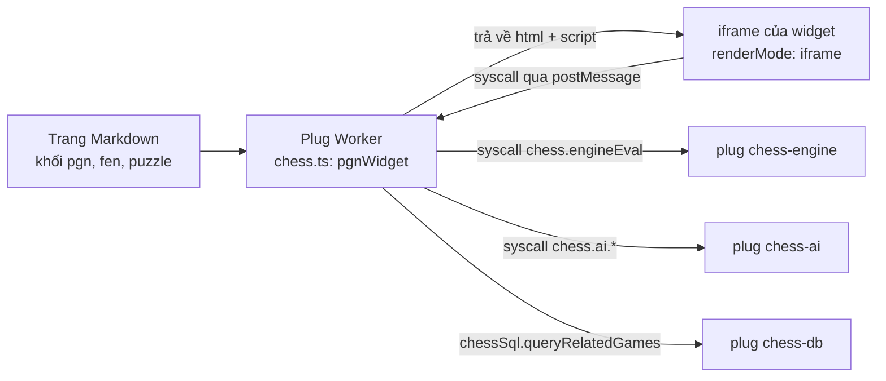
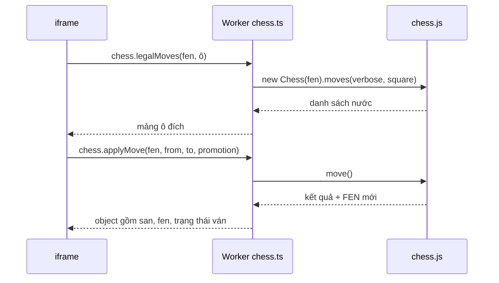
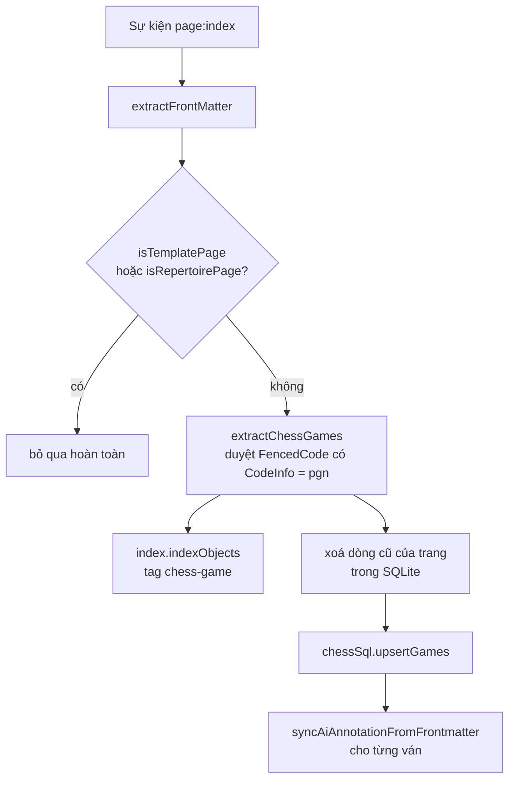

# Module `chess` (lõi) — bàn cờ, chỉ mục ván cờ, ván liên quan

> Tài liệu này mô tả mã nguồn tại commit `383bab47be` (2026-09-13), cộng phần chỉnh sửa chưa commit của `plugs/chess-pdf-export/` (xem [05](05-chess-pdf-export.md)).
> Số dòng lấy bằng `wc -l`; bảng tra cứu đầy đủ ở [TRA-CUU-TU-DONG.md](TRA-CUU-TU-DONG.md).

## Phần A — Chức năng

### Module này làm gì

Đây là **plug nền tảng** của ChessNote: mọi plug cờ vua khác đều dựa vào nó. Nó biến các khối mã trong ghi chú Markdown thành giao diện cờ vua tương tác:

| Bạn viết trong ghi chú | Bạn thấy |
|---|---|
| ` ```fen ` + một chuỗi FEN | Bàn cờ của thế cờ đó, có thể đi thử quân theo luật, lật bàn, xem engine chấm điểm, và **sửa bàn cờ tự do** |
| ` ```pgn ` + biên bản ván đấu | Bàn cờ có nút ◀ ▶ ⏮ ⏭ duyệt từng nước, danh sách nước đi, đồ thị ưu thế, nút phân tích bằng engine, nút AI, danh sách "ván liên quan" |
| ` ```puzzle ` + FEN + lời giải | Bài tập chiến thuật: bạn đi quân, hệ thống chấm đúng/sai, có gợi ý và nút xem đáp án |

Ngoài ra module này **đọc mọi trang ghi chú và ghi nhớ các ván cờ** trong đó (người chơi, kết quả, ngày, mã khai cuộc ECO…) để các tính năng khác (thống kê, tìm kiếm, hỏi AI) có dữ liệu mà dùng.

### Những việc người dùng làm được

- **Xem và đi thử quân**: chỉ đi được nước hợp lệ; quân chọn sẽ hiện các ô có thể đến.
- **Sửa bàn cờ tự do** (nút "✏️ Sửa bàn cờ"): thêm, xoá, kéo-thả quân bất kể luật; chọn bên đi, quyền nhập thành, ô bắt tốt qua đường; dán FEN vào rồi "Tải".
- **"💾 Lưu vào trang"**: ghi vị trí hiện tại ngược vào khối mã trong trang. Không tự lưu — chỉ khi bấm.
- **Đổi giao diện** (nút "🎨 Theme"): 6 bộ quân, 8 màu bàn; có thể đặt làm mặc định cho mọi tài liệu (xem [07](07-chess-themes.md)).
- **Sơ đồ thiếu vua**: FEN chỉ có vài quân (ví dụ minh hoạ "xe kiểm soát những ô nào") vẫn vẽ được, không báo lỗi; nút Engine tự ẩn vì engine cần đủ hai vua.
- **Ván liên quan**: dưới mỗi ván PGN hiện tối đa 5 ván khác cùng mã khai cuộc hoặc cùng người chơi, kèm lý do.

### Điều module này cố ý *không* làm

- Không tự chạy engine hay AI khi mở trang. Việc đắt đỏ luôn cần bạn bấm nút (quyết định ADR-004 trong [MEMORY.md](../../MEMORY.md)).
- Không đánh chỉ mục các trang mẫu (`Library/`, tag `meta/template*`) và trang sổ tay khai cuộc (tag `repertoire`) — vì chúng chứa PGN giả/placeholder.

---

## Phần B — Kỹ thuật

### B.1. Tệp và quy mô

| File | Dòng | Vai trò |
|---|---|---|
| `plugs/chess/chess.ts` | 2.670 | 3 widget (`fenWidget`, `pgnWidget`, `puzzleWidget`) + 3 syscall luật cờ. HTML + script iframe nằm trong template string |
| `plugs/chess/board_renderer.ts` | 873 | `CHESS_CSS`, `renderStaticBoardHtml`, `getChessCss` |
| `plugs/chess/index.ts` | 251 | Indexer `page:index`, `extractChessGames`, `isTemplatePage`, `isRepertoirePage` |
| `plugs/chess/related_games.ts` | 101 | `findRelatedGames`, `buildRelatedGameReasons` |
| `plugs/chess/text_normalize.ts` | 66 | `normalize`, `extractKeywords`, `VI_STOPWORDS` |
| `plugs/chess/fen_utils.ts` | 39 | `openChessLenient`, `isMissingKingOnly`, `hasBothKings` |
| `plugs/chess/external_syscalls.ts` | 181 | Bọc `syscall()` cho mọi phụ thuộc plug khác (ADR-006) |
| `plugs/chess/plug_api.ts` | 41 | Bọc syscall của chính plug này cho plug khác import |
| `plugs/chess/chess.plug.yaml` | 110 | Manifest: 3 widget, 2 event, 8 syscall |

### B.2. Kiến trúc widget (hai thế giới)



- **Worker** (đọc được syscall, không có DOM): parse PGN/FEN bằng `chess.js`, dựng HTML, tra `chessSql`, tra giao diện mặc định.
- **iframe** (có DOM, không có syscall trực tiếp): chạy script vẽ bàn cờ, nghe chuột/bàn phím (`ArrowLeft`/`ArrowRight`), rồi **gọi ngược Worker qua `syscall(...)`** (ví dụ `chess.applyMove`, `chess.legalMoves`, `chess.engineEval`).
- Quy tắc trong `CLAUDE.md`: logic nghiệp vụ ở Worker; iframe chỉ hiển thị. Điều này giải thích vì sao luật cờ (`legalMoves`, `applyMove`, `applySan`) là **syscall** chứ không nằm trong script iframe.
- Giao diện mặc định lưu ở `localStorage` **của iframe** với các khoá `chessnote_default_piece_set`, `chessnote_default_board_theme`, `chessnote_piece_set`, `chessnote_board_theme`; cấu hình toàn cục `chess.pieceSet`/`chess.boardTheme` đọc qua `system.getConfig` (hàm `safeGetConfig` nuốt lỗi và trả mặc định).

### B.3. Ba syscall luật cờ



`applyMove`/`applySan` trả về đối tượng mô tả kết quả (chiếu, chiếu hết, hoà…) qua `describeResult`. Toàn bộ luật (chiếu, ghim, nhập thành, bắt tốt qua đường) do `chess.js` xử lý — mã dự án không tự cài luật.

### B.4. Chế độ sửa bàn cờ (FEN widget)

Thêm ngày 2026-09-13 qua 3 commit (`feat: free-form board editor`, `fix: TDZ crash + castling/en-passant`, `feat: drag-and-drop`, `feat: Lưu vào trang`). Điểm kỹ thuật:

1. Trạng thái bàn ở chế độ sửa là một `boardMap` (ô → quân) trong script iframe; FEN được dựng lại bằng `buildFenBoard(boardMap, activeColor)` + quyền nhập thành + ô en-passant + hai bộ đếm nước.
2. Quyền nhập thành hợp lệ **về hình học** chỉ khi vua và xe còn ở ô gốc; hàm đồng bộ hộp kiểm sẽ vô hiệu hoá ô không hợp lệ và **xoá thật** quyền tương ứng khỏi FEN (không chỉ làm xám).
3. Danh sách ô bắt tốt qua đường được dựng lại theo vị trí tốt/bên đi khả dĩ, giữ lựa chọn hiện tại nếu còn hợp lệ.
4. Comment trong mã ghi rõ một lỗi đã gặp: biến trạng thái phải khai báo **trước** lần vẽ đầu tiên ("TDZ crash") — commit `0d884883`.
5. "Lưu vào trang": hàm `buildSavedBodyText(bodyText, oldFen, newFen)` tìm dòng FEN cũ (so khớp nguyên văn, nếu không thấy thì lấy dòng khác rỗng đầu tiên) rồi thay bằng FEN mới; mọi dòng khác của khối (title, orientation, arrows, highlights, pieceSet, boardTheme…) giữ nguyên. Ghi ngược bằng hàm `globalThis.replaceWidgetBody(cũ, mới)` do khung iframe (`client/components/panel_html.ts`) cấp: nó gửi `postMessage({type: "replaceBody", oldText, newText})` lên cha (`client/codemirror/iframe_widget.ts`); cha **chỉ áp dụng nếu `oldText` vẫn khớp nội dung thật của tài liệu**, nếu không thì từ chối thay vì ghi đè âm thầm một thay đổi vừa xảy ra ở nơi khác. Nếu sandbox không có hàm này, widget hiện lỗi "chưa hỗ trợ ghi ngược vào trang". Không tự động — chỉ khi bấm.

### B.5. Chỉ mục ván cờ (`index.ts`)



- Mỗi khối ` ```pgn ` hợp lệ → một object `chess-game` với `ref = "<trang>@<vị trí khối>"`, `range` là vị trí phần `CodeText`.
- Trường: `page, pgn, white, black, result, date, eco, event, comments, whiteElo, blackElo, timeControl, opening, variation`. `comments` là các chú thích `{...}` trong PGN, nối bằng dấu cách.
- PGN hỏng (đang gõ dở) → `catch` rồi `continue`: chỉ bỏ ván đó, không làm mất phần chỉ mục còn lại của trang.
- `deleteChessGamesForPage` xử lý sự kiện `page:deleted`, vì `page:index` **không bao giờ** bắn cho trang đã xoá.
- **Blob tìm kiếm FTS5** (`buildSearchBlob`): `white, black, eco, event, tags (frontmatter), chessSummary, comments` → nối rồi `normalize` (bỏ dấu, chữ thường). Cùng hàm `normalize` được dùng phía tìm kiếm — phải đồng nhất hai đầu, nếu không index và từ khoá sẽ lệch nhau.
- Indexer **không** chạy engine — comment: "this indexer must stay fast, it runs on every save".

### B.6. Chuẩn hoá tiếng Việt (`text_normalize.ts`)

```text
normalize(s)  = s.normalize("NFD").replace(/\p{Diacritic}/gu, "").toLowerCase()
extractKeywords(q) = tách theo /[^a-z0-9]+/, giữ token dài >= 2,
                     bỏ 36 hư từ trong VI_STOPWORDS, loại trùng
```

**Lỗi cũ (đã sửa 2026-09-29)**: chữ `đ` không phải dấu kết hợp nên `normalize("đối thủ Đại")` từng trả `"đoi thu đai"` (đã tái hiện bằng `node`), rồi `split(/[^a-z0-9]+/)` coi `đ` là ký tự phân cách → `"đối thủ"` thành `['oi','thu']`. Nay `normalize` đổi `đ→d`, `Đ→D` **trước** `NFD` (khớp với `VI_STOPWORDS` vốn đã giả định `đã→da`, `để→de`, `đó→do`), nên `"Đen đối thủ"` → `"den doi thu"`. Có 3 test mới trong `text_normalize.test.ts`.

### B.7. Ván liên quan

Chấm điểm nằm trong SQL (`chessSql.queryRelatedGames`, xem [03](03-chess-db.md)):

```text
điểm = (eco khớp và không rỗng ? 3 : 0) + (chung tên người chơi, không phân biệt hoa/thường ? 2 : 0)
```

Chỉ giữ `điểm > 0`, sắp giảm dần, mặc định lấy 5. Phần chữ "lý do" (`buildRelatedGameReasons`) được **dựng lại bằng TypeScript** để test được bằng vitest mà không cần WASM. Tên placeholder `""`, `white`, `black` được coi là không có ý nghĩa (`PLACEHOLDER_NAMES`). Loại trừ theo **trang**, không theo `ref` (giả định mỗi trang một ván).

### B.8. Ràng buộc từ Worker sandbox

- Không gọi `window`/`document` trong phần Worker; mọi thứ qua `syscall`.
- Mã trong template string của iframe là chuỗi JS thuần: không được import module, chỉ dùng dữ liệu đã `JSON.stringify` truyền vào (ví dụ `PIECE_SETS`, `solutionMoves`).

---

## Điểm cần lưu ý và hạn chế

**Thiết kế**
- `chess.ts` 2.670 dòng gồm HTML/CSS/JS trong template string. Script iframe không chạy được trong vitest (không có DOM thật), nên `chess.test.ts` (25 test) dùng các mẹo gián tiếp: kiểm tra script sinh ra **không có lỗi cú pháp JS** (kể cả với FEN thiếu vua), kiểm tra các hàm thuần được trích ra (`computeCastlingAvailability`, `computeEnPassantCandidates`, `buildSavedBodyText`, `placeEditPiece`/`eraseEditPiece`/`moveEditPiece`), và kiểm tra script có nối dây kéo-thả. Hành vi kéo-thả thật, vẽ SVG, `localStorage` chỉ kiểm bằng trình duyệt.
- Cả ba widget đều đọc/ghi cùng các khoá `localStorage` (các dòng 355, 1521 và cụm tương ứng của puzzle) — mã lặp lại, sửa một nơi cần sửa cả ba.
- Giả định "mỗi trang một ván" trong ván liên quan: trang có nhiều ván chỉ bị loại trừ theo `page`, nên ván khác cùng trang không bao giờ được gợi ý.

**Vận hành**
- Sau khi build lại plug, điều hướng lại trang **không chắc** nạp bundle mới — phải gọi `system.reloadPlugs` (bài học ghi ở memory dự án).
- `console.log` bên trong Worker của plug **không** thấy được qua công cụ Chrome; muốn chẩn đoán phải trả thông tin qua giá trị của syscall.
- Bản mobile (Capacitor) ẩn các tính năng cần server; tính năng AI báo "cần bản Web hoặc Desktop".

**Đã sửa**
- Lỗi mất chữ `đ` khi tách từ khoá (xem B.6) — sửa ở `normalize`, dùng chung cho cả phía index (blob FTS5) lẫn phía tìm, nên hai đầu vẫn đồng nhất. Test đơn vị xanh; **chưa** chạy thử trọn vẹn qua FTS5 trên trình duyệt. Blob FTS5 nằm trong SQLite bộ nhớ và được dựng lại mỗi lần tải nên không cần migrate dữ liệu cũ.
- Comment ở đầu `related_games.ts` nhắc tới `chess_sql_store.ts` — file này đã chuyển thành `plugs/chess-db/sqlite_store.ts` sau ADR-006; comment chưa cập nhật.

## Đường dẫn tham chiếu nhanh

| Muốn xem… | Mở file |
|---|---|
| Widget bàn cờ, chế độ sửa, puzzle | **`plugs/chess/chess.ts`** |
| CSS bàn cờ, render tĩnh cho in | `plugs/chess/board_renderer.ts` |
| Vì sao trang mẫu/sổ tay không vào chỉ mục | **`plugs/chess/index.ts`** (`isTemplatePage`, `isRepertoirePage`) |
| Công thức điểm ván liên quan | `plugs/chess/related_games.ts`, `plugs/chess-db/sqlite_store.ts` (`queryRelatedGames`) |
| Chuẩn hoá và hư từ tiếng Việt | `plugs/chess/text_normalize.ts` |
| FEN thiếu vua | `plugs/chess/fen_utils.ts` |
| Test | `plugs/chess/*.test.ts` |
