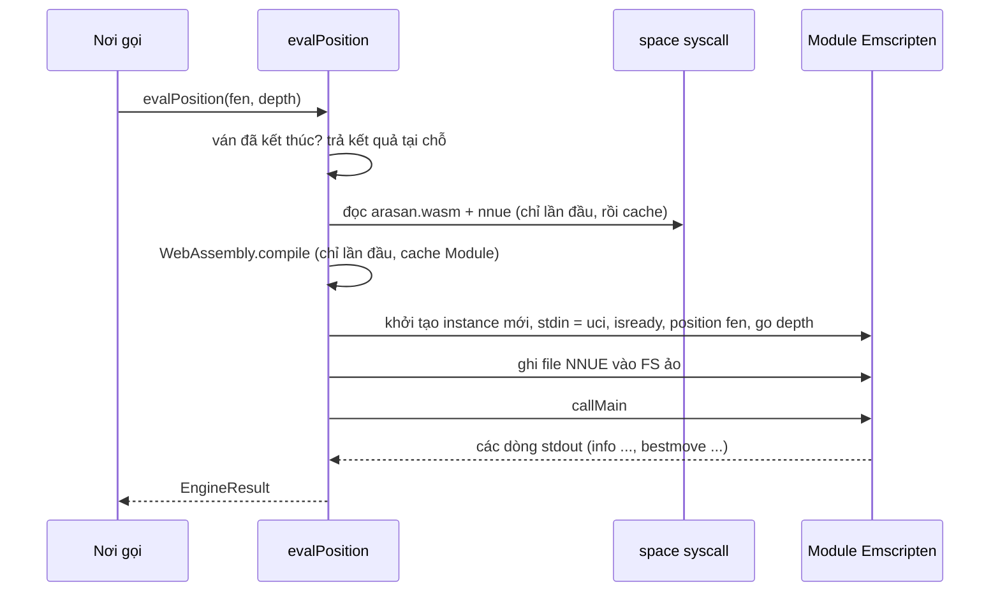
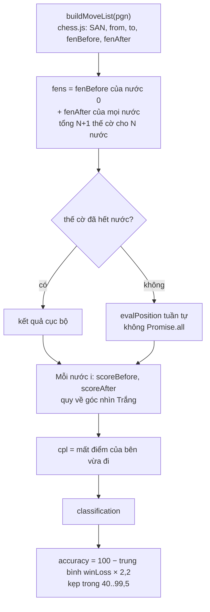

# Module `chess-engine` — động cơ Arasan WASM và Game Review

> Tài liệu này mô tả mã nguồn tại commit `383bab47be` (2026-09-13). Bảng số liệu: [TRA-CUU-TU-DONG.md](TRA-CUU-TU-DONG.md).

## Phần A — Chức năng

### Module này làm gì

Cho ChessNote một **"giám khảo cờ vua thật"** chạy ngay trong trình duyệt/ứng dụng, không cần mạng:

1. **Chấm điểm một thế cờ** ("Engine Eval"): cho biết ai đang hơn và nước đi tốt nhất.
2. **Phân tích cả ván đấu** ("Game Review"): xét từng nước đi, xếp loại (Tốt nhất / Ổn / Thiếu chính xác / Sai lầm / Sai lầm nghiêm trọng…), tính **độ chính xác %** cho mỗi bên và vẽ đồ thị ưu thế.
3. Cung cấp **số liệu thật** cho các tính năng AI. Đây là nền của nguyên tắc chống "AI bịa": AI không tự nhận xét thế cờ, chỉ diễn giải con số do engine tính.

### Điều người dùng cần biết

- Engine là **Arasan** (giấy phép MIT, dùng mạng nơ-ron NNUE), đã biên dịch sang WebAssembly.
- Phân tích một ván **mất thời gian thật**: đo được khoảng 0,5 giây mỗi thế cờ ở độ sâu 12 (theo comment trong mã, đo trên một thế trung cuộc phức tạp vừa) → một ván dài có thể mất hàng chục giây. Vì vậy nó luôn nằm sau nút bấm, không tự chạy.
- Hai file dữ liệu engine (~26 MB) được **nhúng sẵn trong bản build** ChessNote chuẩn; bản tuỳ biến lược bỏ chúng sẽ thấy thông báo "Không tìm thấy file engine Arasan".

---

## Phần B — Kỹ thuật

### B.1. Tệp

| File | Dòng | Vai trò |
|---|---|---|
| `plugs/chess-engine/arasan_engine.ts` | 208 | `evalPosition(fen, depth)`, cache byte/module, lỗi `EngineNotInstalledError` |
| `plugs/chess-engine/game_reviewer.ts` | 280 | `buildMoveList`, `reviewGame`, phân loại và tính accuracy |
| `plugs/chess-engine/uci_protocol.ts` | 88 | `parseUciInfoLine`, `centipawnsToWinChance`, `formatScore` |
| `plugs/chess-engine/plug_api.ts` | 39 | Bọc syscall + `isEngineNotInstalledError` cho plug khác |
| `plugs/chess-engine/wasm/arasan.mjs` | 3.285 | Mã keo Emscripten (sinh tự động, không sửa tay) |
| `libraries/Library/Chess/arasan.wasm`, `arasanv8-20260906.nnue` | — | Nhị phân engine + mạng NNUE (nằm ngoài plug) |

Syscall cung cấp: `chess.engineEval`, `chess.reviewGame`, `chess.engine.buildMoveList`.

### B.2. Cách engine chạy (mỗi lần gọi một instance mới)



Chi tiết quan trọng, đều lấy từ comment trong mã:

- **Không có tiến trình bền**: mỗi `evalPosition` tạo *instance* Emscripten mới, nạp lệnh UCI qua hàng đợi `stdin()` đồng bộ, đọc kết quả qua `Module.print`. Ghi lại file NNUE ~25 MB mỗi lần.
- **Cố ý KHÔNG gửi `quit`**: Arasan kiểm tra stdin giữa các vòng lặp deepening; một `quit` đã nằm sẵn trong hàng đợi làm engine dừng ngay sau độ sâu 1 ("verified: removing it lets a depth-12 search actually reach depth 12"). Hàng đợi hết thì `stdin()` trả EOF, engine coi như `quit` và thoát sạch.
- **Tối ưu 2026-09-13** (commit `perf(chess): cache compiled WASM module`): cache thêm `WebAssembly.Module` đã compile để mỗi lần chỉ *link* chứ không *compile* lại ~925 KB. Chưa cache `instance` hay FS ảo — "thay đổi kiến trúc vòng đời lớn hơn, cố ý để lại".
- **Thế cờ hết nước** (chiếu hết/hoà cờ): trả kết quả ngay bằng chess.js, không hỏi engine, vì đầu ra UCI của trường hợp này không phân tích được. Chiếu hết → `mateIn = -1`, `scoreCp = null`; hoà → `scoreCp = 0`.
- WASM cần **SIMD128** (lớp đầu vào thưa của NNUE) — không có bản dự phòng không SIMD (theo comment đầu file).

### B.3. Phân tích dòng UCI

`parseUciOutput` duyệt các dòng, lấy **dòng `info ... pv` cuối cùng** làm kết quả: `depth`, `score cp X` hoặc `score mate X` (mate ghi đè cp), `pv`. `bestmove` lấy token thứ hai. `EngineResult.scoreCp` là điểm **theo góc nhìn bên đang đi**.

Công thức xác suất thắng (Lichess), trong `uci_protocol.ts`:

```text
winChance(cp) = 100 / (1 + exp(-0,00368208 × cp))        // phần trăm 0..100
```

(Comment trong mã ghi công thức dạng `50 + 50 × (2/(1+exp(-k·cp)) − 1)` — hai dạng này bằng nhau về đại số; hàm thực tế dùng dạng gọn.)

### B.4. Thuật toán `reviewGame(pgn, depth = 12)`



**Quy đổi điểm**: `toWhiteCp` đổi điểm engine (góc nhìn bên đi) sang góc nhìn Trắng; mate quy thành ±10.000 (chỉ dấu người thắng quan trọng, không cần khoảng cách mate).

**CPL** (centipawn loss, luôn ≥ 0):
```text
Trắng đi:  cpl = max(0, scoreBeforeWhite − scoreAfterWhite)
Đen đi:    cpl = max(0, scoreAfterWhite − scoreBeforeWhite)
```
Điểm *trước* nước đi đã phản ánh giá trị nước tốt nhất của engine nên dùng làm mốc chuẩn.

**Phân loại** (đúng thứ tự kiểm tra trong mã):

| Điều kiện | Loại |
|---|---|
| `i < 6` (6 nửa nước đầu, tức 3 nước đầu mỗi bên) | `book` |
| `cpl == 0` hoặc `san == bestMoveSan` | `best`; nếu nước đó là **ăn quân** (`san` chứa `x`) và `|scoreAfterWhite| > 300` → `brilliant` |
| `cpl ≤ 30` | `good` |
| `cpl ≤ 85` | `inaccuracy` |
| `cpl ≤ 180` | `mistake` |
| còn lại | `blunder` |

**Độ chính xác** mỗi bên:
```text
winLoss(nước) = max(0, winChance(trước) − winChance(sau))      // theo góc nhìn bên vừa đi
accuracy = clamp( 100 − (Σ winLoss / số nước) × 2,2 ,  40 ,  99,5 )   // làm tròn 1 chữ số
```

`advantageGraph` = mảng `{moveIdx, score}` với `score` là điểm sau nước đó theo góc nhìn Trắng.

### B.5. Thứ tự bước trong review

`reviewGame` chạy **tuần tự** có chủ ý: mỗi lần gọi tạo WASM instance + ghi ~25 MB NNUE, chạy song song chỉ làm tăng đỉnh bộ nhớ/CPU mà không nhanh hơn (WASM đơn luồng đã chiếm hết một lõi).

---

## Điểm cần lưu ý và hạn chế

**Thiết kế**
- Điểm mate quy thành ±10.000 nên một nước làm mất mate (từ "thắng chắc" xuống "hơn 3 tốt") có CPL rất lớn; còn nước đi từ M3 sang M5 vẫn cho CPL 0. Đây là hệ quả của phép quy đổi, không phải bug.
- `brilliant` chỉ dựa trên **ăn quân + đang hơn > 3 tốt**, không kiểm tra hy sinh thật hay nước duy nhất. Nhãn `great` có trong kiểu `MoveClassification` nhưng **không nhánh nào gán nó** (đã đọc toàn bộ hàm) — luôn bằng 0.
- Độ sâu cố định 12, không có "thời gian tối đa" hay hủy giữa chừng.
- `book` cứng 6 nửa nước đầu, **không** tra sách khai cuộc thật.

**Vận hành**
- Comment khai báo `MoveClassification` từng ghi ngưỡng `inaccuracy 30–75`, `mistake 75–150`, `blunder > 150`, nhưng mã dùng **85 / 180** (tài liệu cũ chép theo comment). Đã sửa comment cho khớp mã và ghi chú `great` chưa được gán (2026-09-29); lấy **mã** làm chuẩn.
- Lỗi `EngineNotInstalledError` mất định danh class khi đi qua ranh giới syscall Worker (chỉ `.message` sống sót) — nên nơi gọi phải so khớp chuỗi thông báo bằng `isEngineNotInstalledError()` (ADR-005/006).
- Mỗi lượt ghi NNUE 25 MB vào FS ảo tốn bộ nhớ tạm; tối ưu tái dùng instance chưa làm.

**Điều đáng ngờ (chưa chạy thử)**
- Ngưỡng CPL cố định theo centipawn không tính đến điểm số tuyệt đối (mất 100cp khi đang +10 khác hẳn khi đang 0). Accuracy dùng win% đã bù phần nào, nhưng phân loại thì không.

## Đường dẫn tham chiếu nhanh

| Muốn xem… | Mở file |
|---|---|
| Vòng đời engine, cache, lỗi thiếu file | **`plugs/chess-engine/arasan_engine.ts`** |
| Phân loại nước, công thức accuracy | **`plugs/chess-engine/game_reviewer.ts`** |
| Công thức win%, parse `info` | `plugs/chess-engine/uci_protocol.ts` |
| Vì sao engine không nằm trong bundle plug | comment đầu `arasan_engine.ts`, `docs/plans/2026-09-07-danh-gia-va-ke-hoach-hoan-thien-chessnote.md` |
| Test | `plugs/chess-engine/*.test.ts` |
