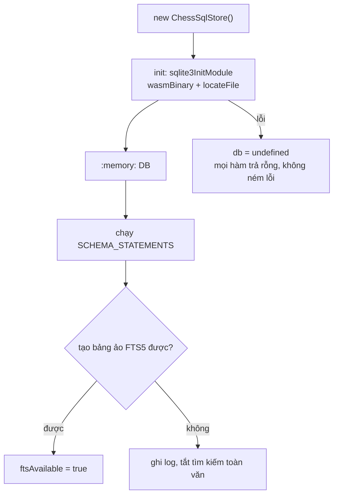
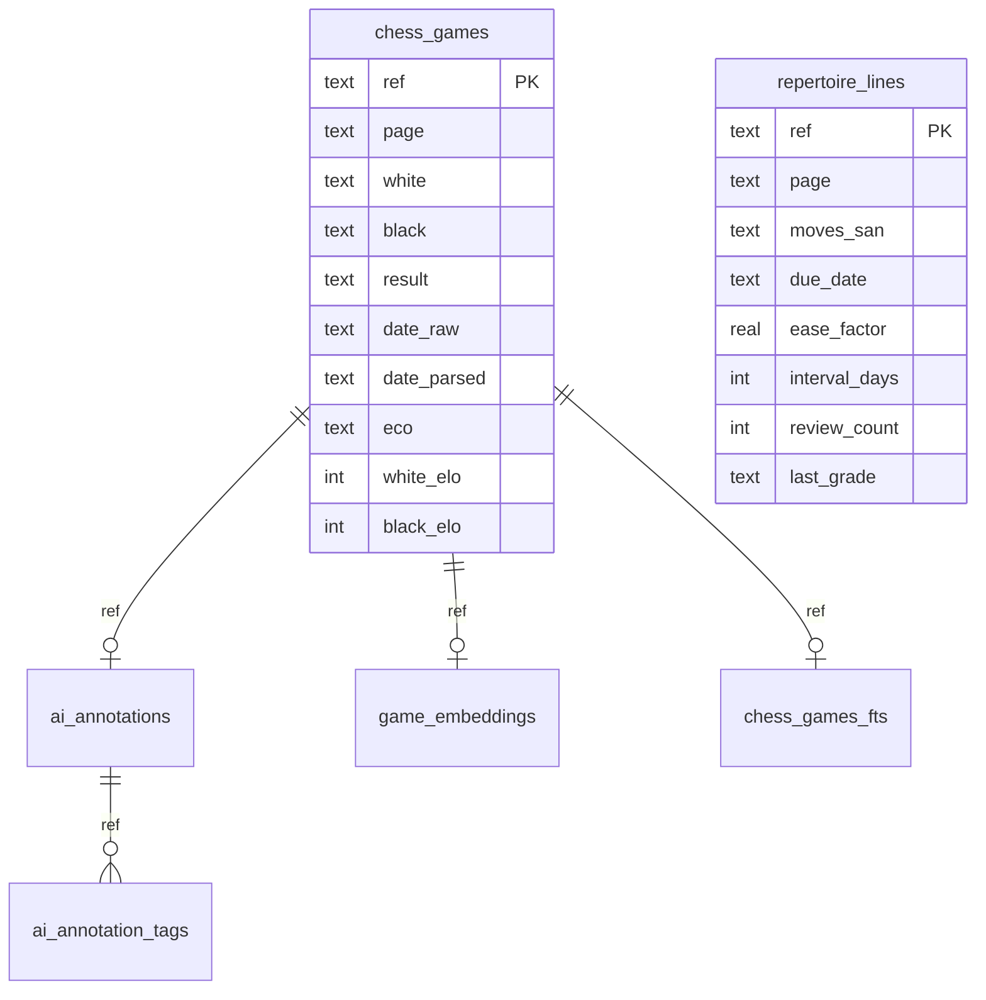
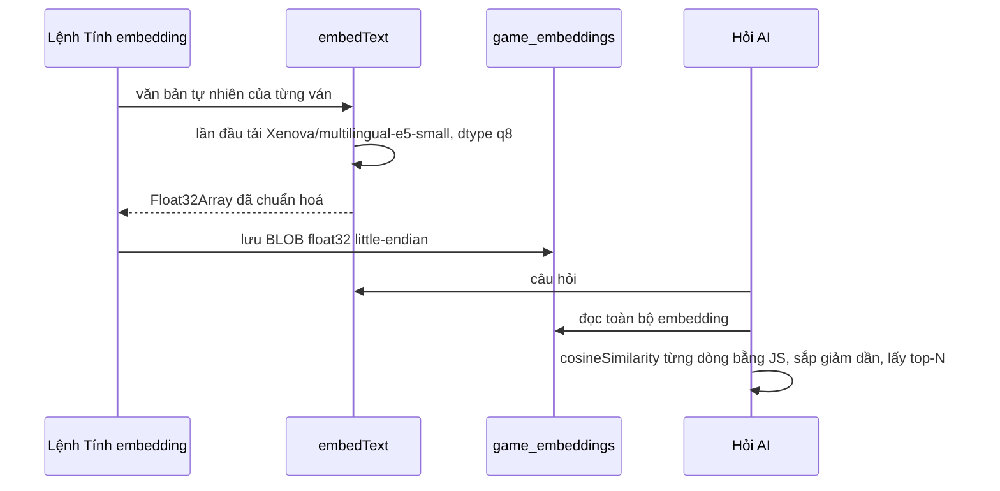
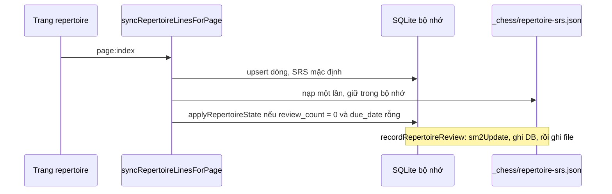

# Module `chess-db` — cơ sở dữ liệu SQLite WASM, tìm kiếm toàn văn, embedding

> Tài liệu này mô tả mã nguồn tại commit `383bab47be` (2026-09-13). Bảng số liệu: [TRA-CUU-TU-DONG.md](TRA-CUU-TU-DONG.md).

## Phần A — Chức năng

### Module này làm gì

Cho ChessNote một **cơ sở dữ liệu thật (SQLite) chạy ngay trong trình duyệt**, để làm được những việc mà "chỉ mục đối tượng" của SilverBullet (quét tuần tự rồi lọc trong bộ nhớ) làm không nổi hoặc làm chậm:

| Việc | Ví dụ |
|---|---|
| **Thống kê khai cuộc** | "Tôi chơi bao nhiêu ván mỗi mã ECO, thắng/hoà/thua ra sao?" — gộp nhóm bằng SQL |
| **Tìm kiếm toàn văn** | Gõ câu hỏi tự nhiên, tìm ván có tên người chơi, giải đấu, tag, tóm tắt, chú thích |
| **Ván liên quan** | Chấm điểm nhanh "cùng khai cuộc / cùng người chơi" |
| **Lưu kết quả AI có cấu trúc** | Tóm tắt, tag, model đã tạo, thời điểm tạo |
| **Sổ tay khai cuộc + lịch ôn tập** | Mỗi biến khai cuộc có lịch ôn theo thuật toán SM-2 |
| **Tìm theo ngữ nghĩa** | Hiểu ý câu hỏi (không chỉ khớp từ) bằng embedding |

### Điều người dùng cần biết

- Dữ liệu này là **bộ nhớ đệm**, dựng lại từ các khối ` ```pgn ` mỗi lần mở lại ứng dụng. File ghi chú của bạn luôn là nguồn sự thật.
- **Lịch ôn khai cuộc (SRS) được lưu ra file `_chess/repertoire-srs.json` trong Space** (từ 2026-09-29) nên còn nguyên sau khi tải lại và được đồng bộ sang thiết bị khác. **Embedding đã tính thì vẫn nằm trong bộ nhớ**: sau khi tải lại phải chạy lại lệnh "Chess: Tính embedding ngữ nghĩa" (trong lúc đó "Hỏi AI" tự dùng tìm kiếm toàn văn).
- Tính năng embedding cần tải một mô hình AI (vài chục MB) lần đầu.

---

## Phần B — Kỹ thuật

### B.1. Tệp

| File | Dòng | Vai trò |
|---|---|---|
| `plugs/chess-db/sqlite_store.ts` | 953 | Lớp `ChessSqlStore`: schema, mọi truy vấn SQL |
| `plugs/chess-db/index.ts` | 235 | Hàm phẳng cho manifest (`syscall:` cần `path` là hàm export thường) + logic `search` embedding |
| `plugs/chess-db/embedding_store.ts` | 78 | `embedText`, `cosineSimilarity`, đổi Float32 ⇄ byte |
| `plugs/chess-db/srs_sm2.ts` | 84 | `sm2Update` |
| `plugs/chess-db/srs_persist.ts` | 63 | Bền hoá lịch SRS ra file `_chess/repertoire-srs.json` (thuần, test được) |
| `plugs/chess-db/chess_pgn_date.ts` | 23 | `parsePgnDateToIso` |
| `plugs/chess-db/chess_pgn_fields.ts` | 11 | `parseEloToInt` |
| `plugs/chess-db/plug_api.ts` | 172 | Bọc syscall cho plug khác |

Syscall: nhóm `chessSql.*` (14) và `chessEmbedding.*` (3) — liệt kê đầy đủ ở bảng tra cứu tự động.

### B.2. Khởi tạo & vòng đời



- Cơ sở dữ liệu **`:memory:`**, không OPFS ("cross-platform OPFS support is uneven").
- **Nuốt lỗi khởi tạo có chủ đích**: nếu WASM không khởi tạo được, mọi phương thức trả rỗng/no-op để không làm hỏng việc đánh chỉ mục trang.
- **Hai lỗi lịch sử rất khó thấy** (ADR-006 trong [MEMORY.md](../../MEMORY.md)): (1) `sqlite3InitModule()` ném `TypeError: Invalid URL` trong Worker vì `import.meta.url` không hợp lệ trong ngữ cảnh `blob:` → sửa bằng `locateFile: (path) => path`; lỗi bị nuốt khiến `db` mãi `undefined`, trông y hệt "dữ liệu không bền". (2) `bm25(f)` dùng bí danh thay vì `bm25(chess_games_fts)` → `no such column: f`, chỉ lộ sau khi sửa lỗi (1).

### B.3. Lược đồ (6 bảng)



Các cột còn lại của `chess_games`: `event, summary, time_control, opening, variation`. Chỉ mục: `idx_chess_games_page`, `idx_chess_games_eco`, `idx_ai_annotation_tags_tag`, `idx_repertoire_due`, `idx_repertoire_page`, `idx_game_embeddings_page`. `chess_games_fts` là `fts5(ref UNINDEXED, blob)`.

### B.4. Các truy vấn chính

**Tìm toàn văn** (`searchGames`): mỗi từ khoá thành `"kw"*` (khớp tiền tố), nối bằng `OR`, xếp bằng `bm25(chess_games_fts)`, giới hạn `LIMIT ?`; nội dung đưa vào FTS là "blob" đã bỏ dấu. Trả rỗng nếu không có FTS5 hoặc không có từ khoá.

**Thống kê khai cuộc** (`queryOpeningStats`): `GROUP BY eco ORDER BY total DESC`. Điều kiện `(white = ? OR black = ?)` so khớp tên **chính xác, phân biệt hoa/thường** (không có `COLLATE NOCASE`, khác với truy vấn ván liên quan). `wins`/`losses` tính theo **màu quân người đó cầm** (`white = tên AND result = '1-0'` hoặc `black = tên AND result = '0-1'`…). `draws` đếm `result = '1/2-1/2'`; `total = COUNT(*)` nên ván kết quả `*` (chưa kết thúc) vào `total` nhưng không vào thắng/hoà/thua. Mã ECO rỗng hiển thị là `(không rõ)`. Tuỳ chọn `sinceDate` so với `date_parsed >= ?`; ngày PGN không đầy đủ (`2026.??.??`) có `date_parsed = NULL` nên **bị loại khi có lọc ngày**, nhưng vẫn được đếm khi không lọc.

**Ván liên quan** (`queryRelatedGames`):
```sql
SELECT * FROM (
  SELECT page, white, black, result, eco,
    (CASE WHEN eco = ? AND ? != '' THEN 3 ELSE 0 END) +
    (CASE WHEN (tên1 IS NOT NULL AND (white = tên1 COLLATE NOCASE OR black = tên1 COLLATE NOCASE))
            OR (tên2 IS NOT NULL AND (white = tên2 COLLATE NOCASE OR black = tên2 COLLATE NOCASE))
          THEN 2 ELSE 0 END) AS score
  FROM chess_games WHERE page != ?
) WHERE score > 0 ORDER BY score DESC LIMIT ?
```

**Chú thích AI** (`ai_annotations` + `ai_annotation_tags`): hai đường ghi tách bạch —
- `upsertAiAnnotation`: gọi ngay sau khi AI sinh nội dung; ghi cả `confidence`, `model_version`, `generated_at`.
- `syncAiAnnotationFromFrontmatter`: gọi mỗi lần đánh chỉ mục lại trang; chỉ đồng bộ `summary` và tag theo frontmatter, **không đụng** `confidence/model_version/generated_at` (những trường đó không có bản tương đương trong frontmatter nên không suy lại được).

**Sổ tay khai cuộc** (`repertoire_lines`): `syncRepertoireLinesForPage` **không** xoá-rồi-thêm như `chess_games`. Nó upsert các dòng hiện có (giữ nguyên `due_date`, `ease_factor`, `interval_days`, `review_count`, `last_grade` của `ref` đã tồn tại) rồi chỉ xoá các `ref` của trang không còn trong danh sách. Nếu danh sách rỗng (trang đang gõ dở) thì **bỏ qua bước dọn dẹp** để không xoá oan tiến độ.

### B.5. Embedding và tìm kiếm ngữ nghĩa



- Mô hình: `Xenova/multilingual-e5-small` (hỗ trợ tiếng Việt, ONNX lượng tử `q8`), tải qua transformers.js từ CDN (HuggingFace/jsDelivr) **theo yêu cầu** lần đầu, không đóng gói vào bundle. Comment trong mã ghi rõ: đây là phần **chưa được kiểm chứng trên trình duyệt thật** trong phiên viết.
- Xếp hạng là **quét toàn bộ + cosine bằng JS**, không có chỉ mục vector: không dựa vào `sqlite-vec` vì chưa xác minh tương thích WASM.
- `bytesToFloat32` sao chép sang buffer mới vì dữ liệu đọc từ sqlite-wasm không đảm bảo căn hàng 4 byte.

### B.6. SM-2 biến thể 4 nút (`srs_sm2.ts`)

Trạng thái ban đầu: `easeFactor 2,5`, `intervalDays 0`, `reviewCount 0`; sàn `easeFactor = 1,3`.

| Nút | `reviewCount` | `intervalDays` | `easeFactor` |
|---|---|---|---|
| `again` | về 0 | 1 | −0,2 (không dưới 1,3) |
| `hard` | +1 | `max(1, round(interval × 1,2))` | −0,15 (không dưới 1,3) |
| `good` | +1 | lần 1 → 1; lần 2 → 6; sau đó `round(interval × ease)` | giữ nguyên |
| `easy` | +1 | lần 1 → 4; sau đó `round(interval × ease × 1,3)` | +0,15 |

`dueDate = hôm nay + intervalDays` (định dạng `YYYY-MM-DD`, tính theo `toISOString()` tức UTC).

### B.7. Bền hoá lịch SRS (thêm 2026-09-29)



- File `_chess/repertoire-srs.json` nằm trong Space nên **được đồng bộ** (plug `sync`) sang thiết bị khác.
- **Khoá theo nội dung** `srsKey(page, movesSan)` (trang + chuỗi nước SAN, ngăn cách bằng ký tự NUL), không theo `ref` (`ref` chứa vị trí khối trong trang nên đổi khi người dùng thêm chữ phía trên). Hệ quả: sửa nước đi của một biến thì biến đó coi như biến mới (lịch về mặc định).
- `applyRepertoireState` chỉ ghi khi `review_count = 0 AND due_date IS NULL` — không đè lên kết quả ôn mới hơn trong phiên.
- Lỗi đọc/ghi file chỉ ghi log (`console.error`), không làm hỏng đánh chỉ mục hay lượt ôn; nội dung file hỏng → bỏ qua từng mục sai (`parseSrsState`).
- Hai thiết bị cùng ôn rồi đồng bộ sẽ cho xung đột file JSON (đường `.conflict` chung của `sync`); chưa có bước gộp theo từng khoá.

---

## Điểm cần lưu ý và hạn chế

**Thiết kế**
- Toàn bộ dữ liệu SQL là **cache trong bộ nhớ**, dựng lại từ PGN mỗi lần tải: đúng với `chess_games`/FTS, nhưng `repertoire_lines` và `game_embeddings` chứa **trạng thái không dựng lại được từ trang** (lịch SRS, vector đã tính). Comment ở schema nói rõ đây là "review STATE" và bảo vệ nó khi *lưu trang*. Khi *tải lại* cả DB bị xoá: lịch SRS nay được khôi phục từ file bền hoá (B.7); embedding thì chưa.
- Tìm ngữ nghĩa quét toàn bộ embedding mỗi câu hỏi (O(số ván)) — ổn ở quy mô cá nhân, chậm khi hàng chục nghìn ván.
- `parsePgnDateToIso` chỉ chuyển ngày đầy đủ đúng dạng `YYYY.MM.DD`; ngày thiếu phần nào không lọc được theo `sinceDate`.

**Vận hành**
- Bản build không có FTS5 → tìm kiếm toàn văn tắt âm thầm (chỉ ghi log console).
- Secret-scanning của GitHub từng chặn push `chessnote-plug-db` vì một chuỗi hex trong mã minify của `@huggingface/transformers` (dương tính giả) — chủ tài khoản phải tự xác nhận trên GitHub.
- `Chess: Kiểm tra dữ liệu SQLite (debug)` (`chessSql.debugDump`) là công cụ chẩn đoán khi nghi ngờ DB rỗng; xem [04](04-chess-ai.md).

**Điều đáng ngờ (chưa chạy thử)**
- **Embedding vẫn mất khi tải lại** (chỉ lịch SRS đã được bền hoá) → "Hỏi AI" tự rơi về FTS5 cho tới khi chạy lại "Chess: Tính embedding ngữ nghĩa".
- **Chưa kiểm thử trên trình duyệt thật**: `applyRepertoireState`/`getRepertoireLinesForPage` cần SQLite WASM nên không chạy được trong vitest; chỉ phần thuần (`srs_persist.ts`, 7 test) được kiểm tự động. Cần thử tay: ôn 1 biến → F5 → mở lại `Chess: Ôn tập khai cuộc`, xác nhận biến đó không còn đến hạn ngay.
- *(Đã xử lý 2026-09-29, giữ lại để hiểu lịch sử)* **Mất tiến độ SRS khi tải lại**: đọc mã thì `new sqlite3.oo1.DB(":memory:")` + không có bước nạp lại trạng thái từ nơi nào khác → sau mỗi lần mở lại, `syncRepertoireLinesForPage` tạo lại dòng với giá trị mặc định (`due_date` rỗng…). Tôi **chưa** chạy ứng dụng để xác nhận. Tài liệu kế hoạch (`docs/plans/2026-09-11-dbms-huong-dan-demo-kiem-tra.md`, dòng 286) cũng nói "SQLite tự mất khi tải lại trang". Nếu đúng, tính năng ôn tập khai cuộc thực chất chỉ có lịch trong phiên làm việc. Cần một giải pháp bền (OPFS, hoặc ghi trạng thái ra một trang/file trong Space).
- `queryOpeningStats` so khớp tên bằng `=` phân biệt hoa/thường, nên "nguyen van a", "Nguyen Van A" và "Nguyễn Văn A" là ba người khác nhau. (Đọc từ truy vấn SQL; chưa chạy thử.)

## Đường dẫn tham chiếu nhanh

| Muốn xem… | Mở file |
|---|---|
| Schema, mọi truy vấn SQL | **`plugs/chess-db/sqlite_store.ts`** |
| Danh sách hàm bọc thành syscall | `plugs/chess-db/index.ts`, `plugs/chess-db/chess-db.plug.yaml` |
| Mô hình embedding, cosine | `plugs/chess-db/embedding_store.ts` |
| Thuật toán lịch ôn | **`plugs/chess-db/srs_sm2.ts`** |
| Lý do thiết kế / quyết định | `docs/plans/2026-09-11-dbms-sqlite-wasm-tich-hop.md` |
| Cách kiểm thử thủ công | `docs/plans/2026-09-11-dbms-huong-dan-demo-kiem-tra.md` |
