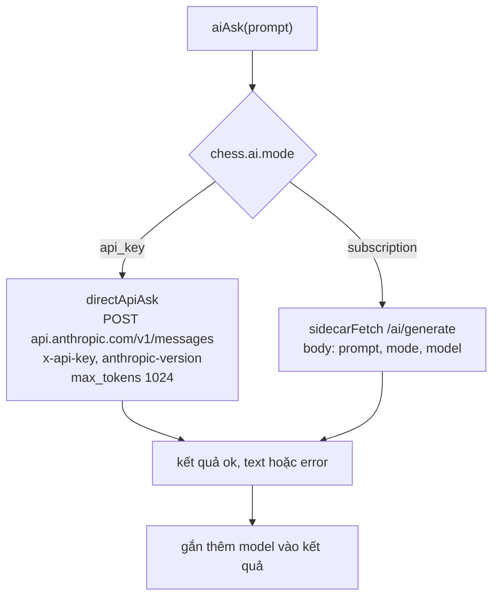
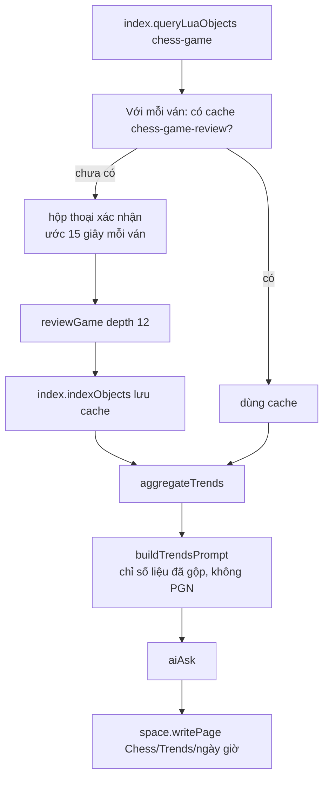
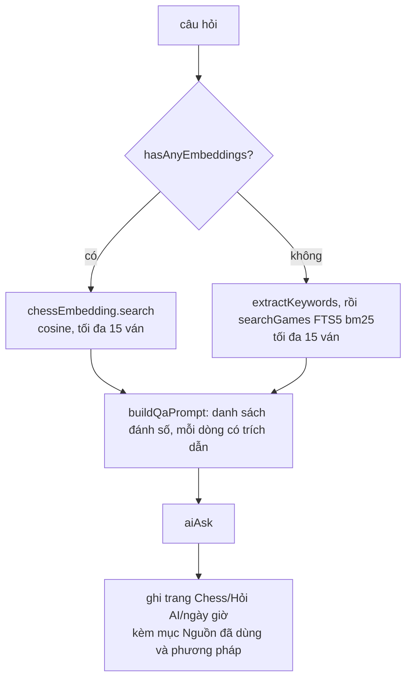

# Module `chess-ai` — AI Coach, xu hướng, gắn tag, hỏi đáp, thống kê

> Tài liệu này mô tả mã nguồn tại commit `383bab47be` (2026-09-13). Bảng số liệu: [TRA-CUU-TU-DONG.md](TRA-CUU-TU-DONG.md).

## Phần A — Chức năng

### Module này làm gì

Bộ **trợ lý thông minh** của ChessNote, gồm sáu việc:

| Tính năng | Bạn làm gì | Bạn nhận được |
|---|---|---|
| **AI giải thích nước đi** | Bấm nút trên một nước trong ván PGN | 2–4 câu tiếng Việt giải thích vì sao nước đó tốt/xấu |
| **AI bình luận cả ván** | Bấm nút bình luận trên widget PGN | Bài bình luận theo các bước ngoặt của ván |
| **Phân tích xu hướng** | Lệnh `Chess: Phân tích xu hướng` | Trang báo cáo: độ chính xác trung bình, lỗi theo giai đoạn (khai/trung/tàn cuộc) và theo mã ECO, kèm nhận xét AI |
| **AI gợi ý tag + tóm tắt** | Bấm "🏷️ AI Gợi ý tag" trên widget, rồi "Áp dụng" | Tag và một câu tóm tắt được ghi vào ghi chú |
| **Hỏi AI** | Lệnh `Chess: Hỏi AI`, gõ câu hỏi | Câu trả lời có dẫn nguồn `[[Tên trang]]` từ các ván của bạn |
| **Thống kê khai cuộc** | Lệnh `Chess: Thống kê khai cuộc` | Bảng thắng/hoà/thua theo mã ECO (không dùng AI) |

### Nguyên tắc cốt lõi: AI không tự nhận xét thế cờ

Mọi nhận xét về nước đi đều dựa trên **số liệu do engine Arasan tính** (điểm, CPL, nước tốt nhất). AI chỉ **diễn giải** con số — mỗi câu lệnh gửi AI đều kết thúc bằng một quy tắc cấm bịa thêm nước đi/biến thể ngoài số liệu. Khi phân tích nhiều ván, AI thậm chí **không được thấy PGN**, chỉ thấy số liệu đã gộp.

### Hai chế độ nguồn AI

- **`api_key`** (mặc định): dùng API key Anthropic của bạn, gọi thẳng `api.anthropic.com`. Không cần chạy thêm chương trình nào.
- **`subscription`**: dùng gói Claude Pro/Max cá nhân qua chương trình phụ `ai-sidecar` (xem [09](09-ai-sidecar.md)). Nâng cao, cần đăng nhập.

### Điều cần biết

- Việc đắt (chạy engine, gọi AI) **luôn cần bạn bấm** — không tự chạy khi lưu trang.
- Không chạy được trên bản mobile ("cần bản Web hoặc Desktop").
- Báo cáo sinh ra là **trang ghi chú mới**: `Chess/Trends/…`, `Chess/Hỏi AI/…`, `Chess/Thống kê khai cuộc/…` (tên có ngày giờ, không dùng dấu `:` vì Windows không cho phép).

---

## Phần B — Kỹ thuật

### B.1. Tệp

| File | Dòng | Vai trò |
|---|---|---|
| `plugs/chess-ai/bridge.ts` | 334 | Chọn đường gọi AI theo `chess.ai.mode`, đăng nhập sidecar, khai báo 5 khoá cấu hình |
| `plugs/chess-ai/coach.ts` | 159 | Prompt giải thích nước / bình luận ván, `pickTurningPoints`, `ANTI_HALLUCINATION_RULE` |
| `plugs/chess-ai/trends.ts` | 398 | Cache review, gộp số liệu, báo cáo xu hướng |
| `plugs/chess-ai/tagging.ts` | 149 | Prompt gợi ý tag, parse nghiêm ngặt, ghi frontmatter |
| `plugs/chess-ai/qa.ts` | 146 | Hỏi-đáp trên kho ván (truy xuất + prompt) |
| `plugs/chess-ai/opening_stats.ts` | 113 | Lệnh thống kê khai cuộc (SQL) |
| `plugs/chess-ai/semantic_index.ts` | 107 | Lệnh tính embedding theo lô |
| `plugs/chess-ai/debug_dump.ts` | 126 | Lệnh chẩn đoán SQLite |
| `plugs/chess-ai/external_syscalls.ts` | 210 | Bọc syscall sang các plug khác |
| `plugs/chess-ai/engine_review_types.ts`, `chess_game_types.ts` | 44 / 24 | Kiểu dữ liệu sao chép để không import xuyên plug |

### B.2. Đường gọi AI (`bridge.ts`)



- Cả hai đường đi qua **cơ chế proxy `/.proxy/`** của server Rust (proxy tổng quát, không giới hạn host) để tránh CORS.
- `aiAsk` luôn trả kèm `model` (giá trị đã gửi) vì `tagging.ts` cần ghi model nào đã tạo chú thích; cả hai đường đều không tự trả model về.
- Khoá cấu hình (định nghĩa bằng `config.define` khi `editor:init`): `chess.ai.mode` (`api_key`|`subscription`, mặc định `api_key`), `chess.ai.apiKey`, `chess.ai.sidecarUrl` (mặc định `http://127.0.0.1:3457`), `chess.ai.sidecarToken`, `chess.ai.model` (mặc định `claude-haiku-4-5-20251001`).
- Ở `api_key` mode, ID model **phải** là ID API hợp lệ; ở `subscription` CLI tự hiểu cả bí danh.
- Lệnh đăng nhập/đăng xuất/trạng thái: chỉ có nghĩa ở `subscription`; ở `api_key` chỉ hướng dẫn nhập key.

### B.3. Prompt và chống hallucination (`coach.ts`)

```text
ANTI_HALLUCINATION_RULE = "Chỉ dựa DUY NHẤT vào số liệu được cung cấp ở trên — KHÔNG suy diễn,
KHÔNG bịa thêm nước đi, biến thể, hay tình huống nào ngoài số liệu đó."
```

- `buildExplainMovePrompt` đưa vào: nhãn nước (`12.. Nf6`), loại theo engine (bản dịch trong `CLASSIFICATION_VI`), CPL, nước tốt nhất theo engine, điểm trước/sau (đơn vị quân Tốt, góc nhìn bên vừa đi), FEN trước/sau.
- `pickTurningPoints(moves)`: lọc `blunder|mistake|brilliant|great` → sắp theo `cpl` giảm dần → lấy **10** → sắp lại theo thời gian để AI kể mạch lạc.
- Tất cả prompt dựng ở **Worker** (không trong iframe): logic thuần nên test được không cần mock.

### B.4. Phân tích xu hướng (`trends.ts`)



**Cache bằng Object Index, không dùng frontmatter (ADR-002)**: đối tượng `chess-game-review` dùng chung `ref` với `chess-game`. Bộ vá YAML của dự án không an toàn với cấu trúc lồng nhau (`whiteStats`, `turningPoints`), nên không ghi vào file ghi chú. Bonus: khi trang được lưu lại, `index.clearFileIndex()` tự xoá cache của trang đó — không cần cơ chế phát hiện "PGN đã đổi".

**`aggregateTrends`**:
- `avgWhiteAccuracy`, `avgBlackAccuracy`: trung bình cộng qua các ván đã review.
- `errorCounts`: cộng dồn `whiteStats` + `blackStats` của mọi ván theo từng loại.
- `phaseErrorCounts`: duyệt `turningPoints` **chỉ loại `blunder`/`mistake`**, phân giai đoạn theo `classifyPhase(moveNum)`: `≤ 10` → `opening`; `≤ 25` → `middlegame`; còn lại `endgame` ("chỉ đủ để nhóm thô, không phải phân tích cấu trúc thế cờ").
- `ecoErrorCounts`: cộng lỗi mỗi ván vào mã ECO của ván, sắp giảm dần, lấy **5**.

### B.5. Gợi ý tag (`tagging.ts`)

- Prompt yêu cầu **đúng khuôn**: `TAGS: tag1, tag2…` và `TOMTAT: <câu>` (tối đa 4 tag, mỗi tag 1–3 từ không dấu nối bằng gạch ngang; tóm tắt ≤ 25 từ).
- `parseTagSuggestion` **nghiêm ngặt**: thiếu một trong hai dòng, hoặc tag/tóm tắt rỗng → `null` → báo lỗi "AI trả lời sai định dạng, không tự áp dụng được", **không đoán mò** áp vào ghi chú.
- `applyTagSuggestion` (chỉ khi bấm "Áp dụng"): đọc trang → **gộp** tag mới vào tag cũ (không xoá, so sánh không phân biệt hoa/thường) → vá frontmatter bằng `index.patchFrontmatter` (`tags`, `chessSummary`) → ghi trang → gọi `chessSql.upsertAiAnnotation` cho từng ván trên trang, với `confidence = null` ("không bịa số giả").

### B.6. Hỏi AI (`qa.ts`)



- `MAX_CONTEXT_GAMES = 15`. `citationLine` = `[[trang]] — Trắng: … — Đen: … — Kết quả: … — ECO: … — <tóm tắt>`.
- Prompt bắt buộc: chỉ dựa danh sách, mỗi ván nhắc tới phải trích đúng `[[TênTrang]]`, danh sách trống thì nói rõ không tìm thấy.
- Không dùng `plug-api/lib/fuzzy.ts` `rank()`: hàm đó khớp kiểu **AND mọi từ** nên loại sạch ứng viên ngay khi câu hỏi tự nhiên có một từ không khớp ("tôi", "tại sao").

### B.7. Lệnh khác

- **Thống kê khai cuộc** (`opening_stats.ts`): hỏi tên người chơi (điền sẵn từ `chess.playerName`) và ngày bắt đầu `YYYY-MM-DD` (không hợp lệ thì bỏ lọc, có cảnh báo) → `chessSql.queryOpeningStats` → ghi trang.
- **Tính embedding** (`semantic_index.ts`): xác nhận (lần đầu tải mô hình) → mỗi ván: `buildEmbeddingText` (văn bản tự nhiên, **không** bỏ dấu, khác blob FTS) → `chessEmbedding.computeForGame`. Ván lỗi bị bỏ qua và đếm.
- **Debug SQLite** (`debug_dump.ts`): xuất nội dung các bảng để chẩn đoán.

---

## Điểm cần lưu ý và hạn chế

**Thiết kế**
- Xu hướng theo giai đoạn dựa trên `turningPoints` (≤ 10 điểm mỗi ván, chỉ khi thuộc bốn loại được chọn) nên `phaseErrorCounts` và `ecoErrorCounts` **chỉ đếm trong tối đa 10 bước ngoặt mỗi ván** (những nước mất nhiều điểm nhất), không phải tổng số lỗi thật. Ván dài nhiều sai lầm bị đếm thiếu; ngược lại `errorCounts` (cộng từ `whiteStats`/`blackStats`) đếm đủ mọi nước — hai nhóm số liệu này không cùng thang.
- Giai đoạn ván xác định theo số nước (≤10 / ≤25), không theo thế cờ.
- `confidence` của chú thích AI luôn `null` (chưa có tín hiệu).

**Vận hành**
- **Bảo mật API key**: ở `api_key` mode, key được lưu như một giá trị cấu hình thường trong Space (đọc bằng `config.get("chess.ai.apiKey")`) và gửi qua proxy của server ChessNote. Ai đọc được Space (hoặc log proxy) có thể lấy key. Chưa thấy cơ chế mã hoá riêng cho khoá này (đọc từ `bridge.ts`; chưa rà soát hết phía server).
- Điều kiện dùng `subscription` thuộc ranh giới điều khoản của nhà cung cấp; comment trong `chess.ai.mode` nêu "chỉ hợp lệ cho một người dùng là chính chủ tài khoản".
- Mỗi lần "Hỏi AI" tạo một trang mới trong `Chess/Hỏi AI/` — sẽ đầy dần.
- `max_tokens: 1024` cố định ở đường `api_key`.

**Điều đáng ngờ**
- *(Đã sửa 2026-09-29)* Lỗi chữ `đ` trong `extractKeywords`/`normalize` từng làm từ khoá như "Đen" thành `en` — xem [01](01-chess-core.md), mục B.6.
- Ước lượng "15 giây mỗi ván" trong hộp thoại xác nhận là số cứng trong mã; thực tế phụ thuộc số nước và máy (comment ở [02](02-chess-engine.md) đo ~0,5 giây/thế ở độ sâu 12).

## Đường dẫn tham chiếu nhanh

| Muốn xem… | Mở file |
|---|---|
| Chọn `api_key`/`subscription`, khoá cấu hình | **`plugs/chess-ai/bridge.ts`** |
| Nội dung prompt, quy tắc chống bịa | **`plugs/chess-ai/coach.ts`** |
| Cách gộp số liệu nhiều ván, cache review | `plugs/chess-ai/trends.ts` |
| Định dạng `TAGS/TOMTAT`, ghi frontmatter | `plugs/chess-ai/tagging.ts` |
| Truy xuất + trích dẫn nguồn | `plugs/chess-ai/qa.ts` |
| Test | `plugs/chess-ai/*.test.ts` |
| Kế hoạch gốc | `docs/plans/05-phase-5-ai-agents-subscription.md`, `docs/plans/2026-09-09-ai-pham-vi-rong-nhieu-ghi-chu.md` |
