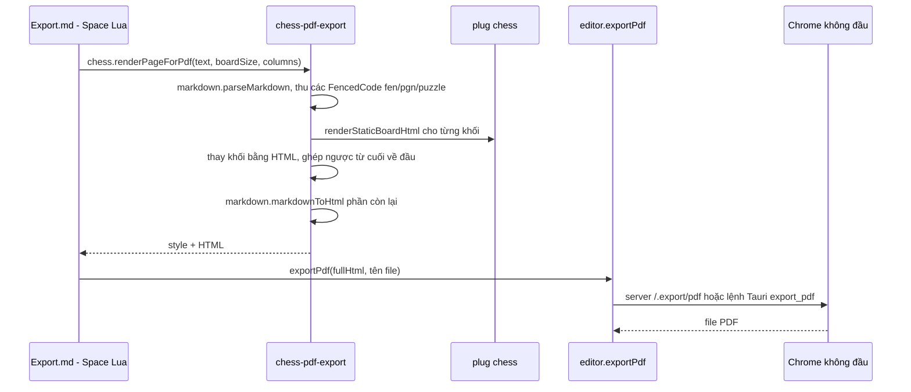

# Module `chess-pdf-export` — xuất trang ghi chú ra PDF có bàn cờ tĩnh

> Tài liệu này mô tả mã nguồn tại commit `383bab47be` (2026-09-13) **cộng phần chỉnh sửa chưa commit** trong working tree (xem B.5). Số dòng lấy từ working tree.

## Phần A — Chức năng

### Module này làm gì

Khi bạn xuất một trang ghi chú ra PDF, các khối ` ```fen `, ` ```pgn `, ` ```puzzle ` — vốn là widget tương tác — được đổi thành **bàn cờ tĩnh** (hình vẽ cố định) để in đẹp trên giấy A4. Phần văn bản xung quanh giữ nguyên.

### Tuỳ chỉnh được

| Tuỳ chọn | Mặc định | Cách đặt |
|---|---|---|
| Số cột | 2 | `pdfExport.columns` trong cấu hình, hoặc `pdfColumns: 1` trong frontmatter của trang |
| Cỡ bàn cờ | 400 px (kẹp trong 150–700) | `pdfExport.boardSize`, hoặc `pdfBoardSize: <px>` trong frontmatter |
| Bộ quân, màu bàn | `merida`, `textbook` | dòng `| pieceSet:` / `| boardTheme:` trong khối `fen`, hoặc tag `[PieceSet "…"]` / `[BoardTheme "…"]` trong PGN |
| Thế cờ hiển thị của ván PGN | thế xuất phát | tag `[DisplayMove "17"]`, `"17b"`, `"last"` trong PGN |

Bản in không hiện chuỗi FEN dưới bàn cờ (bàn cờ đã thể hiện thế cờ) và có đánh số trang tự động.

### Điều cần biết

- Chức năng này **không có trên mobile** (cần Chrome không đầu — `headless Chrome` — ở server hoặc ứng dụng desktop).
- Ván PGN in ra là **một bàn cờ + toàn bộ nước đi dạng văn bản**, không phải chuỗi nhiều bàn cờ.

---

## Phần B — Kỹ thuật

### B.1. Tệp

| File | Dòng | Vai trò |
|---|---|---|
| `plugs/chess-pdf-export/pdf_export.ts` | 421 | `renderPageForPdf` + CSS in + render từng loại khối |
| `plugs/chess-pdf-export/pdf_export.test.ts` | 313 | 25 test case |
| `plugs/chess-pdf-export/external_syscalls.ts` | 29 | Gọi `chess.renderStaticBoardHtml`, `chess.getCss`, `chess.engine.buildMoveList` |
| `libraries/Library/Std/Infrastructure/Export.md` | — | Lệnh Space Lua nối `chess.renderPageForPdf` với `editor.exportPdf` |

Syscall cung cấp: `chess.renderPageForPdf(text, boardSize?, columns?)`.

### B.2. Luồng xuất PDF



- **Thay thế từ cuối về đầu** (`replacements.sort(b.from - a.from)`) để vị trí các khối đứng trước không bị lệch khi chuỗi dài ra/ngắn lại.
- Hình học bàn cờ tĩnh (`renderStaticBoardHtml` trong `plugs/chess/board_renderer.ts`): duyệt lưới 8×8 theo hướng nhìn; ô sáng khi `(col + rank − 1) % 2 === 1`; toạ độ hạng vẽ ở cột hiển thị đầu, toạ độ cột ở hàng hiển thị cuối; FEN được mở bằng `openChessLenient` (chấp nhận thiếu vua).
- Ba loại khối: `fen` (dòng đầu là FEN, các dòng `| key: value` là tuỳ chọn, chấp nhận nhiều bí danh: `pieceSet|pieces`, `boardTheme|theme|board`), `puzzle` (chỉ `fen`, `hint` có ý nghĩa khi in), `pgn` (tiêu đề `Trắng vs Đen (kết quả)`, thế cờ theo `DisplayMove`).

### B.3. Thuật toán `DisplayMove`

`resolveDisplayMove(moves, tagValue)`:
1. Không có tag hoặc không có nước đi → giữ thế xuất phát.
2. `"last"` → nước cuối cùng.
3. Khớp `^(\d+)\s*(w|b)?$` (không phân biệt hoa/thường): số nước + bên (`w` mặc định) → tìm nước trùng đúng.
4. Không có nước trùng (nhập sai hoặc vượt quá số nước): lấy **nước gần nhất trước đó** ("close enough input still does something sensible").
5. Trả `{ entry, label }`, nhãn kiểu `sau nước 17` hoặc `sau nước đen 17`; bàn cờ hiển thị `entry.fenAfter`.

### B.4. Hình học in

`@page { size: A4; margin: 0.4in 0.4in 0.6in 0.4in }`. Bàn cờ dùng `aspect-ratio: 1/1`, lưới 8 cột × 8 hàng, `break-inside: avoid` (cộng bản có tiền tố WebKit), tiêu đề `break-after: avoid`, đoạn văn `orphans/widows: 3`. Bảng màu in ép về nền sáng (`--bg-panel #ffffff`, `--text-main #111111`) vì CSS gốc của widget mặc định theo chủ đề tối.

### B.5. Trạng thái chưa commit — quan trọng

Working tree hiện **xoá** `pdf_pagination.ts` (187 dòng) và `pdf_pagination.test.ts` (162 dòng) và đơn giản hoá `pdf_export.ts` (`git diff --stat`: 92 dòng thêm, 637 dòng xoá qua 5 file). Ở commit `383bab47be` (HEAD), thuật toán này vẫn còn:

- **Phiên bản HEAD (đã bỏ trong working tree)**: *tiền phân trang phía server*. Vì `Page.printToPDF` của Chrome không tôn trọng ổn định `break-inside: avoid` khi phần tử nằm trong bố cục nhiều cột CSS đang bị chia trang ("hai ngữ cảnh phân mảnh lồng nhau" — hạn chế đã biết của Blink), module quyết định trước cột/trang, sau đó mỗi trang là một hàng flex các `<div>` cột (`.pdf-page`/`.pdf-col`). Hình học dùng khổ A4 8,27×11,69 in, lề 0,4/0,4/0,4/0,6 in, 96 px/in, khoảng cách cột 24 px, biên an toàn 40 px, ước lượng chiều cao từng khối để xếp.
- **Phiên bản working tree (đang có)**: quay lại `column-count: 2; column-fill: auto` thuần CSS; khối luôn `break-inside: avoid`. `Export.md` cũng được sửa mô tả cho khớp và bỏ khối CSS nội tuyến trong bản Lua.

Không có commit nào ghi lý do đảo ngược. **Chưa kiểm chứng** phiên bản nào ổn định hơn khi in; nên xác nhận với chủ dự án trước khi commit (lịch sử: `fix(pdf): enforce 1:1 aspect ratio and strict page break avoidance for chessboards` ngày 2026-09-10; pagination thêm trong commit `feat(ui): add document tab bar…`, ngày 2026-09-11).

---

## Điểm cần lưu ý và hạn chế

**Thiết kế**
- Ván PGN in một bàn cờ tĩnh; muốn in nhiều thế cờ của một ván phải viết nhiều khối `fen`.
- `DisplayMove` là tag PGN tự đặt; chess.js giữ tag lạ nhưng không nơi nào khác dùng.

**Vận hành**
- Trên Windows, xuất PDF cần đặt `SB_CHROME_DATA_DIR` tới một đường dẫn tuyệt đối đơn giản (ví dụ `C:\Users\<tên>\chessnote-chrome-data`); thư mục mặc định trong Space (có dấu chấm đầu, lồng sâu) làm Chrome/Edge lặng lẽ thoát exit code 21 (ghi trong `CLAUDE.md` và memory dự án).
- Trong Docker, `SB_CHROME_DATA_DIR=/tmp/chrome-data` và `CHROMIUM_PATH=/usr/bin/chromium-browser` (xem `docker-compose.dokploy.yml`).
- Không có trên mobile (`if not system.isCapacitor()` trong `Export.md`).

**Điều đáng ngờ**
- Working tree đang lệch HEAD (xem B.5): `Export.md` ở HEAD còn nhắc đường dẫn `plugs/chess/pdf_pagination.ts` — đường dẫn này **đã lỗi thời** từ khi tách plug (ADR-005), tức mô tả ở HEAD vốn đã sai đường dẫn.

## Đường dẫn tham chiếu nhanh

| Muốn xem… | Mở file |
|---|---|
| Chuyển khối thành HTML in | **`plugs/chess-pdf-export/pdf_export.ts`** |
| Lệnh xuất PDF, cấu hình cột/cỡ | **`libraries/Library/Std/Infrastructure/Export.md`** |
| Bàn cờ tĩnh | `plugs/chess/board_renderer.ts` (`renderStaticBoardHtml`) |
| Chrome không đầu phía server | `server-runtime-chrome/src/pool.rs`, `server/src/pdf.rs` |
| Chrome phía desktop | `desktop/src-tauri/src/lib.rs` (`export_pdf`) |
| Bản có tiền phân trang | `git show HEAD:plugs/chess-pdf-export/pdf_pagination.ts` |
