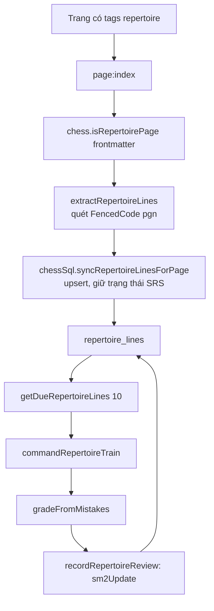

# Module `chess-repertoire` — sổ tay khai cuộc và ôn tập ngắt quãng (SRS)

> Tài liệu này mô tả mã nguồn tại commit `383bab47be` (2026-09-13). Thuật toán lịch ôn và bảng SQL nằm ở [03](03-chess-db.md).

## Phần A — Chức năng

### Module này làm gì

Giúp bạn **học thuộc hệ thống khai cuộc** của mình:

1. Bạn viết một trang **Sổ tay khai cuộc** từ mẫu `Opening_Repertoire` (có sẵn trong thư viện): mỗi biến là một khối ` ```pgn ` riêng, đặt tên bằng tag `[Variation "…"]`.
2. ChessNote tự nhận ra các biến này và đưa vào hàng đợi ôn tập.
3. Lệnh **`Chess: Ôn tập khai cuộc`** đưa từng biến đến hạn ra hỏi: bạn nhập nước tiếp theo bạn nghĩ đúng, hệ thống báo đúng/sai, rồi **tự xếp lịch ôn lại** — nhớ tốt thì lâu mới gặp lại, sai nhiều thì gặp lại sớm.

### Cách chấm điểm một lượt ôn

| Kết quả một biến | Nút chấm | Ý nghĩa |
|---|---|---|
| Bỏ cuộc giữa chừng (để trống) | `again` | học lại từ đầu, hẹn mai |
| 0 lỗi | `easy` | khoảng ôn dài |
| 1 lỗi | `good` | khoảng ôn vừa |
| ≥ 2 lỗi | `hard` | khoảng ôn ngắn |

Mỗi phiên tối đa **10** biến. Dù bạn đoán đúng hay sai, hệ thống luôn đi tiếp đúng nước trong sổ tay — đây là bài kiểm tra trí nhớ một biến cụ thể, không phải một ván đấu mở.

### Hạn chế hiện tại (nói thẳng)

- Giao diện ôn tập v1 chỉ là **hộp nhập văn bản** (gõ SAN, ví dụ `Nf3`), chưa có bàn cờ kéo-thả. Đây là lựa chọn có chủ đích vì lúc viết không kiểm chứng được giao diện đồ hoạ.
- Lịch ôn được lưu ra file `_chess/repertoire-srs.json` trong Space (từ 2026-09-29), nên còn sau khi tải lại và theo bạn sang thiết bị khác qua đồng bộ; xem [03](03-chess-db.md), mục B.7. Sửa nước đi của một biến thì biến đó tính như biến mới.

---

## Phần B — Kỹ thuật

### B.1. Tệp

| File | Dòng | Vai trò |
|---|---|---|
| `plugs/chess-repertoire/index.ts` | 110 | `extractRepertoireLines`, `indexRepertoireLines` (sự kiện `page:index`) |
| `plugs/chess-repertoire/trainer.ts` | 114 | `gradeFromMistakes`, `commandRepertoireTrain` |
| `plugs/chess-repertoire/external_syscalls.ts` | 75 | Bọc `chessSql.*` và `chess.isRepertoirePage` |
| `libraries/Library/Chess/Templates/Opening_Repertoire.md` | — | Mẫu trang sổ tay |

### B.2. Luồng dữ liệu



- Một trang chỉ đi vào **một** trong hai indexer: `indexChessGames` (plug `chess`) bỏ qua trang `repertoire`, còn `indexRepertoireLines` chỉ xử lý trang `repertoire` — để PGN giả ("Repertoire Master") không làm bẩn thống kê, xu hướng, ván liên quan, hỏi đáp.
- `side`, `eco`, `openingName` lấy từ **frontmatter của trang** (một trang = một khai cuộc); `variationName` lấy từ tag `[Variation]` của **từng khối**.
- **Quyết định thiết kế**: mỗi biến là một khối PGN riêng, **không** dùng biến thể ngoặc đơn (RAV) của PGN vì chess.js không giữ RAV khi `loadPgn()`/`history()`. Đổi lại phải lặp tiền tố nước đi ở mỗi khối.
- `ref = "<trang>@<vị trí khối>"`; `movesSan = chess.history().join(" ")`; khối PGN hỏng hoặc không có nước bị bỏ qua.
- Hàng đợi: `WHERE due_date IS NULL OR due_date <= date('now') ORDER BY due_date ASC LIMIT ?` — dòng chưa ôn bao giờ (`NULL`) đứng đầu (SQLite xếp `NULL` trước khi `ASC`).

### B.3. Vòng ôn một biến (`trainLine`)

Với mỗi nước `expected` (SAN) của biến: hỏi bằng `editor.prompt` (kèm FEN hiện tại và ký hiệu `12.` hoặc `12...`); để trống → trả `{ gaveUp: true }`; so sánh `guess.trim().toLowerCase() === expected.toLowerCase()`; sai thì `mistakes++` và báo nước đúng; sau đó **luôn** `chess.move(expected)` để tiếp tục.

Điểm cần chú ý: so khớp **không phân biệt hoa/thường**, nên `nf3` được coi đúng với `Nf3`, nhưng cũng nghĩa là `bxc3` và `Bxc3` (hai nước khác nhau: tốt ăn / tượng ăn) **bị coi là như nhau**. Đây là hệ quả của `toLowerCase()` trên cả hai vế (đọc từ mã; chưa chạy thử).

---

## Điểm cần lưu ý và hạn chế

**Thiết kế**
- Ôn bằng gõ SAN: người dùng phải thuộc ký hiệu cờ vua chuẩn; ký hiệu có dấu `+`/`#`/`=Q` phải gõ đúng y như trong sổ tay (so khớp chuỗi thẳng, không chuẩn hoá SAN).
- Không có xem trước thống kê tiến độ (số biến đã thuộc, sắp đến hạn).

**Vận hành**
- Chỉ dùng được trên Web/Desktop nếu `chess-db` chạy được (SQLite WASM).

**Điều đáng ngờ**
- `toLowerCase()` làm `bxc3` ≡ `Bxc3` (xem B.3). Ít gặp trong thực tế vì cùng ô đích hiếm khi cả tốt và tượng đều ăn được, nhưng có thể xảy ra.
- Lịch SRS đã bền hoá nhưng **chưa thử trên trình duyệt thật** (phần khôi phục cần SQLite WASM) — xem [03](03-chess-db.md).

## Đường dẫn tham chiếu nhanh

| Muốn xem… | Mở file |
|---|---|
| Cách trích biến từ trang | **`plugs/chess-repertoire/index.ts`** |
| Chấm điểm và vòng ôn | **`plugs/chess-repertoire/trainer.ts`** |
| Thuật toán lịch ôn | `plugs/chess-db/srs_sm2.ts` |
| Bảng `repertoire_lines` | `plugs/chess-db/sqlite_store.ts` |
| Mẫu trang sổ tay | `libraries/Library/Chess/Templates/Opening_Repertoire.md` |
