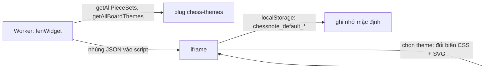

# Module `chess-themes` — bộ quân cờ và màu bàn cờ

> Tài liệu này mô tả mã nguồn tại commit `383bab47be` (2026-09-13). Đây là plug **không phụ thuộc plug cờ vua nào khác** — nên là plug đầu tiên portable thật sự (ADR-005); sau ADR-006 cả 7 plug đều cài độc lập được lên SilverBullet gốc.

## Phần A — Chức năng

### Module này làm gì

Cung cấp diện mạo cho mọi bàn cờ: **6 bộ quân** và **8 màu bàn**, phù hợp cả màn hình lẫn in sách báo.

| Bộ quân | Phong cách |
|---|---|
| `merida` (mặc định) | Chuẩn giáo khoa, sách báo, ChessBase, Informant |
| `alpha` | Diagram kinh điển sách cờ châu Âu (Eric Bentzen) |
| `leipzig` | Diagram cổ điển Đức |
| `maestro` | Tạp chí FIDE / Informator |
| `cburnett` | Staunton hiện đại, quen thuộc trên Lichess/Wikipedia |
| `spatial` | Đơn sắc, tối ưu in laser/photocopy |

| Màu bàn | Ghi chú |
|---|---|
| `textbook` (mặc định) | Trắng / xám xanh, hợp sách báo |
| `wood`, `maple`, `parchment` | Gỗ cổ điển, óc chó, giấy da |
| `green`, `blue` | Xanh thi đấu, xanh ChessBase |
| `monochrome` | Đen trắng báo in |
| `dark` | Giao diện tối |

### Cách người dùng chọn

Nút "🎨 Theme" trên mỗi bàn cờ: chọn bộ quân + màu bàn, có nút **"Đặt làm mặc định cho mọi tài liệu"** và **"Khôi phục chuẩn Textbook"**. Với một bàn cờ riêng, ghi thẳng vào khối: dòng `| pieceSet: …`, `| boardTheme: …` (khối `fen`), hoặc tag PGN `[PieceSet]`, `[BoardTheme]`.

---

## Phần B — Kỹ thuật

### B.1. Tệp

| File | Dòng | Vai trò |
|---|---|---|
| `plugs/chess-themes/board_themes.ts` | 168 | `BOARD_THEMES`, `getBoardTheme`, `getAllBoardThemes`, `generateBoardThemeCss` |
| `plugs/chess-themes/piece_sets.ts` | 93 | `PIECE_SETS_META`, `getPieceSet`, `getAllPieceSets` |
| `plugs/chess-themes/pieces/*.ts` | 30 × 6 | Mỗi file: bản đồ 12 quân → chuỗi SVG (`wP`…`bK`) |
| `plugs/chess-themes/plug_api.ts` | 36 | Bọc syscall |

Syscall: `chess.themes.getPieceSet`, `getAllPieceSets`, `getBoardTheme`, `getAllBoardThemes`, `generateBoardThemeCss`.

### B.2. Kiểu dữ liệu

`BoardTheme` = `{ id, name, nameVi, light, dark, border, select, highlight, dest, coordLight, coordDark }`. `generateBoardThemeCss` xuất 6 biến CSS: `--sq-light`, `--sq-dark`, `--board-border`, `--sq-select`, `--sq-highlight`, `--sq-dest` (thuộc tính toạ độ `coordLight/Dark` **không** nằm trong CSS sinh ra — đọc từ hàm).

Tra cứu **chịu lỗi**: `getBoardTheme(id)` chuẩn hoá `toLowerCase().trim()`, id lạ hoặc rỗng → về `textbook`. Tương tự bộ quân về `merida`.

### B.3. Vì sao có `getAll*`

Script của widget chạy trong iframe không có syscall, nên Worker gọi `getAllPieceSets()`/`getAllBoardThemes()` **một lần** rồi nhúng toàn bộ dữ liệu (`JSON.stringify`) vào script iframe; việc đổi theme trong iframe chỉ là tra bảng đó.

---

## Điểm cần lưu ý và hạn chế

**Thiết kế**
- Toàn bộ SVG quân cờ (6 bộ × 12 quân) được nhúng vào **mọi** widget đã render trong trang (JSON trong script) — trang có nhiều bàn cờ làm tăng kích thước HTML. (Suy ra từ cách nhúng `PIECE_SETS`; chưa đo kích thước thực.)
- Mặc định người dùng lưu ở `localStorage` của iframe; cấu hình toàn cục `chess.pieceSet`/`chess.boardTheme` (đọc bằng `system.getConfig`) chưa qua `config.define` nên không hiện trong Configuration Manager.

**Vận hành**
- Nguồn quân cờ mang giấy phép riêng của từng bộ (Merida, Alpha, Leipzig, Maestro, Cburnett…) — cần rà soát trước khi phân phối thương mại (mã không kèm file giấy phép; **chưa kiểm tra**).

**Điều đáng ngờ**
- Không thấy test cho từng SVG (chỉ `themes.test.ts`, 6 test) — bộ quân lỗi SVG có thể không bị phát hiện.

## Đường dẫn tham chiếu nhanh

| Muốn xem… | Mở file |
|---|---|
| Bảng màu 8 bàn | **`plugs/chess-themes/board_themes.ts`** |
| Danh sách 6 bộ quân + mô tả | **`plugs/chess-themes/piece_sets.ts`** |
| SVG một bộ quân | `plugs/chess-themes/pieces/<tên>.ts` |
| Nơi widget dùng theme | `plugs/chess/chess.ts` (`generateThemeModalHtml`), `plugs/chess/board_renderer.ts` |
