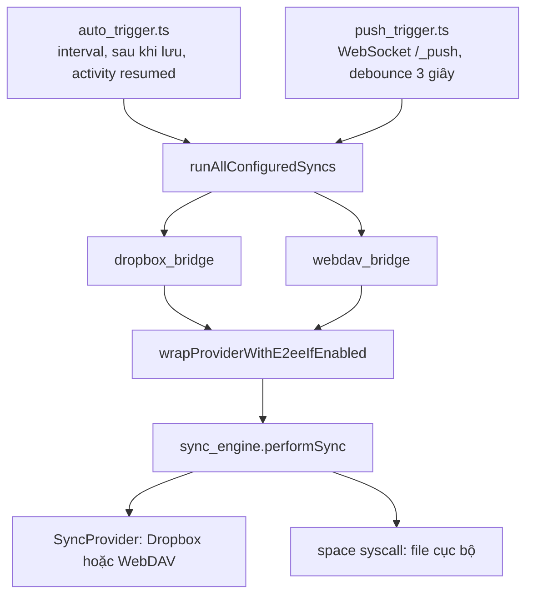

# Module `sync` — đồng bộ đa nền tảng: Dropbox, WebDAV, ChessNote Cloud, mã hoá đầu cuối

> Tài liệu này mô tả mã nguồn tại commit `383bab47be` (2026-09-13). Số dòng plug: xem mục 9 của [TRA-CUU-TU-DONG.md](TRA-CUU-TU-DONG.md). Máy chủ đi kèm: [10](10-cloud-server.md).

## Phần A — Chức năng

### Module này làm gì

Giữ **cùng một kho ghi chú** trên nhiều thiết bị (máy tính, điện thoại, web) bằng cách đồng bộ qua một nơi lưu trữ trung gian do bạn chọn:

| Nơi lưu | Khi nào dùng |
|---|---|
| **Dropbox** | Đã có tài khoản, muốn đơn giản |
| **WebDAV** (Nextcloud, v.v.) | Có máy chủ WebDAV sẵn |
| **ChessNote Cloud** | Tự dựng máy chủ riêng (nhẹ, kèm kênh "đẩy tín hiệu" để đồng bộ gần thời gian thực) |

### Người dùng làm được gì

- Đăng nhập/đăng xuất từng dịch vụ và chạy đồng bộ thủ công bằng lệnh trong Command Palette.
- **Tự đồng bộ**: theo chu kỳ (mặc định 5 phút), 30 giây sau khi lưu trang, và ngay khi quay lại ứng dụng (đổi tab, mở lại app).
- **Gần thời gian thực** (chỉ với ChessNote Cloud): thiết bị khác đổi gì là nhận tín hiệu và đồng bộ ngay.
- **Mã hoá đầu cuối** tuỳ chọn: nội dung file được mã hoá trước khi lên đám mây; nhà cung cấp chỉ thấy dữ liệu đã mã hoá (tên file vẫn hiển thị).
- **Chẩn đoán Dropbox** (chỉ đọc, không ghi gì) khi nghi ngờ đồng bộ lỗi.

### Khi hai nơi cùng sửa một file

Bản **trên thiết bị đang đồng bộ (local) được giữ và đẩy đè lên đám mây**; nội dung bản đám mây bị thay thế được lưu vào file `<tên>.conflict-<thời điểm>.md` cạnh đó để bạn đối chiếu và tự gộp. Nếu một bên **xoá** file còn bên kia **sửa** thì giữ lại bản đã sửa.

### Điều cần biết

- Đồng bộ áp dụng cho ghi chú của bạn; thư viện đóng gói sẵn (`Library/`, `Repositories/`) **không** được đồng bộ.
- File nhị phân (ảnh…) bị xung đột sẽ không tạo được file `.conflict` đúng (nội dung được đọc như văn bản) — hiếm gặp nhưng là giới hạn thật.
- Khoá mã hoá chỉ nằm trong bộ nhớ: mỗi lần mở lại ứng dụng phải chạy "Mở khoá mã hoá đồng bộ" trước khi đồng bộ.

---

## Phần B — Kỹ thuật

### B.1. Kiến trúc

**Tách tầng**: `sync_engine.ts` chỉ biết interface `SyncProvider` (`listEntries`, `download`, `upload`, `delete`) và `SpaceOps` (file cục bộ). Dropbox và WebDAV là hai cài đặt của `SyncProvider`; E2EE là **decorator** bọc ngoài một provider bất kỳ.

### B.2. Thuật toán `performSync` (hai chiều, ba trạng thái)

Với mỗi đường dẫn `path` trong hợp `local ∪ remote ∪ state`:

- `prior` = `{ localMtime, remoteRev }` ghi ở lần đồng bộ thành công trước; luôn ghi **cả hai** trường cùng lúc, nên "có `prior`" nghĩa là lần trước file có ở **cả hai** bên.
- `localChanged = local.lastModified !== prior.localMtime` (nếu chưa có `prior`: `Boolean(local)`).
- `remoteChanged = remote.rev !== prior.remoteRev` (chưa có `prior`: `Boolean(remote)`).

| Có local | Có remote | `prior` | Điều kiện | Hành động |
|---|---|---|---|---|
| ✗ | ✗ | — | — | Quên khỏi state |
| ✓ | ✗ | không | — | Đẩy lên (file mới) |
| ✓ | ✗ | có | local không đổi | **Xoá local** (lan truyền xoá từ remote) |
| ✓ | ✗ | có | local đã sửa | Đẩy lên lại (ưu tiên không mất chỉnh sửa) |
| ✗ | ✓ | không | — | Tải về (file mới) |
| ✗ | ✓ | có | remote không đổi | **Xoá remote** (lan truyền xoá từ local) |
| ✗ | ✓ | có | remote đã sửa | Tải về lại |
| ✓ | ✓ | có | cả hai đổi | **Xung đột thật**: **bản local thắng** — giữ nguyên `path`, đẩy đè lên remote (`update` theo `rev` remote hiện tại), còn nội dung remote bị thay thế được lưu vào file `.conflict` |
| ✓ | ✓ | có | chỉ local đổi | Đẩy lên (`update`) |
| ✓ | ✓ | có | chỉ remote đổi | Tải về |
| ✓ | ✓ | có | không đổi | Giữ nguyên |
| ✓ | ✓ | **không** | nội dung **y hệt** (so từng byte) | Chỉ ghi nhận state `{localMtime, remoteRev}`; không upload, không xung đột |
| ✓ | ✓ | **không** | nội dung **khác** | **Xung đột**: giống dòng "cả hai đổi" — local thắng, remote bị thay thế lưu vào `.conflict` (sửa 2026-09-29; trước đó local ghi đè remote không để lại dấu vết) |

(Bảng tổng hợp từ đọc `performSync`, `sync_engine.ts` dòng ~452–560, không phải chép bảng có sẵn.)

- **Bug thật đã sửa và ghi lại trong mã**: từng so `remoteChanged || localChanged` để "phát hiện" xoá, nhưng khi remote biến mất thì `remoteChanged` luôn `true`, vô tình khoá nhánh xoá. Giờ dùng `prior` để biết chắc đó là một lượt xoá.
- **File xung đột**: nội dung `.conflict` gồm tiêu đề `# Xung đột đồng bộ <provider>: <path>`, giải thích, rồi bản remote bị thay thế (hoặc dòng "nội dung nhị phân, không hiển thị được"). `conflictPath(path)` chèn `.conflict-<ISO UTC, ':' và '.' thay bằng '-'>` trước phần mở rộng cuối, luôn kết thúc `.md`. Nội dung phải giải mã UTF-8 nghiêm ngặt (`isUtf8Decodable`).
- **Checkpoint theo lô**: state được ghi ra đĩa mỗi `20` đường dẫn hoặc mỗi `2.000 ms` (điều kiện đến trước), thay vì sau mỗi path — tránh O(n²) I/O khi Space nhiều file. Đánh đổi: ngắt giữa chừng thì mất tối đa một lô tiến độ, không mất dữ liệu thật.
- **Race lúc ghi**: provider ném `RemoteConflictError` → coi như xung đột an toàn, lần sau xử lý lại.

### B.3. Phạm vi loại trừ (`computeSyncScope`)

Không đồng bộ: file có `perm === "ro"`, mọi đường dẫn bắt đầu bằng `Library/` hoặc `Repositories/` (`BAKED_IN_PREFIXES`), và chính các file trạng thái. Lý do (sự cố 2026-09-13): kiểm `perm` một mình không đủ — một số trang dưới `Library/` vẫn bị báo xung đột lặp lại dù không có file thật; loại theo tiền tố là lớp phòng thủ độc lập. Trạng thái nằm trong Space: `_dropbox/sync-state.json`, `_dropbox/sync-cursor.json`, `_sync/<provider>-state.json`, `_sync/<provider>-cursor.json`.

### B.4. Liệt kê delta (Giai đoạn 2.1)

`listEntries(folder, priorCursor?)` trả `{ entries, cursor?, full }`. Dropbox dùng `files/list_folder/continue` với cursor đã lưu → chỉ nhận thay đổi; nếu Dropbox trả `reset` (cursor hết hạn) thì **tự rơi về liệt kê đầy đủ**. `resolveRemoteEntries` gộp delta vào bản sao (`RemoteCache`) rồi trả toàn bộ. WebDAV không có cursor (luôn `full: true`, `PROPFIND` đệ quy). Cursor lưu trong file **riêng** (không nhồi vào `sync-state.json`) để không đổi định dạng file đang chạy thật của người dùng.

### B.5. Dropbox

- OAuth2 **PKCE** thuần WebCrypto: `generateCodeVerifier` / `generateCodeChallenge` / `buildAuthorizeUrl`; người dùng dán mã xác thực vào hộp thoại (không có redirect); token lưu ở `clientStore` (khoá `TOKENS_KEY`), không nằm trong Space.
- Tự gia hạn token (`ensureFreshTokens`, biên `60 s`); `apiFetch` thử lại tối đa `MAX_RETRIES = 5` khi HTTP `429` và **báo người dùng** trước mỗi lần chờ (thay vì lặng lẽ); mọi `fetch` có timeout `30 s`.
- Tiêu đề API chứa JSON được thoát ASCII (`toAsciiSafeHeaderJson`) vì tên file tiếng Việt vi phạm quy định header.
- Lỗi cấu hình hay gặp: Dropbox App phải tick quyền ở tab Permissions **trước** khi đăng nhập, nếu không API trả HTTP 400 dù đăng nhập thành công (memory dự án).

### B.6. WebDAV

- `PROPFIND` đệ quy, `PUT` có điều kiện: `add` → `If-None-Match: *`; `update` → `If-Match: "<rev>"`; `rev` = ETag đã bỏ dấu nháy.
- `409` → thử tạo thư mục cha (`ensureParentCollections`) rồi PUT lại **đúng một lần**; `412`/`409` sau đó → `WebDavConflictError`.
- Máy chủ không trả ETag trong phản hồi PUT → `HEAD` để lấy.
- `DELETE` → `404` coi là thành công (idempotent).

### B.7. Đẩy tín hiệu gần thời gian thực (`push_trigger.ts`)

- Kết nối `ws(s)://host/_push?auth=<base64(user:pass)>` (WebSocket phía client không gắn được header `Authorization`).
- Nhận tín hiệu `"changed"` → debounce **3 s** (`PUSH_DEBOUNCE_MS`) gộp cả loạt tín hiệu thành một lượt đồng bộ (một lượt sync ở thiết bị khác ghi N file sinh ra N tín hiệu).
- Nối lại với độ trễ tăng dần từ `5 s` đến tối đa `5 phút`.
- Bật bằng `chess.webdav.enableRealtimePush` (mặc định `false`; đổi xong cần tải lại). Chỉ áp dụng cho ChessNote Cloud, **không** cho WebDAV thường/Dropbox.

### B.8. Chống chồng lượt (`auto_trigger.ts`)

`providerLocks` khoá **theo tên provider**: hai lượt của cùng provider không chồng nhau, nhưng Dropbox và WebDAV vẫn chạy song song. Thông báo tự động chỉ hiện khi có việc đáng chú ý (`syncReportIsNotable`). `chess.sync.autoIntervalMinutes` mặc định `5`.

### B.9. Mã hoá đầu cuối (`e2ee.ts`)

- **KDF**: PBKDF2-SHA256, `600.000` vòng (khuyến nghị OWASP 2023), WebCrypto thuần.
- **Cipher**: AES-GCM 256-bit; IV ngẫu nhiên `12` byte mỗi lần mã hoá; gói tin mỗi file = `iv(12) ‖ ciphertext+tag`.
- **Salt cố định** (`"ChessNote-E2EE-v1"` dạng byte) — đánh đổi có chủ ý: salt ngẫu nhiên phải đồng bộ tới thiết bị mới *trước khi* giải mã được gì ("gà và trứng"). Mô hình đe doạ: che nội dung khỏi nhà cung cấp lưu trữ, không chống tấn công rainbow-table quy mô toàn cầu.
- **Chỉ mã hoá nội dung, không mã hoá tên file/đường dẫn** (mã hoá tên phá logic dựa trên path của engine).
- **Fail-closed**: bật E2EE mà chưa mở khoá thì `wrapProviderWithE2eeIfEnabled` ném lỗi, không bao giờ đồng bộ plaintext âm thầm.
- Khoá suy ra lưu ở biến `unlockedKey` trong bộ nhớ (mất khi tải lại). `EncryptingSyncProvider` mã hoá trước `upload` và giải mã sau `download`, nên `sync_engine.ts` luôn thấy plaintext (kể cả khi ghi file `.conflict`).

---

## Điểm cần lưu ý và hạn chế

**Thiết kế**
- Phát hiện thay đổi cục bộ bằng **`lastModified`** (thời gian sửa) chứ không băm nội dung: `touch` file làm nó bị coi là "đã đổi". Với remote dùng `rev`/ETag.
- ETag của ChessNote Cloud là `sha1(nội dung)`, còn Dropbox dùng `rev` riêng — mỗi provider có ngữ nghĩa `rev` khác nhau nhưng engine coi như chuỗi mờ.
- Salt E2EE cố định (xem B.9): hai người dùng chung mật khẩu sẽ ra cùng khoá.
- Xung đột file nhị phân: xem phần A.

**Vận hành**
- **Sự cố lịch sử 2026-09-13**: vòng lặp xung đột vô tận trên `Library/Std/…` (do `perm` không nhất quán) — đã vá bằng loại theo tiền tố; mỗi lần sync trước đó còn sinh file `.conflict-*.md` rác trong `Library/Std`.
- Lỗi treo do `nativeFetch` không timeout từng làm mất sạch tiến độ một lượt; đã thêm timeout 30 s và checkpoint.
- Lệnh `Sync: Space` / `Sync: File` là của SilverBullet gốc (đồng bộ client ↔ server), khác với `Chess: Đồng bộ …` (đồng bộ với đám mây ngoài).

**Điều đáng ngờ (chưa chạy thử)**
- **Đã sửa 2026-09-29 — lần đồng bộ đầu với file trùng tên hai bên**: trước đây khi chưa có `prior` mà cả hai bên đều có file, local ghi đè remote không sinh `.conflict` (nguy cơ mất bản trên đám mây khi thiết bị mới đã có ghi chú cùng tên). Nay nội dung y hệt thì chỉ ghi nhận state, khác thì đi qua nhánh xung đột (bản remote được lưu vào `.conflict`). Có 2 test mới trong `sync_engine.test.ts`; test cũ ở `sync_engine.cursor.test.ts` được đổi kỳ vọng (`uploaded = []`). **Còn lệch**: `diagnoseSync` (chế độ chẩn đoán chỉ đọc của Dropbox) vẫn chỉ báo xung đột khi có `prior`, vì phát hiện trường hợp không `prior` cần tải nội dung remote — chưa làm.
- Không có cơ chế **hoà giải nội dung tự động** (3-way merge) cho file văn bản — chỉ tạo file `.conflict`. (Server Rust có crate `server-merge` cho việc khác, xem [11](11-nen-tang-va-trien-khai.md); chưa kiểm tra có dùng cho sync đám mây hay không — nhiều khả năng là không.)
- Token Dropbox lưu ở `clientStore` (phía client); chưa rà soát vùng lưu này có được mã hoá hay chia sẻ giữa các Space hay không.

## Đường dẫn tham chiếu nhanh

| Muốn xem… | Mở file |
|---|---|
| Thuật toán đồng bộ, xung đột | **`plugs/sync/sync_engine.ts`** |
| Interface provider | `plugs/sync/sync_provider.ts` |
| Dropbox API | **`plugs/sync/dropbox_sync.ts`**, `dropbox_bridge.ts`, `dropbox_provider.ts` |
| WebDAV | `plugs/sync/webdav_sync.ts`, `webdav_bridge.ts`, `webdav_provider.ts` |
| Tự chạy / kênh đẩy | `plugs/sync/auto_trigger.ts`, `plugs/sync/push_trigger.ts` |
| Mã hoá | **`plugs/sync/e2ee.ts`**, `e2ee_bridge.ts` |
| Manifest lệnh, sự kiện | `plugs/sync/sync.plug.yaml` |
| Kế hoạch | `docs/plans/2026-09-09-giai-doan-a-dong-bo-da-nen-tang.md`, `…giai-doan-b-chessnote-cloud.md` |
