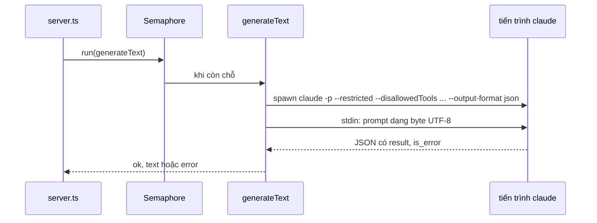

# Module `ai-sidecar` — tiến trình phụ đưa gói thuê bao Claude vào ChessNote

> Tài liệu này mô tả mã nguồn tại commit `383bab47be` (2026-09-13). Từ ADR-006, đây là **tuỳ chọn nâng cao**: chế độ mặc định `api_key` của plug `chess-ai` gọi thẳng `api.anthropic.com` và **không cần** sidecar ([04](04-chess-ai.md)).

## Phần A — Chức năng

### Module này làm gì

Nếu bạn đã trả tiền cho gói **Claude Pro/Max**, sidecar cho phép ChessNote dùng chính gói đó thay vì trả thêm tiền API. Nó là một chương trình Node nhỏ chạy cạnh ChessNote, đứng giữa và:

1. **Đăng nhập** Claude thay bạn (mở trang đăng nhập, nhận mã, hoàn tất).
2. **Nhận yêu cầu AI** từ ChessNote (giải thích nước đi, bình luận ván…) rồi gọi công cụ Claude Code (`claude`) để sinh văn bản.

### Vì sao cần một chương trình riêng

Plug chạy trong "hộp cát" trình duyệt: không được chạy lệnh hệ thống, không đọc file, không quản lý tiến trình con. Việc đăng nhập và chạy `claude` bắt buộc phải nằm ngoài hộp cát (ADR-001).

### Những điều nên biết

- Chỉ dành cho **một người dùng là chính chủ tài khoản** (comment trong cấu hình `chess.ai.mode`); dùng chung cho nhiều người vượt ranh giới điều khoản của nhà cung cấp. Đó là lý do có công tắc chuyển sang API key.
- Mỗi lần gọi tốn ngân sách gói: theo comment đã đo thật (2026-09-08), ~4.500–8.000 token overhead mỗi lượt (do mỗi lượt là một phiên `claude` mới, không dùng lại cache).
- Không dùng được trên mobile.

---

## Phần B — Kỹ thuật

### B.1. Tệp

| File | Dòng | Vai trò |
|---|---|---|
| `ai-sidecar/src/server.ts` | 155 | HTTP server, định tuyến, xác thực Bearer |
| `ai-sidecar/src/model.ts` | 119 | `generateText`: spawn `claude -p` |
| `ai-sidecar/src/auth.ts` | 313 | Luồng đăng nhập/trạng thái/đăng xuất |
| `ai-sidecar/src/concurrency.ts` | 48 | `Semaphore`, `QueueFullError` |
| `ai-sidecar/src/mode.ts` | 16 | `normalizeMode`, `envForCli` |
| `ai-sidecar/src/kill-tree.ts` | 70 | Giết cả cây tiến trình (Windows `taskkill /T`) |
| `ai-sidecar/src/utf8-stream.ts` | 32 | Gom stdout/stderr đúng UTF-8 |
| `ai-sidecar/Dockerfile` | 15 | `node:24-alpine`, chạy `tsx src/server.ts` |

Chỉ dùng Node core (`http`), không dependency runtime (ngoại lệ có chủ đích ở `cloud-server` là `ws`).

### B.2. API

| Method + đường dẫn | Chức năng |
|---|---|
| `GET /healthz` | `{ ok: true }` (không cần xác thực) |
| `GET /auth/status` | Trạng thái đăng nhập |
| `POST /auth/start` | Bắt đầu đăng nhập, trả URL |
| `POST /auth/code` | Gửi mã `{ code }` |
| `POST /auth/logout`, `POST /auth/cancel` | Đăng xuất / huỷ |
| `POST /ai/generate` | `{ prompt, mode, model }` → `{ ok, text | error }` |

Xác thực: nếu đặt `AUTH_SIDECAR_TOKEN` thì mọi đường (trừ `/healthz`) đòi `Authorization: Bearer <token>`; không đặt thì cảnh báo trong log ("mọi tiến trình trên máy gọi được endpoint này"). Thân yêu cầu giới hạn `64 KB`. Server lắng nghe host `AI_SIDECAR_HOST` (mặc định **`127.0.0.1`**) và cổng `AI_SIDECAR_PORT` hoặc `PORT` (mặc định `3457`) — hai biến host/`AI_SIDECAR_PORT` thêm 2026-09-29 (trước đó host cứng `127.0.0.1`, chỉ đọc `PORT`).

### B.3. Sinh văn bản (`generateText`)

Các quyết định đã ghi trong comment:

- **Prompt qua stdin, không qua argv**: tránh trần dòng lệnh 32.767 ký tự của Windows; ghi **dạng byte** để Windows không dịch `\n` thành `\r\n`.
- **Khoá tool chặt**: `--restricted` + `--disallowedTools "Read Write Edit Glob Grep WebSearch Task NotebookEdit Bash"` + `--permission-prompts none`: nhánh **chỉ sinh văn bản**. Request mang tool từng bị một số tài khoản subscription trả lỗi "out of extra usage".
- **`--bare` không dùng được** ở chế độ subscription (CLI báo "Not logged in").
- Chạy với `cwd` = thư mục tạm, không phải repo, để khỏi nạp `CLAUDE.md` vào mỗi lượt.
- Timeout mặc định `45.000 ms` → `killTree(proc, 1000)`. Tên model chỉ nhận `^[a-zA-Z0-9._-]+$`.
- Không dùng `@anthropic-ai/claude-agent-sdk` (giấy phép không MIT — quyết định 2026-09-08).
- **Ranh giới điều khoản**: Anthropic đã chặn việc tự đọc token rồi gọi API trực tiếp từ 4/4/2026 (theo comment `auth.ts`), nên sidecar chỉ *spawn CLI chính chủ*, **không bao giờ đọc nội dung** file credentials (chỉ kiểm tồn tại khi cần dự phòng).

### B.4. Giới hạn đồng thời (Giai đoạn 2.2, 2026-09-13)

`Semaphore(AI_SIDECAR_MAX_CONCURRENCY = 2, AI_SIDECAR_MAX_QUEUE = 10)`. Đầy hàng → `QueueFullError` → HTTP `429`. Trước đó mỗi request mở một tiến trình `claude` mới không giới hạn.

### B.5. Công tắc chế độ (`mode.ts`)

Sidecar là **nguồn sự thật duy nhất** về việc có API key hay không; ChessNote chỉ gửi *ý định* chế độ. `normalizeMode`: chỉ `"api_key"` mới là `api_key`, mọi giá trị lạ → `subscription`. `envForCli("api_key")` truyền `ANTHROPIC_API_KEY` từ môi trường sidecar cho CLI nếu không rỗng; rỗng thì lùi về `subscription` (không để biến rỗng giết mọi lượt).

### B.6. Đăng nhập (`auth.ts`) — khuôn "pipe + regex"

Không có OAuth công khai để tự cài, nên sidecar spawn `claude auth login --claudeai`, đọc output bắt URL bằng `/https?:\/\/\S+/`, chuyển URL cho giao diện; người dùng dán mã lại. Trạng thái dùng `claude auth status --json` (trường `loggedIn`), cache `60 s`, có nhánh `stale` khi lần hỏi gặp timeout. Credentials do CLI tự giữ ở `~/.claude/.credentials.json` (`CLAUDE_HOME` đổi được).

`killTree` dùng `SIGTERM` → chờ → `SIGKILL` và `taskkill /T` trên Windows, vì CLI sinh thêm `node` con và `SIGKILL` đúng lúc CLI ghi credentials có thể làm cụt file token.

---

## Điểm cần lưu ý và hạn chế

**Thiết kế**
- Mỗi request là một phiên `claude` mới → tốn token overhead; comment khuyến nghị gộp nhiều nước vào một lần hỏi, không gọi từng nước.
- Không có chế độ streaming; phản hồi trả một lần khi tiến trình đóng.

**Vận hành**
- Chưa đặt `AUTH_SIDECAR_TOKEN` thì mọi tiến trình cùng máy đều gọi được sidecar.
- Cổng: `Dockerfile` và compose đặt `AI_SIDECAR_PORT`; từ 2026-09-29 mã đọc biến này (trước đó chỉ đọc `PORT`, nên biến không có tác dụng).

**Điều đáng ngờ (chưa chạy thử)**
- **Sidecar trong Docker vẫn chưa dùng được đầy đủ**: mặc định vẫn nghe `127.0.0.1`, nên container khác không gọi tới được trừ khi đặt `AI_SIDECAR_HOST=0.0.0.0` (khi đó **bắt buộc** đặt `AUTH_SIDECAR_TOKEN`); compose **chưa** đặt hai biến này. `Dockerfile` chỉ cài Node, **không** cài CLI `claude`, nên `subscription` không chạy được trong container. Với `api_key` mặc định plug gọi thẳng Anthropic nên service `chessnote-ai` trong compose có lẽ không cần thiết. Suy luận từ đọc `server.ts`, `Dockerfile`, compose; chưa chạy thử.
- Luồng đăng nhập đầy đủ **chưa được thử thật** trên máy dev (comment đầu `auth.ts`: chạy logout thật sẽ ngắt phiên Claude Code đang dùng để lập trình) — cần người dùng tự thử trên máy/tài khoản phụ.

## Đường dẫn tham chiếu nhanh

| Muốn xem… | Mở file |
|---|---|
| Các endpoint, xác thực, hàng đợi | **`ai-sidecar/src/server.ts`** |
| Cờ CLI, khoá tool, timeout, chi phí | **`ai-sidecar/src/model.ts`** |
| Đăng nhập | `ai-sidecar/src/auth.ts` |
| Giới hạn đồng thời | `ai-sidecar/src/concurrency.ts` |
| Kiến trúc sidecar, bẫy đã gặp | skill `ai-subscription-bridge` (`~/.claude/skills`), `docs/plans/2026-09-07-ban-giao-phien-tiep-theo.md` |
| Phía plug | `plugs/chess-ai/bridge.ts` |
