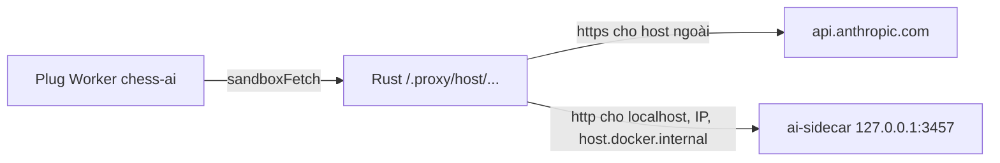
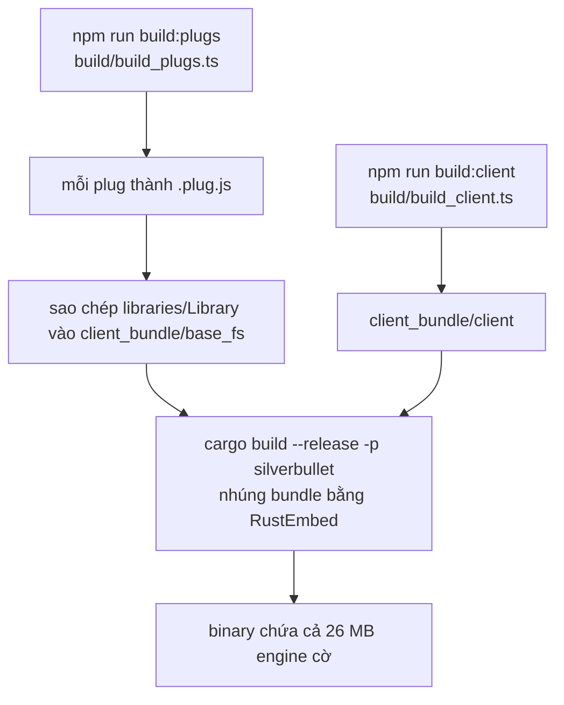

# Nền tảng, máy chủ, ứng dụng đa nền tảng và triển khai

> Tài liệu này mô tả mã nguồn tại commit `383bab47be` (2026-09-13). Phần lõi (client, server, PlugOS, Space Lua) **kế thừa từ SilverBullet 2.10.0** — tài liệu gốc của SilverBullet nằm ở `docs/Architecture/`, `docs/Plugs/`, `docs/Features/`. Tài liệu này chỉ nói kỹ về những gì ChessNote **thêm hoặc chỉnh**, và trỏ tới nơi khác cho phần còn lại.

## Phần A — Chức năng

### ChessNote chạy ở đâu

| Nền tảng | Hình thức | Ghi chú |
|---|---|---|
| **Web** | Máy chủ ChessNote + trình duyệt (PWA, dùng offline) | Đầy đủ tính năng, kể cả xuất PDF và AI |
| **Desktop** | Ứng dụng Tauri (Windows/macOS/Linux) | Nhẹ; tự có xuất PDF bằng Chrome cục bộ |
| **Android** | Ứng dụng Capacitor, độc lập, chạy offline | Ẩn tính năng cần máy chủ (AI, xuất PDF) |
| **iOS** | Có thư mục dự án Capacitor (`ios/`) | Chưa thấy tài liệu/kiểm chứng phát hành trong repo |

### Điểm ChessNote thêm so với SilverBullet gốc

- **Thanh tab tài liệu**: mở nhiều trang cùng lúc như tab trình duyệt; ghim tab; đóng các tab khác. Phím tắt: `Alt-]` (tab sau), `Alt-[` (tab trước), `Alt-w` (đóng tab hiện tại); lệnh "Tabs: Close Other Tabs" giữ tab đang mở và các tab đã ghim.
- **Widget có thể ghi ngược vào trang** (dùng cho "💾 Lưu vào trang" của bàn cờ) — với cơ chế từ chối nếu nội dung trang đã đổi.
- **Chiều cao widget** luôn được theo dõi suốt vòng đời (sửa lỗi widget bị cắt khi bật panel).
- **Cây thư mục** giới hạn số mục con mỗi thư mục để tránh DOM phình vô hạn.
- Bộ **triển khai** cho tên miền riêng (Docker, Traefik/Dokploy, Caddy).

---

## Phần B — Kỹ thuật

### B.1. Bản đồ thư mục và quy mô

| Thư mục | Ngôn ngữ | Dòng (đếm bằng script, xem dưới) | Nguồn gốc |
|---|---|---|---|
| `client/` | TypeScript/Preact | 302 file `.ts/.tsx` không kể test | SilverBullet + chỉnh |
| `plug-api/` | TypeScript | — | SilverBullet (SDK cho plug) |
| `plugs/` | TypeScript | xem [TRA-CUU-TU-DONG.md](TRA-CUU-TU-DONG.md) | 7 plug cờ + `sync` là của ChessNote; `core`, `editor`, `index`, `emoji`, `image-viewer`, `configuration-manager`, `object-graph` là của SilverBullet |
| `server/` | Rust | 26.894 | SilverBullet |
| `server-common/` | Rust | 4.171 | SilverBullet |
| `server-merge/` | Rust | 802 | SilverBullet |
| `server-runtime-chrome/` | Rust | 1.612 | SilverBullet (Chrome không đầu) |
| `bin/silverbullet`, `bin/sb` | Rust | 3.152 / 4.561 | SilverBullet |
| `desktop/src-tauri/` | Rust (Tauri v2) | 92 (`src/`) | ChessNote |
| `android/`, `ios/`, `mobile/` | Java/Kotlin + Capacitor | — | ChessNote |
| `ai-sidecar/`, `cloud-server/` | TypeScript/Node | xem [09](09-ai-sidecar.md), [10](10-cloud-server.md) | ChessNote |
| `libraries/Library/Chess/` | Markdown + WASM | — | ChessNote: mẫu trang, slash template, engine |
| `e2e/`, `bench/` | Playwright / vitest bench | — | Chưa rà soát phần nào là của ChessNote |

Số dòng Rust là tổng `cat` mọi file `.rs` (không kể `target/`) rồi đếm bằng `wc -l`: `server` 26.894; `server-common` 4.171; `server-merge` 802; `server-runtime-chrome` 1.612; `bin/silverbullet` 3.152; `bin/sb` 4.561; `desktop/src-tauri/src` 92.

Workspace Rust (`Cargo.toml`): thành viên `server-common`, `server`, `server-runtime-chrome`, `server-merge`, `bin/silverbullet`, `bin/sb`; **loại** `desktop/src-tauri` (build riêng); mặc định `cargo run` nhắm `bin/silverbullet`.

### B.2. Đường đi của một yêu cầu AI (ví dụ)

`handle_proxy` (`server/src/handlers/proxy.rs`): trả `405` nếu server ở chế độ chỉ đọc (`read_only`); đường dẫn rỗng → `400`; đích dựng bằng `proxy_target_url`: **`http://` nếu host khớp** `^(localhost|127\.0\.0\.1|\d+\.\d+\.\d+\.\d+|host\.docker\.internal)`, còn lại **`https://`**; header cần chuyển tiếp truyền qua tiền tố `X-Proxy-Header-*` (tiền tố bị cắt); nếu không có `user-agent` thì bổ sung mặc định. Proxy này **tổng quát, không giới hạn host** — nền cho `api_key` mode ở ADR-006.

### B.3. Các đường HTTP của server

Từ `server/src/router.rs`: `/.config`, `/.accounts`, `/.fs` (+ `PUT`/`DELETE` theo đường dẫn), `/.events`, `/.revisions/…`, `/.shell` (POST), `/.proxy/…`, `/.runtime/lua`, `/.runtime/lua_script`, `/.runtime/logs`, `/.export/pdf`, `/.auth`, `/.auth/authorize`, `/.auth/token`, `/.ping`, `/.client/manifest.json`, `/.logout`, `/metrics`. Xác thực, đa không gian (`server/src/multi/`), phiên bản (`server/src/revisions/`) là của SilverBullet gốc.

### B.4. Thanh tab (ChessNote thêm, commit `94b1d684`, 2026-09-11)

Thêm `client/components/tab_bar.tsx` (`DocumentTabBar`: `onSelectTab`, `onCloseTab`, `onPinTab`, `onNewTab`, `onCloseOtherTabs`), `client/styles/tab_bar.scss`, lệnh trong `client/editor_commands.ts`, trạng thái `tabs` trong `client/reducer.ts` (`close-tab`, `set-tabs`) và kiểu `DocumentTab` trong `client/types/ui.ts`. Có test trong `client/reducer.test.ts`.

### B.5. Cầu nối widget (`client/components/panel_html.ts`)

Khung iframe của widget nhận `postMessage({type: "html", html, script, theme})`, gán `document.body.innerHTML`, rồi **`eval(data.script)`** — đó là cách script trong template string của `chess.ts` chạy được. Hai cầu ngược lên cha:

1. `globalThis.syscall(name, ...args)` → `postMessage({type: "syscall", id, name, args})`.
2. `globalThis.replaceWidgetBody(oldText, newText)` → `postMessage({type: "replaceBody", …})`; phía cha ở `client/codemirror/iframe_widget.ts` chỉ áp dụng khi `oldText` còn khớp.

Chiều cao: `ResizeObserver` (sự kiện, không giới hạn thời gian) thay cho cơ chế kiểm tra có hạn cũ — commit `5e3ebede`.

### B.6. Desktop (Tauri v2)

`desktop/src-tauri/tauri.conf.json`: sản phẩm `ChessNote`, phiên bản `1.3.0`, `identifier: com.chessnote.app`, cửa sổ 1280×850, `frontendDist: ../../client_bundle/client/.client`, `csp: null`. Lệnh Tauri (`src/lib.rs`): `get_app_info`, `export_pdf(html)`. `export_pdf` dùng **một** `ChromePool` toàn ứng dụng (`OnceLock`), tái dùng crate `server-runtime-chrome`; nếu không tìm thấy Chrome thì lỗi được cache để không quét `PATH` lại mỗi lần. Chạy: `npm run desktop:dev`; đóng gói: `npm run desktop:build`.

### B.7. Mobile (Capacitor)

`capacitor.config.ts`: `appId com.chessnote.app`, `webDir client_bundle/client/.client`, `androidScheme https`, `cleartext false`; splash/status bar nền `#1e293b`. Android: `versionName "1.3"`, `versionCode 4`. Lệnh: `npm run mobile:build`, `mobile:android`, `mobile:run:android`. Kiến trúc offline-first (IndexedDB + Worker qua Blob URL, không cần server) đã được kiểm chứng ở đợt audit 2026-09-07. Các tính năng cần server bị ẩn (`system.isCapacitor()`).

### B.8. Build

`plugs/builtin_plugs.ts` liệt kê 15 plug dựng sẵn: `core, editor, index, sync, emoji, image-viewer, configuration-manager, object-graph, chess-themes, chess-engine, chess-db, chess-pdf-export, chess-repertoire, chess-ai, chess`. Đường dẫn cài: `Library/Std/Plugs/<tên>.plug.js`. Vì `libraries/Library` được nhúng làm "lớp nền chỉ đọc" phía dưới mọi Space, bản build chuẩn luôn có `Library/Chess/arasan.wasm` (xem [02](02-chess-engine.md)).

### B.9. Triển khai

| File | Vai trò |
|---|---|
| `Dockerfile.dokploy` | Đa tầng: `node:22-alpine` dựng frontend → `rust:1.85-alpine` dựng server (`cargo build --release -p silverbullet`) → ảnh chạy (tầng cuối chưa đọc) |
| `Dockerfile` | Chưa đọc chi tiết |
| `Dockerfile.runtime-api`, `Dockerfile.website` | Ảnh phụ (runtime API, trang web) — chưa khảo sát chi tiết |
| `docker-compose.dokploy.yml` | 3 service: `chessnote` (cổng 3000), `chessnote-sync` (cloud-server, 8080), `chessnote-ai` (sidecar, 3457); Traefik, `chessnote.dsc.edu.vn`, Let's Encrypt |
| `docker-compose.vps.yml`, `Caddyfile`, `.env.vps.example`, `scripts/deploy-vps.sh` | Phương án VPS Ubuntu với Caddy tự cấp HTTPS |
| `scripts/release.sh` | Phát hành (chưa khảo sát chi tiết) |

Biến môi trường chính của ứng dụng: `SB_HOSTNAME`, `SB_PORT`, `SB_FOLDER`, `SB_USER`, `CHROMIUM_PATH`, `SB_CHROME_DATA_DIR`. Healthcheck: `curl --fail http://127.0.0.1:3000/.instance` (compose Dokploy) — các sửa gần đây cho thấy dùng IPv4 loopback tường minh và `wget` cho ảnh sync.

### B.10. Kiểm thử

`npm test` (vitest, mọi `*.test.ts` trong repo), `npm run check` (`tsc --noEmit`), `npm run lint`/`fmt` (Biome), `npm run test:e2e` (Playwright, thư mục `e2e/`), `cargo check --workspace`, `bench/` cho Space Lua. E2E và benchmark **không** chạy trong phiên viết tài liệu này.

---

## Điểm cần lưu ý và hạn chế

**Thiết kế**
- ChessNote là **bản fork** của SilverBullet: nâng cấp từ upstream sẽ phải hợp nhất tay các chỗ đã chỉnh (`client/components/panel_html.ts`, tab bar, `client/boot.ts` — `spaceFolderPath: "ChessNote"`).
- `client/` không còn mã cờ vua riêng sau ADR-006 (mọi thứ nằm ở plug): `grep -ril chess client` chỉ ra 3 file — `client/boot.ts` (`spaceFolderPath: "ChessNote"`), `client/components/panel_html.ts` (comment nhắc bàn cờ), `client/types/wasm_asset.d.ts`.

**Vận hành**
- Ảnh Docker cho `chessnote-ai` và các chi tiết mạng: xem "Điều đáng ngờ" ở [09](09-ai-sidecar.md).
- Mật khẩu mặc định trong compose đã bỏ (thiếu biến thì compose dừng); xem [10](10-cloud-server.md) — có việc bạn cần làm trước lần redeploy Dokploy kế tiếp.
- Trên Windows, xuất PDF cần `SB_CHROME_DATA_DIR` (xem [05](05-chess-pdf-export.md)).

**Điều đáng ngờ**
- iOS: có thư mục `ios/` và lệnh `mobile:ios` nhưng không thấy ghi chú kiểm chứng/phát hành trong lịch sử commit đã đọc.
- `Dockerfile.runtime-api`, `Dockerfile.website`, `scripts/release.sh`: chưa đọc — không nêu công dụng chi tiết để tránh đoán.

## Đường dẫn tham chiếu nhanh

| Muốn xem… | Mở file |
|---|---|
| Đăng ký plug dựng sẵn | `plugs/builtin_plugs.ts` |
| Quy trình build | `build/build_plugs.ts`, `build/build_client.ts`, `Makefile` |
| Proxy `/.proxy/` | **`server/src/handlers/proxy.rs`** |
| Mọi route server | `server/src/router.rs` |
| Thanh tab | `client/components/tab_bar.tsx`, `client/editor_commands.ts`, `client/reducer.ts` |
| Cầu nối widget | **`client/components/panel_html.ts`**, `client/codemirror/iframe_widget.ts` |
| Desktop | `desktop/src-tauri/tauri.conf.json`, `desktop/src-tauri/src/lib.rs` |
| Mobile | `capacitor.config.ts`, `android/app/build.gradle` |
| Deploy | `docker-compose.dokploy.yml`, `Dockerfile.dokploy`, `Caddyfile` |
| Kiến trúc SilverBullet gốc | `docs/Architecture/*.md`, `docs/Architecture/ADR/*.md` |
