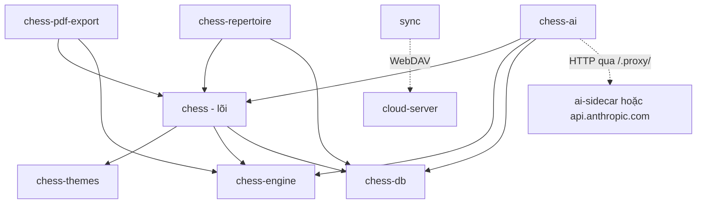

# Tài liệu module ChessNote — mục lục và bản đồ đọc

> Bộ tài liệu này mô tả mã nguồn tại commit **`383bab47be`** (2026-09-13). Mọi tài liệu trong thư mục này dùng chung commit đó; nếu mã nguồn đổi, chạy lại `python scripts/gen_module_reference.py` (sinh hai file tự động) và rà lại các tài liệu viết tay.
>
> ⚠️ Working tree lúc viết có **thay đổi chưa commit** ở `plugs/chess-pdf-export/` và `libraries/Library/Std/Infrastructure/Export.md` (xoá module phân trang) — tài liệu [05](05-chess-pdf-export.md) mô tả cả hai trạng thái.

## Mục đích

Làm nền cho việc **rà soát**, **thêm module/tính năng mới** và **nhân bản phần mềm** sang lĩnh vực khác (xem [../NHAN-BAN.md](../NHAN-BAN.md)). Mỗi tài liệu chia hai phần:

- **Phần A — Chức năng**: dành cho mọi người, không cần biết lập trình.
- **Phần B — Kỹ thuật**: tên hàm, công thức, số liệu, đường dẫn thật.

Kết thúc mỗi tài liệu luôn có hai mục: *Điểm cần lưu ý và hạn chế* (chia thiết kế / vận hành / điều đáng ngờ) và *Đường dẫn tham chiếu nhanh*.

## Danh mục

| # | Tài liệu | Nội dung | Chủ đề chính |
|---|---|---|---|
| 01 | [chess-core](01-chess-core.md) | Widget `fen`/`pgn`/`puzzle`, sửa bàn cờ, chỉ mục ván, ván liên quan | Giao diện + dữ liệu nền |
| 02 | [chess-engine](02-chess-engine.md) | Arasan WASM, UCI, Game Review, công thức accuracy | Thuật toán |
| 03 | [chess-db](03-chess-db.md) | SQLite WASM, FTS5, SM-2, embedding | Dữ liệu + thuật toán |
| 04 | [chess-ai](04-chess-ai.md) | AI Coach, xu hướng, gắn tag, hỏi đáp, thống kê | AI |
| 05 | [chess-pdf-export](05-chess-pdf-export.md) | Xuất PDF có bàn cờ tĩnh | Xuất bản |
| 06 | [chess-repertoire](06-chess-repertoire.md) | Sổ tay khai cuộc + ôn tập SRS | Học tập |
| 07 | [chess-themes](07-chess-themes.md) | 6 bộ quân, 8 màu bàn | Giao diện |
| 08 | [sync](08-sync.md) | Dropbox, WebDAV, thuật toán đồng bộ, E2EE | Đồng bộ |
| 09 | [ai-sidecar](09-ai-sidecar.md) | Đưa gói Claude Pro/Max vào ChessNote | Hạ tầng AI |
| 10 | [cloud-server](10-cloud-server.md) | Máy chủ WebDAV tự host + đẩy tín hiệu | Hạ tầng đồng bộ |
| 11 | [nền tảng và triển khai](11-nen-tang-va-trien-khai.md) | Server Rust, client, Tauri, Capacitor, Docker | Nền tảng |
| — | [TRA-CUU-TU-DONG](TRA-CUU-TU-DONG.md) | Lệnh, syscall, sự kiện, khoá cấu hình, bảng SQL, quy mô (**sinh tự động**) | Tra cứu |
| — | [LICH-SU-COMMIT](LICH-SU-COMMIT.md) | Toàn bộ commit của các giai đoạn ChessNote (**sinh tự động**) | Lịch sử |

Tài liệu tổng của dự án (ở gốc repo): [README.md](../../README.md), [CLAUDE.md](../../CLAUDE.md), [AGENTS.md](../../AGENTS.md), [TECH.md](../../TECH.md), [SKILLS.md](../../SKILLS.md), [MEMORY.md](../../MEMORY.md), và [CHESS_MODULES.md](../CHESS_MODULES.md).

## Bản đồ phụ thuộc giữa các plug cờ vua

Lời gọi xuyên plug đi qua **syscall** (mỗi plug có `external_syscalls.ts` riêng bọc `syscall()`), không import TypeScript trực tiếp — nhờ đó mỗi plug là một `.plug.js` độc lập (ADR-005, ADR-006).

Thứ tự cài độc lập lên SilverBullet gốc: `chess-themes`, `chess-engine`, `chess-db` → `chess` → `chess-pdf-export`, `chess-repertoire`, `chess-ai`.

## Ba nguyên tắc xuyên suốt (nên nắm trước khi sửa mã)

1. **Không để AI tự nhận xét thế cờ.** Mọi nhận xét dựa trên số liệu engine thật; AI chỉ diễn giải ([04](04-chess-ai.md)).
2. **Việc đắt đỏ luôn do người dùng bấm** — không gắn engine/AI vào autosave hay `page:saved` (ADR-004).
3. **Không làm hỏng ghi chú của người dùng**: không ghi cấu trúc lồng nhau vào frontmatter (ADR-002); mọi ghi ngược vào trang đều do người dùng chủ động và có kiểm tra khớp nội dung.

## Những phát hiện đáng chú ý khi rà soát (tổng hợp)

Gom lại từ mục "Điều đáng ngờ" của từng tài liệu. Cột *Trạng thái* cập nhật sau đợt xử lý 2026-09-29. Bản sửa được kiểm bằng test đơn vị (394 test xanh); **chưa** thử trên trình duyệt thật.

| Mức | Phát hiện | Trạng thái | Ở đâu |
|---|---|---|---|
| Cao | Chữ `đ` bị mất khi tách từ khoá → tìm kiếm/hỏi đáp sai với "Đen", "đối"… | ✅ **Đã sửa** + 3 test (2026-09-29) | [01](01-chess-core.md) |
| Cao | Lịch ôn khai cuộc (SRS) mất khi tải lại (SQLite `:memory:`) | ✅ **Đã sửa** — lưu ra `_chess/repertoire-srs.json`; ⚠️ chưa thử trên trình duyệt | [03](03-chess-db.md), [06](06-chess-repertoire.md) |
| Cao | Embedding mất khi tải lại | ⏳ Còn mở (chạy lại lệnh tính embedding; Hỏi AI tự dùng FTS5) | [03](03-chess-db.md) |
| Cao | Đồng bộ lần đầu, file trùng tên hai bên: local ghi đè remote, không `.conflict` | ✅ **Đã sửa** + 2 test; `diagnoseSync` còn lệch | [08](08-sync.md) |
| Cao | Mật khẩu mặc định ghi cứng trong `docker-compose.*.yml` | ✅ **Đã bỏ**; ⚠️ cần đặt `SYNC_USERS` trên Dokploy trước khi redeploy; mật khẩu cũ đã nằm trong lịch sử git | [10](10-cloud-server.md) |
| Trung bình | Ngưỡng CPL trong comment khác mã; nhãn `great` không bao giờ được gán | ✅ Đã sửa comment; `great` là hành vi (quyết định của bạn) | [02](02-chess-engine.md) |
| Trung bình | Thống kê lỗi theo giai đoạn/ECO chỉ đếm tối đa 10 bước ngoặt mỗi ván | ⏳ Hành vi có chủ đích, đã ghi rõ | [04](04-chess-ai.md) |
| Trung bình | API key Anthropic lưu như cấu hình thường trong Space | ⏳ Còn mở (cần quyết định thiết kế) | [04](04-chess-ai.md) |
| Trung bình | Sidecar trong Docker: cổng/host | 🟡 Đã thêm `AI_SIDECAR_PORT`/`AI_SIDECAR_HOST`; compose chưa đặt, image thiếu CLI `claude` | [09](09-ai-sidecar.md) |
| Trung bình | Working tree lệch HEAD ở module PDF | ⏳ Việc của bạn (chưa commit, chưa rõ ý định) — không đụng | [05](05-chess-pdf-export.md) |
| Thấp | So khớp SAN không phân biệt hoa/thường (`bxc3` ≡ `Bxc3`) trong ôn tập | ⏳ Còn mở | [06](06-chess-repertoire.md) |
| Thấp | Giấy phép các bộ quân cờ chưa rà soát | ⏳ Cần người rà (pháp lý) | [07](07-chess-themes.md) |
| Thấp | `MEMORY.md` (ADR-006) dẫn tới file kế hoạch không có trong repo | ✅ Đã ghi chú trong `MEMORY.md` | [MEMORY.md](../../MEMORY.md) |

## Cách cập nhật bộ tài liệu này

1. Sau khi đổi mã: `python scripts/gen_module_reference.py` — cập nhật hai file tự động.
2. Với mỗi tài liệu viết tay: đổi commit hash ở dòng đầu, rà lại số dòng bằng `wc -l` (không lấy từ công cụ đọc file), kiểm lại các con số/công thức trích từ mã.
3. Khi thêm module mới: dùng mẫu hai phần A/B + hai mục kết; thêm một dòng vào bảng danh mục ở trên và vào [TECH.md](../../TECH.md).
