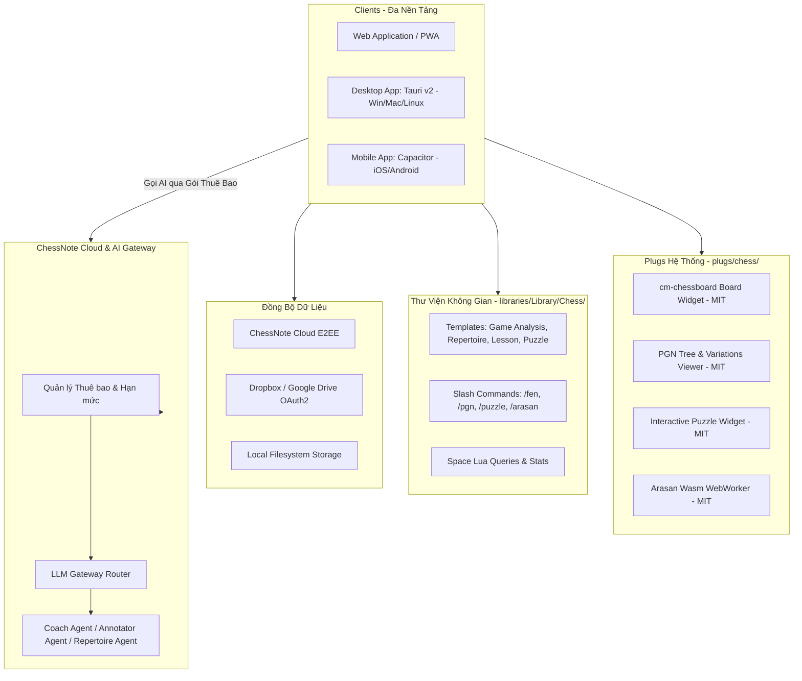

# ♟️ KẾ HOẠCH TỔNG THỂ DỰ ÁN CHESSNOTE (MASTER PLAN)
> **Phiên bản**: 1.0.0  
> **Ngày lập**: 06/09/2026  
> **Giấy phép mục tiêu**: 100% MIT / Permissive License (Sẵn sàng thương mại hóa)

---

## 1. TỔNG QUAN DỰ ÁN & ĐỊNH VỊ
**ChessNote** là hệ thống ghi chú và nghiên cứu tri thức cờ vua chuyên sâu (All-in-one Chess Knowledge & Study Base), được phát triển trên nền tảng SilverBullet, mở rộng toàn diện phục vụ 2 nhóm đối tượng cốt lõi:
1. **Người tự học & Nghiên cứu cá nhân**: Xây dựng sổ tay khai cuộc (Repertoire), phân tích ván đấu cá nhân, rèn luyện bài tập chiến thuật & tàn cuộc.
2. **Huấn luyện viên & Giáo viên Cờ vua**: Soạn bài giảng/giáo án trực quan, tạo kho bài tập tương tác, xuất tài liệu và sơ đồ ván đấu.

### Các Nguyên Tắc Thiết Kế Cốt Lõi
- **Bản quyền sạch (MIT Compliance)**: 100% mã nguồn, thư viện, engine đều tuân thủ giấy phép MIT hoặc tương đương (Apache 2.0, BSD, ISC) để tự do phân phối thương mại.
- **Tương tác trực quan (Interactive-First)**: Mọi thế cờ (FEN), biên bản ván đấu (PGN), bài tập (Puzzle) đều có bàn cờ tương tác kéo thả mượt mà trực tiếp trong trang Markdown.
- **Engine Arasan tích hợp (Arasan Engine)**: Tích hợp Arasan MIT qua WebAssembly (Web/Mobile) và Native UCI (Desktop).
- **Đa nền tảng & Đồng bộ (Multi-Platform & Sync)**: Hoạt động đồng bộ trên Web, Desktop (Tauri v2) và Mobile (Capacitor) qua ChessNote Cloud E2EE và Dropbox API.
- **Hệ sinh thái AI Agents (Subscription Model)**: Cung cấp trợ lý AI chuyên môn (Claude, Antigravity, OpenAI, Grok) theo gói thuê bao tháng trọn gói, không yêu cầu người dùng cấu hình API Key.

---

## 2. KIẾN TRÚC HỆ THỐNG TỔNG THỂ (SYSTEM ARCHITECTURE)



---

## 3. LỘ TRÌNH TRIỂN KHAI TUẦN TỰ (OPTIMIZED IMPLEMENTATION ROADMAP)

Để tối ưu hóa thời gian và đảm bảo các giai đoạn sau kế thừa vững chắc từ giai đoạn trước, lộ trình được chia thành 5 giai đoạn:

```
┌─────────────────────────────────────────────────────────────────────────────┐
│ GIAI ĐOẠN 1: CORE CHESS PLUG (Giao diện & Tương tác Cờ vua Cốt lõi)         │
│ Tài liệu chi tiết: docs/plans/01-phase-1-chess-core-plug.md                 │
│ ├─ Khởi tạo Plug `plugs/chess/` (TypeScript, Vite/ESBuild)                  │
│ ├─ Tích hợp `cm-chessboard` (SVG, MIT) & `chess.js` (Logic, BSD)            │
│ ├─ Khối Bàn cờ FEN tương tác (Flip, Move exploration, Copy FEN/Link)       │
│ ├─ Khối Ván đấu PGN (Move tree, Sublines, Comments, NAGs, Phím tắt)        │
│ └─ Khối Bài tập Puzzle (Ẩn lời giải, kéo thả kiểm tra đúng/sai)             │
└──────────────────────────────────────┬──────────────────────────────────────┘
                                       ▼
┌─────────────────────────────────────────────────────────────────────────────┐
│ GIAI ĐOẠN 2: ARASAN ENGINE INTEGRATION (Tích hợp Engine Arasan MIT)         │
│ Tài liệu chi tiết: docs/plans/02-phase-2-arasan-engine.md                   │
│ ├─ Biên dịch Arasan C++ sang WebAssembly (`arasan.wasm`)                    │
│ ├─ Xây dựng Web Worker quản lý luồng tính toán ngầm                         │
│ ├─ Giao diện Thanh đánh giá thế trận (Eval Bar) & Multi-PV Mũi tên gợi ý    │
│ └─ Tính năng Tự động Phân tích sai lầm ván đấu (Game Review)                │
└──────────────────────────────────────┬──────────────────────────────────────┘
                                       ▼
┌─────────────────────────────────────────────────────────────────────────────┐
│ GIAI ĐOẠN 3: SPACE LIBRARY & WORKFLOW TEMPLATES (Giáo án & Sổ tay)          │
│ Tài liệu chi tiết: docs/plans/03-phase-3-space-library-templates.md         │
│ ├─ Thư viện mẫu `libraries/Library/Chess/` (Lesson Plan, Analysis, Dossier) │
│ ├─ Bộ Slash Commands (/fen, /pgn, /puzzle, /repertoire, /analyze)           │
│ ├─ Sổ tay Khai cuộc (Repertoire Tree) & Luyện nhớ biến (SRS)                │
│ └─ Kịch bản Space Lua truy vấn, lọc ván đấu theo kỳ thủ & ECO               │
└──────────────────────────────────────┬──────────────────────────────────────┘
                                       ▼
┌─────────────────────────────────────────────────────────────────────────────┐
│ GIAI ĐOẠN 4: MULTI-PLATFORM & CLOUD/DROPBOX SYNC (Đa Nền Tảng & Đồng Bộ)    │
│ Tài liệu chi tiết: docs/plans/04-phase-4-multi-platform-and-sync.md         │
│ ├─ Đóng gói Desktop App với Tauri v2 (Tích hợp Arasan Native binary)        │
│ ├─ Đóng gói Mobile App với Capacitor (iOS & Android)                        │
│ ├─ Module đồng bộ qua Dropbox API (OAuth2)                                  │
│ └─ Hệ thống đồng bộ cục bộ Offline-First                                    │
└──────────────────────────────────────┬──────────────────────────────────────┘
                                       ▼
┌─────────────────────────────────────────────────────────────────────────────┐
│ GIAI ĐOẠN 5: AI AGENTS SUBSCRIPTION SYSTEM (Hệ thống AI Thuê Bao)           │
│ Tài liệu chi tiết: docs/plans/05-phase-5-ai-agents-subscription.md          │
│ ├─ Xây dựng ChessNote AI Gateway Server (Quản lý User & Gói cước tháng)     │
│ ├─ Tích hợp Multi-LLM Hub (Claude, Antigravity, OpenAI, Grok)               │
│ ├─ Huấn luyện Prompt chuyên môn: AI Coach, AI Annotator, Sparring Partner   │
│ └─ Giao diện tích hợp AI trực tiếp trong Editor & Sidebar                   │
└─────────────────────────────────────────────────────────────────────────────┘
```

---

## 4. MA TRẬN PHÂN CHIA NHIỆM VỤ & DANH MỤC TÀI LIỆU

| STT | Tài liệu Kế hoạch | Module phụ trách | Mục tiêu cốt lõi |
| :---: | :--- | :--- | :--- |
| **01** | [01-phase-1-chess-core-plug.md](01-phase-1-chess-core-plug.md) | `plugs/chess/` | Render bàn cờ FEN, PGN, Puzzle tương tác trực tiếp |
| **02** | [02-phase-2-arasan-engine.md](02-phase-2-arasan-engine.md) | `plugs/chess/engine/` | Phân tích thế cờ với Arasan Wasm/Native |
| **03** | [03-phase-3-space-library-templates.md](03-phase-3-space-library-templates.md) | `libraries/Library/Chess/` | Mẫu giáo án, sổ tay khai cuộc, slash commands |
| **04** | [04-phase-4-multi-platform-and-sync.md](04-phase-4-multi-platform-and-sync.md) | `desktop/`, `mobile/`, `sync/` | Tauri v2 Desktop, Capacitor Mobile, Dropbox Sync |
| **05** | [05-phase-5-ai-agents-subscription.md](05-phase-5-ai-agents-subscription.md) | `server/ai-gateway/`, client | Thuê bao tháng AI: Claude, Antigravity, OpenAI, Grok |
