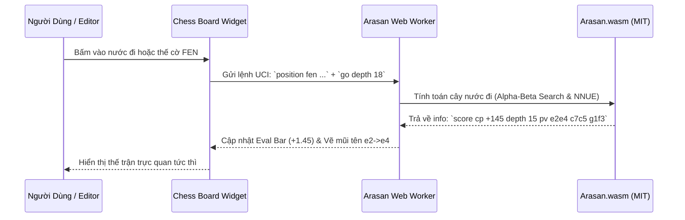

# ♟️ KẾ HOẠCH CHI TIẾT - GIAI ĐOẠN 2: ARASAN ENGINE INTEGRATION
> **Mục tiêu**: Tích hợp Động cơ Phân tích Arasan (Giấy phép MIT) vào hệ thống qua WebAssembly cho Web/Mobile và Native UCI cho Desktop.  
> **Giấy phép**: 100% MIT (Arasan Chess Engine by Jon Dart).

---

## 1. MỤC TIÊU VÀ ĐẦU RA (DELIVERABLES)
1. **Engine Arasan WebAssembly (Web & Mobile)**:
   - File nhị phân `arasan.wasm` và loader `arasan.js` được biên dịch tối ưu (SIMD / Web Threads).
   - Module Web Worker chạy ngầm, không làm nghẽn luồng UI khi đang tính toán thế cờ sâu.
2. **Engine Arasan Native (Desktop App)**:
   - Giao tiếp qua chuẩn UCI (Universal Chess Interface) bằng Rust Backend Subprocess / Tokio Async.
   - Hỗ trợ đa luồng (Multi-threading: 4-16 threads) và dung lượng bảng băm (Hash Table) cấu hình được.
3. **Giao diện Phân tích Trực quan**:
   - **Thanh đánh giá thế trận (Evaluation Bar)**: Hiển thị điểm số hiện tại (ví dụ: `+1.8`, `-0.5`, `M3` - Chiếu hết sau 3 nước) với hiệu ứng động mượt mà.
   - **Multi-PV (Multi Principal Variations)**: Hiển thị 1 đến 5 nước đi hàng đầu kèm theo điểm số và chuỗi nước dự đoán.
   - **Mũi tên gợi ý của Engine (Best Move Arrow)**: Tự động vẽ mũi tên chỉ nước đi tối ưu trên bàn cờ.
4. **Tự động Phân tích Ván đấu (Automated Game Review)**:
   - Quét toàn bộ ván đấu PGN, tự động gắn nhãn: *Xuất sắc (Brilliant)*, *Tốt (Best)*, *Kém chính xác (Inaccuracy)*, *Sai lầm (Mistake)*, *Mất cờ (Blunder)*.
   - Xuất biểu đồ dao động thế trận (Advantage Graph).

---

## 2. KIẾN TRÚC MÃ NGUỒN & MODULES

```
plugs/chess/
  └── src/
      └── engine/
          ├── arasan_worker.ts      # Web Worker bọc giao tiếp UCI với Arasan Wasm
          ├── arasan_native.ts      # Giao tiếp qua Syscall với Arasan Native trên Desktop
          ├── uci_protocol.ts       # Parser giao thức chuẩn UCI (position, go, info, pv, bestmove)
          ├── eval_bar.ts           # Component render thanh điểm số đánh giá thế cờ
          ├── game_reviewer.ts      # Logic tự động quét & chấm điểm toàn bộ ván PGN
          └── wasm/
              ├── arasan.wasm       # File nhị phân Arasan compiled via Emscripten
              └── arasan_wrapper.js # JS Glue code
```

---

## 3. QUY TRÌNH HOẠT ĐỘNG CỦA ENGINE (WORKFLOW)



---

## 4. KẾ HOẠCH KIỂM THỬ & XÁC MINH (VERIFICATION)

1. **Kiểm tra độ chính xác UCI**:
   - Gửi các thế cờ nổi tiếng (ví dụ: Thế cờ chiếu hết Lasker, thế cờ tàn cuộc Philidor) -> Xác nhận Arasan tìm ra `bestmove` chính xác.
2. **Kiểm tra hiệu năng (Performance & Memory)**:
   - Giới hạn RAM tối đa của Worker không vượt quá 128MB.
   - Tự động ngắt tính toán (`stop`) khi người dùng chuyển sang trang khác hoặc lướt qua thế cờ khác để tiết kiệm CPU/Pin.
3. **Kiểm tra Game Review**:
   - Chạy thử nghiệm phân tích một ván đấu PGN 50 nước -> Đảm bảo hoàn thành dưới 15 giây và trả về đầy đủ bảng thống kê sai lầm.
