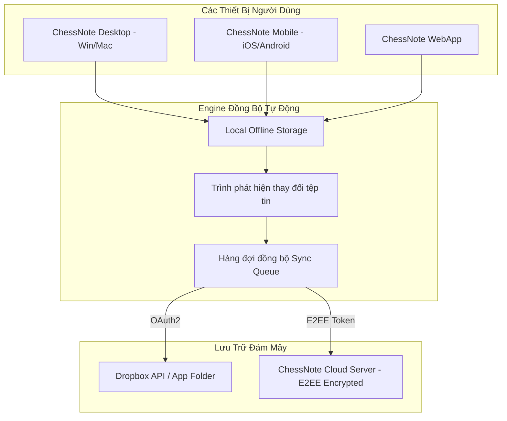

# ♟️ KẾ HOẠCH CHI TIẾT - GIAI ĐOẠN 4: MULTI-PLATFORM & SYNC
> **Mục tiêu**: Đóng gói phần mềm đa nền tảng (Desktop qua Tauri v2, Mobile qua Capacitor) và xây dựng cơ chế đồng bộ linh hoạt qua Dropbox API & ChessNote Cloud E2EE.  
> **Giấy phép**: 100% MIT / Apache 2.0 (Tauri v2, Capacitor, Dropbox SDK).

---

## 1. MỤC TIÊU VÀ ĐẦU RA (DELIVERABLES)
1. **Desktop App (Windows, macOS, Linux)**:
   - Sử dụng **Tauri v2** (Rust Backend + Native Webview).
   - Dung lượng cài đặt cực nhẹ (~10MB), tiêu thụ RAM thấp (<50MB).
   - Tích hợp Engine **Arasan C++ Native** chạy đa luồng tối đa hiệu năng.
   - Hỗ trợ lưu trữ trực tiếp trên hệ thống tệp tin cục bộ (Local File System) và phím tắt toàn hệ thống.
2. **Mobile App (iOS & Android)**:
   - Sử dụng **Capacitor** đóng gói Web Client thành Native App.
   - Tối ưu giao diện cảm ứng: Kéo thả quân nhạy, chế độ xem bàn cờ toàn màn hình, bàn phím số/nước đi ảo.
   - Hoạt động 100% Offline (Local SQLite / IndexedDB Cache).
3. **Cơ Chế Đồng Bộ Dữ Liệu (Multi-Sync Strategy)**:
   - **Đồng bộ Dropbox**: Liên kết tài khoản Dropbox cá nhân của người dùng qua OAuth2 PKCE, tự động đồng bộ 2 chiều (Bidirectional Sync).
   - **Đồng bộ ChessNote Cloud E2EE (Gói Thuê Bao)**: Đồng bộ mã hóa đầu cuối tức thì (Real-time delta sync) giữa Máy tính, Điện thoại và Web.
   - **Xử lý xung đột (Conflict Resolution)**: Tự động giữ phiên bản mới nhất hoặc sinh file xung đột `.conflict.md` không bao giờ làm mất dữ liệu của người dùng.

---

## 2. KIẾN TRÚC MÃ NGUỒN & MODULES

```
chessnote/
  ├── desktop/                      # Ứng dụng Desktop (Tauri v2)
  │   ├── src-tauri/
  │   │   ├── Cargo.toml            # Cấu hình Tauri & Rust dependencies
  │   │   ├── tauri.conf.json       # Thiết lập ứng dụng (Windows, macOS DMG, Linux AppImage)
  │   │   ├── src/
  │   │   │   ├── main.rs           # Entry point Tauri
  │   │   │   ├── arasan_uci.rs     # Quản lý tiến trình Arasan Native qua chuẩn UCI
  │   │   │   └── local_fs.rs       # Native file system driver
  │   │   └── bin/
  │   │       └── arasan-native     # File thực thi Arasan C++ native
  ├── mobile/                       # Ứng dụng Mobile (Capacitor)
  │   ├── capacitor.config.ts       # Cấu hình App ID, Plugins (iOS / Android)
  │   ├── android/                  # Android Studio Project
  │   └── ios/                      # Xcode Project
  └── plugs/
      └── sync/
          ├── dropbox_provider.ts   # Driver đồng bộ qua Dropbox API v2
          ├── cloud_provider.ts     # Driver đồng bộ qua ChessNote Cloud Sync
          └── conflict_resolver.ts  # Thuật toán so khớp phiên bản tệp tin
```

---

## 3. QUY TRÌNH ĐỒNG BỘ DROPBOX & CLOUD (SYNC WORKFLOW)



---

## 4. KẾ HOẠCH KIỂM THỬ & XÁC MINH (VERIFICATION)

1. **Kiểm thử Desktop (Tauri v2)**:
   - Build bộ cài đặt Windows `.msi` / `.exe` và macOS `.dmg`.
   - Kiểm tra khởi động app, mở thư mục ghi chú cục bộ và kích hoạt Arasan Native UCI.
2. **Kiểm thử Mobile (Capacitor)**:
   - Chạy trên thiết bị thật iOS và Android.
   - Kiểm tra khả năng mở offline khi bật Chế độ máy bay (Airplane Mode).
3. **Kiểm thử Đồng bộ (Sync Testing)**:
   - Chỉnh sửa 1 ván cờ trên Desktop -> Mở Mobile xem ván cờ có tự động cập nhật trong vòng 3 giây không.
   - Thử nghiệm mất mạng giữa chừng -> Kiểm tra hệ thống tự động kết nối lại và đồng bộ tiếp khi có mạng.
