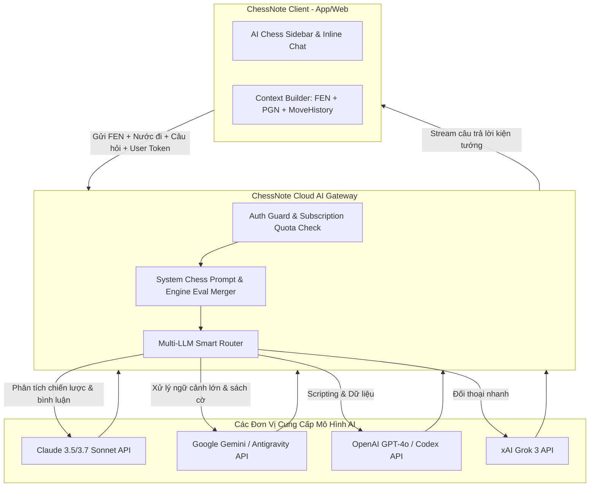

# ♟️ KẾ HOẠCH CHI TIẾT - GIAI ĐOẠN 5: AI AGENTS SUBSCRIPTION SYSTEM
> **Mục tiêu**: Xây dựng Cổng AI Gateway và Hệ sinh thái AI Agents (Claude, Antigravity, OpenAI, Grok) theo mô hình Gói Thuê Bao Hàng Tháng (Subscription SaaS), người dùng không cần cấu hình API Key cá nhân.  
> **Giấy phép**: 100% MIT (Mã nguồn Client/Gateway; các LLM API gọi qua dịch vụ đám mây an toàn).

---

## 1. MỤC TIÊU VÀ ĐẦU RA (DELIVERABLES)
1. **Hệ Thống Đăng Ký & Gói Thuê Bao (Subscription Management)**:
   - Các gói dịch vụ: **Free**, **Pro ($9/tháng)**, **Coach/Master ($19/tháng)**.
   - Người dùng chỉ cần đăng nhập tài khoản ChessNote trong App -> Toàn bộ tính năng AI tự động kích hoạt.
   - Không cần mua API token riêng lẻ; hệ thống tự quản lý hạn mức sử dụng công bằng (Fair Usage Policy).
2. **ChessNote AI Gateway Router (Backend Service)**:
   - Máy chủ Gateway trung gian bảo mật (xây dựng bằng Rust hoặc Node.js).
   - Tiếp nhận câu hỏi từ Client, kiểm tra tính hợp lệ của Token thuê bao, điều phối tới Model AI tối ưu nhất:
     - **Claude 3.5/3.7 Sonnet**: Phân tích thế trận sâu sắc, bình luận ván đấu phong cách Kiện tướng, giải thích ý tưởng trung cuộc.
     - **Antigravity / Gemini 2.5 Flash & Pro**: Phân tích tài liệu lớn, tổng hợp sách cờ, tìm kiếm thông tin lịch sử ván đấu.
     - **OpenAI / Codex (GPT-4o)**: Tự động sinh kịch bản Space Lua, xử lý dữ liệu và bóc tách PGN số lượng lớn.
     - **Grok 3 (xAI)**: Đóng vai phong cách đối thoại chiến thuật nhạy bén, tương tác hỏi đáp nhanh.
3. **Các AI Agents Chuyên Môn Cờ Vua Cốt Lõi**:
   - **Grandmaster Coach Agent**: Đóng vai trò huấn luyện viên cá nhân, giải thích nước đi: *"Tại sao nước đi này tốt? Kế hoạch tiếp theo là gì? Đâu là điểm yếu của đối thủ?"*.
   - **Game Annotator Agent**: Tự động đọc file PGN và viết lời bình văn học cờ vua hoàn chỉnh cho toàn bộ ván đấu.
   - **Repertoire Strategist Agent**: Đề xuất biến thế khai cuộc dựa trên phong cách cá nhân và các ván đấu trước đây của người dùng.
   - **Sparring Chat Agent**: Tương tác với người dùng theo phong cách các danh thủ huyền thoại (Kasparov, Tal, Capablanca, Fischer).

---

## 2. KIẾN TRÚC HỆ THỐNG AI GATEWAY

---

## 3. THIẾT KẾ CÁC GÓI THUÊ BAO (TIER SPECIFICATIONS)

| Gói Dịch Vụ | Giá Đề Xuất | Quyền Lợi AI Agents | Engine Arasan | Đồng Bộ Dữ Liệu |
| :--- | :--- | :--- | :--- | :--- |
| **Free (Miễn Phí)** | $0 | Dùng thử 10 câu hỏi AI/ngày | Arasan Wasm không giới hạn | Local + Dropbox cá nhân |
| **Pro Plan** | **$9 / tháng** | 300 câu hỏi Coach AI/tháng, Tự động phân tích 50 ván PGN/tháng | Arasan Wasm + Native đa luồng | ChessNote Cloud E2EE + Dropbox |
| **Master / Coach Plan** | **$19 / tháng** | Không giới hạn Coach AI, Tự động bình luận ván đấu không giới hạn, Antigravity Book Search | Arasan Native tối đa luồng + Syzygy 7-piece Tablebase | Cloud E2EE tốc độ cao + Chia sẻ giáo án lớp học |

---

## 4. KẾ HOẠCH KIỂM THỬ & XÁC MINH (VERIFICATION)

1. **Kiểm thử AI Gateway**:
   - Gửi yêu cầu với Token hợp lệ / không hợp lệ / hết hạn -> Xác nhận Gateway phản hồi đúng mã lỗi và chuyển hướng nâng cấp gói.
2. **Kiểm thử Chất lượng Phân tích Cờ Vua của AI**:
   - Đưa vào 10 thế cờ chiến thuật phức tạp -> Xác nhận AI Coach giải thích đúng ý đồ chiến thuật (không nói nước đi bịa / hallucination) nhờ vào việc Gateway kết hợp sẵn kết quả tính toán của Arasan vào Prompt.
3. **Kiểm thử Trải nghiệm Streaming**:
   - Câu trả lời của AI hiển thị theo thời gian thực (Server-Sent Events / WebSocket) trực tiếp bên cạnh bàn cờ.
