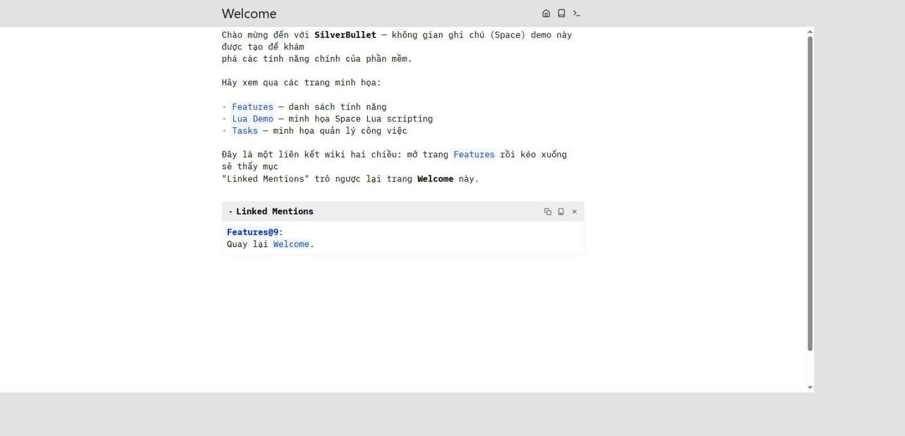
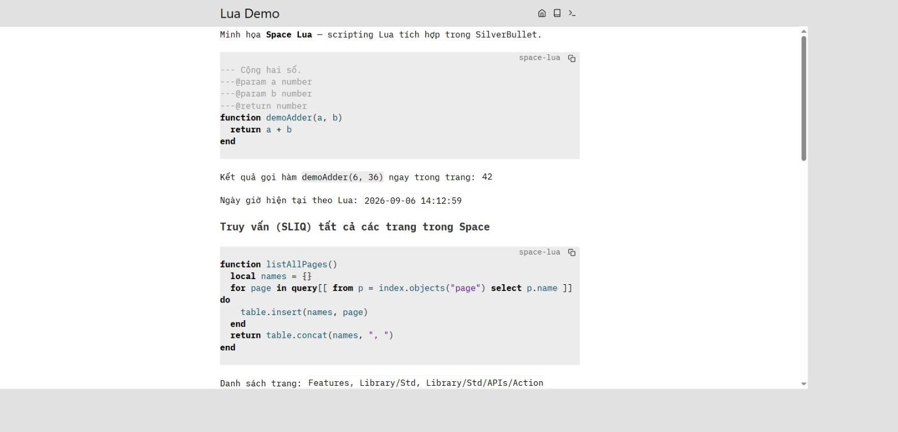
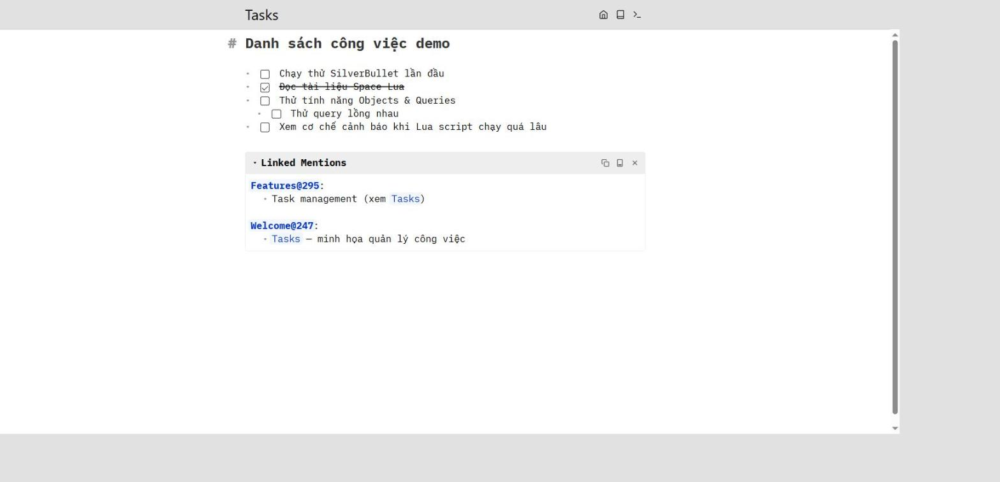
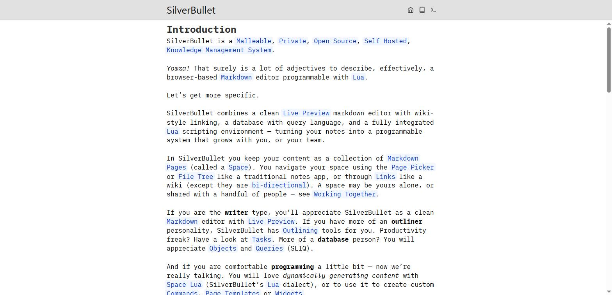
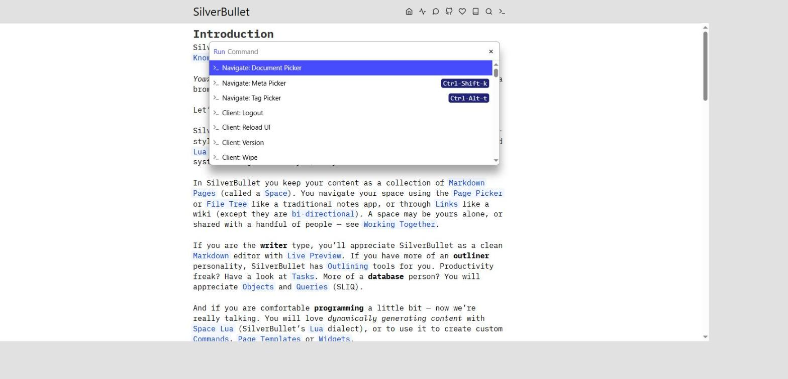
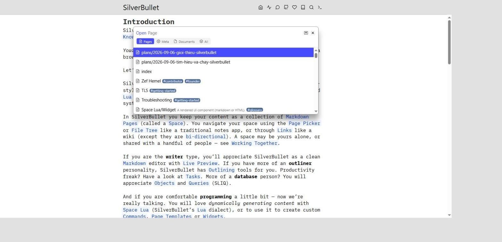
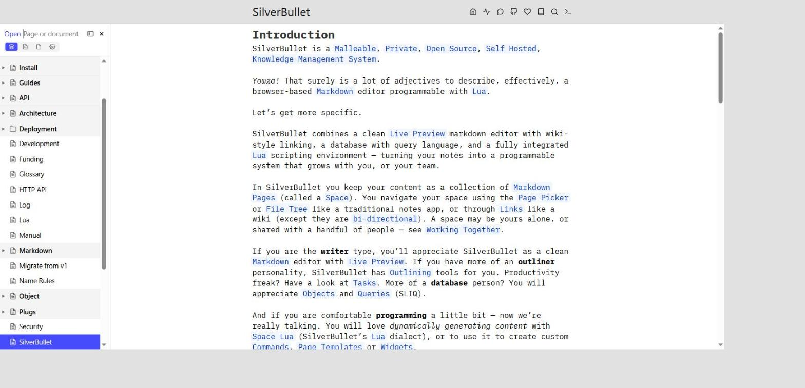
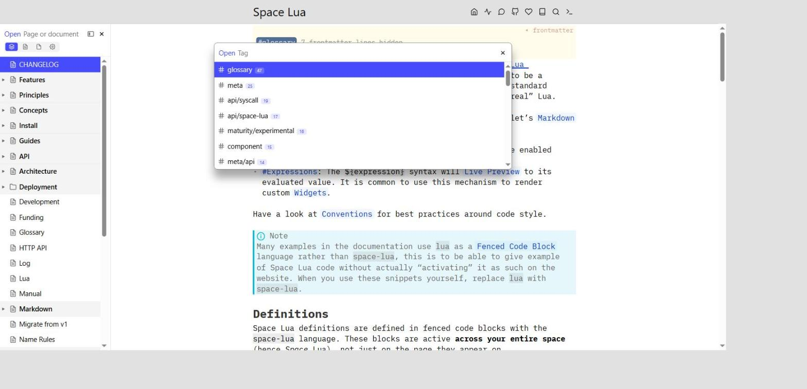
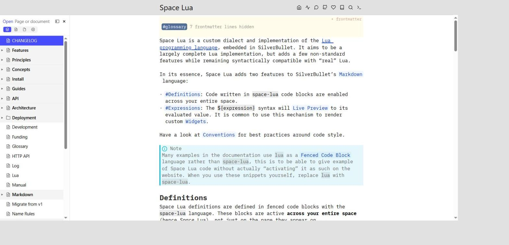

# Giới thiệu chi tiết: SilverBullet (repo "chessnote")

> Tài liệu này tổng hợp kết quả tìm hiểu và chạy thử thực tế phần mềm trong repo
> `D:\code\chessnote`, thực hiện ngày 2026-09-06. Xem kế hoạch gốc tại
> [`2026-09-06-tim-hieu-va-chay-silverbullet.md`](./2026-09-06-tim-hieu-va-chay-silverbullet.md).

## 1. Đây là phần mềm gì?

Tên thư mục/repo cục bộ là **"chessnote"** (remote `origin` trỏ tới
`github.com/covuaduongsinh/chessnote`), nhưng đó chỉ là tên bạn đặt cho bản fork —
**bản thân phần mềm không liên quan gì đến cờ vua**. Đây thực chất là mã nguồn của
**[SilverBullet](https://silverbullet.md)** (`upstream = silverbulletmd/silverbullet`):

> "A Programmable, Private, Browser-based, Open Source, Self-Hosted, Personal Knowledge
> Database."

Nói ngắn gọn: một ứng dụng **ghi chú kiểu wiki**, tự lưu trữ (self-hosted), nội dung là các
trang Markdown gọi là **Space**, có liên kết chéo hai chiều, cơ sở dữ liệu/truy vấn tích hợp,
và một môi trường **scripting Lua** riêng để lập trình ngay trong ghi chú.

## 2. Kiến trúc & công nghệ

Kiến trúc **client-server**, tự host được trên máy cá nhân hoặc server nhóm:

| Thành phần | Công nghệ | Vai trò |
|---|---|---|
| `server/`, `server-common/` | Rust, `axum`, `tokio`, `argon2`, `jsonwebtoken` | HTTP server, router, xác thực, API không gian/file |
| `server-runtime-chrome/` | Rust + headless Chrome | Chạy Space Lua/script phía server (endpoint `/.runtime`) |
| `server-merge/` | Rust | Logic merge/đồng bộ khi nhiều client cùng sửa |
| `client/` | TypeScript, CodeMirror 6, **Preact** (không phải React) | Editor live-preview, UI, Service Worker (PWA offline-first) |
| `client/space_lua/` | Parser Lua tự viết (`@lezer/generator`) | Runtime "Space Lua" chạy trong trình duyệt |
| `plugs/` | TypeScript | Các "Plug" built-in: core, editor, emoji, sync, index... |
| `bin/silverbullet`, `bin/sb` | Rust | Binary server chính và CLI client phụ |

Build tool: ESBuild (client), Cargo (Rust). Test: Vitest (unit TS), `cargo test` (Rust),
Playwright (e2e). Container hoá qua Docker.

## 3. Các tính năng chính

- **Markdown editor với Live Preview** — soạn thảo mượt, xem trước ngay khi gõ.
- **Liên kết wiki hai chiều** — viết `[[Tên trang]]` là tự động tạo liên kết, và trang đích
  tự hiện khối **"Linked Mentions"** liệt kê mọi nơi trỏ tới nó. Đã kiểm chứng trực tiếp khi
  chạy thử (xem ảnh minh họa bên dưới).
- **Objects & Queries (SLIQ)** — một ngôn ngữ truy vấn kiểu SQL/LINQ nhúng trong Lua
  (`query[[ from ... where ... select ... ]]`), cho phép biến ghi chú thành "cơ sở dữ liệu"
  cá nhân, truy vấn task, trang, thẻ (tag) một cách có cấu trúc.
- **Space Lua** — dialect Lua 5.4 tự viết, nhúng sâu vào Markdown qua hai cơ chế:
  - Khối mã ` ```space-lua ` định nghĩa hàm/biến dùng được **toàn Space**.
  - Cú pháp `${expression}` để hiển thị giá trị Lua tính toán được ngay trong trang (live).
  Dùng để viết Command tùy chỉnh, Page Template, Widget động. Có cả runtime phía server qua
  headless-Chrome (`server-runtime-chrome/`) cho các tác vụ nặng hơn.
- **Task management** — checkbox `- [ ]` / `- [x]` tương tác được trực tiếp trên trang, hỗ
  trợ lồng nhau (sub-task).
- **Space Manager** — hỗ trợ triển khai đa người dùng/đa space, phân quyền theo từng space
  (none/read/write), setup wizard, account menu.
- **Revisions** — quản lý lịch sử thay đổi qua git (chế độ Managed/Unmanaged/Disabled).
- **Sync engine offline-first** — Service Worker giúp app hoạt động cả khi mất mạng, đồng bộ
  lại khi có mạng.
- **Collaboration** (đang phát triển, theo git log gần đây) — đồng bộ gần real-time,
  at-mentions, cơ chế giải quyết xung đột.

## 4. Bảo mật — điểm đáng chú ý

Đây là mảng đang được đội ngũ phát triển siết chặt liên tục (nhiều commit gần đây):

- **3 "capability endpoint" nhạy cảm**, tất cả yêu cầu quyền `write`:
  - `/.shell` — chạy lệnh tuỳ ý trên server, **mặc định tắt**.
  - `/.proxy` — proxy HTTP request ra ngoài qua server (dùng qua API Lua `net.proxyFetch`).
  - `/.runtime` — evaluate Lua/script qua headless-browser phía server.
- **Chống CSRF/confused-deputy** (`server/src/router.rs`): mọi route yêu cầu quyền `write`
  đều kiểm tra header `Sec-Fetch-Site` (từ chối request cross-site), fallback so sánh
  `Origin` cho client cũ; chỉ áp dụng khi request có session cookie trình duyệt (không áp
  dụng cho API client dùng Bearer token).
- **Sanitize HTML** khi render Markdown/HTML nhúng (`client/markdown_renderer/sanitize_html.ts`)
  để chống XSS.
- **Security Profiles** (`docs/Deployment/Security Profiles.md`) — khuyến nghị cấu hình
  theo mức độ tin cậy triển khai: cá nhân (1 domain, có thể bật shell) so với dịch vụ dùng
  chung nhiều người (tắt shell, mỗi space không tin cậy dùng subdomain riêng vì session
  cookie scope theo hostname).
- **Mô hình trust** (`docs/Security.md`): một Space là "môi trường có thể chạy script, không
  phải tài liệu thụ động" — ai có quyền `write` có thể viết Space Lua chạy trong trình duyệt
  của bất kỳ ai mở lại space đó, kể cả admin.

## 5. Cơ chế mới nhất: phát hiện Lua script chạy quá lâu

Commit mới nhất trên `main` (`6331add1`) thêm `client/space_lua/budget.ts`: theo dõi thời
gian CPU (busy time) một script Space Lua chiếm dụng trên main thread. Khi vượt ngưỡng, cơ
chế này:

1. Tự động `yield` bằng `MessageChannel` (một macrotask thật sự — cố tình tránh dùng
   `scheduler.yield()` vì API đó có độ ưu tiên cao bất thường so với task thường).
2. Cảnh báo người dùng rằng script đang chạy lâu/chiếm nhiều CPU, cho phép người dùng chọn
   dừng script, thay vì để nó làm treo cứng editor.

Đây là một cải tiến trực tiếp về độ tin cậy của runtime Space Lua — script lỗi (vòng lặp vô
hạn, đệ quy sai) sẽ không còn làm đứng ứng dụng.

## 6. Đã chạy thử thành công — minh họa trực quan

Đã build **full release** (`npm install`, `npm run build`, `npm run build:plug-compile`,
`cargo build --release -p silverbullet -p sb`) và chạy binary
`target/release/silverbullet.exe` với một demo space tạo riêng cho việc này (không commit
vào repo), phục vụ trên `http://localhost:3737`.

**Wiki-link hai chiều — "Linked Mentions" tự động:**



**Space Lua chạy thực tế — gọi hàm, hiển thị ngày giờ động, và truy vấn SLIQ liệt kê trang:**



Kết quả xác nhận: `demoAdder(6, 36)` trả về `42`; biểu thức `${os.date(...)}` hiển thị đúng
giờ hệ thống; truy vấn `query[[ from p = index.objects("page") select p.name ]]` liệt kê
đúng danh sách các trang trong Space.

**Task management — checkbox lồng nhau, tương tác được, cùng Linked Mentions:**



## 6b. "Giao diện trông thô sơ quá?" — câu trả lời

Sau khi xem demo đầu tiên, bạn hỏi đúng: giao diện chỉ có văn bản đơn giản trông rất mộc.
Đã kiểm tra kỹ và đây **không phải lỗi build thiếu tính năng**, mà do 3 lý do cộng lại:

1. **Thẩm mỹ cố ý**: font chữ là monospace `iA Writer Mono` — SilverBullet chọn phong cách
   "plain-text-first", không màu mè như Notion. Đã xác nhận `main.css`, `client.js`, font đều
   tải thành công (HTTP 200), không có lỗi console.
2. **Demo space quá sơ sài**: không gian ghi chú tự tạo ban đầu chỉ có 4 trang ngắn, không đủ
   nội dung để thể hiện định dạng phong phú (heading lớn, admonition, tag, bảng...).
3. **Quan trọng nhất**: phần lớn UI điều hướng "đầy đủ" của SilverBullet là các
   **overlay/sidebar ẩn theo mặc định**, chỉ hiện ra khi gọi bằng phím tắt — không tự động
   hiển thị sẵn trên màn hình như một ứng dụng thông thường.

| Navigator | Phím tắt | Nơi hiển thị |
|---|---|---|
| **Page Picker** (tìm trang theo tên) | `Ctrl-k` | overlay modal |
| **Command Palette** (chạy mọi lệnh) | `Ctrl-/` (hoặc bấm icon `>_` góc phải top bar) | overlay modal |
| **Navigate: Tree** — chính là **sidebar cây trang** bạn mong đợi thấy | `Ctrl-o` / `Ctrl-Shift-o` | sidebar trái, đóng lại được |
| **Tag Picker** | `Ctrl-Alt-t` | overlay modal |
| Table of Contents / Linked Mentions / Linked Tasks | qua Command Palette | modal hoặc gắn đầu/cuối trang |

Để chứng minh, đã chạy thêm một server **thứ hai, chỉ đọc** (`SB_READ_ONLY=1`) ngay trên
chính thư mục `docs/` của repo — đây là Space thật dùng để dựng trang tài liệu chính thức
của SilverBullet, nội dung phong phú hơn hẳn demo space ban đầu:

**Trang chủ tài liệu thật (`docs/` là một Space SilverBullet thật sự):**



**Command Palette (`Ctrl-/`) — danh sách lệnh có thể chạy:**



**Page Picker (`Ctrl-k`) — tìm trang mờ (fuzzy), có tab Pages/Meta/Documents/All, tag:**



**Navigate: Tree (`Ctrl-o`) — đây chính là sidebar cây trang:**



**Tag Picker (`Ctrl-Alt-t`):**



**Một trang tài liệu thật với định dạng phong phú (heading, admonition, tag, inline code):**



**Kết luận**: build không thiếu tính năng gì — toàn bộ UI phong phú (sidebar, command
palette, page picker, tag picker, định dạng heading/admonition/table...) đều hoạt động đầy
đủ, chỉ là chúng ẩn theo mặc định và cần gọi bằng phím tắt, đúng triết lý "distraction-free"
của SilverBullet. Vào Space thật của riêng bạn (thay vì demo space rỗng), giao diện sẽ ngay
lập tức trông phong phú hơn nhiều.

> Lưu ý an toàn: server phục vụ `docs/` được chạy với `SB_READ_ONLY=1` nên không thể ghi đè
> lên tài liệu gốc của repo — đã xác nhận `git status --short docs` sạch sau khi thao tác.

## 7. Cách tự build & chạy lại

Yêu cầu: Node.js 24+, npm 10+, Rust toolchain (rustup). Máy đã kiểm tra có Node v25.2.1,
npm 11.6.2, Rust 1.95.0 — đạt yêu cầu.

```shell
# Cài dependencies JS (không cần npx playwright install nếu chỉ chạy app, chỉ cần cho e2e test)
npm install

# Build client bundle + biên dịch plug
npm run build
npm run build:plug-compile

# Build release binary (Windows: cần MSVC/Visual Studio Build Tools cho linker của Rust)
cargo build --release -p silverbullet -p sb

# Chạy với một thư mục ghi chú bất kỳ làm Space
./target/release/silverbullet.exe -p 3737 "<đường-dẫn-space-của-bạn>"
```

Sau đó mở `http://localhost:3737` (hoặc cổng bạn chỉ định qua `-p`).

Nếu máy có `make` (qua Git Bash/WSL/MSYS2 có GNU Make), có thể dùng tắt:

```shell
make setup   # npm install + npx playwright install (cho e2e test)
make build   # tương đương 3 lệnh build ở trên
```

Các lệnh hữu ích khác trong `Makefile`: `make test` (unit test TS + Rust), `make test-e2e`
(Playwright), `make check` (lint + typecheck + clippy), `make clean`.

## 8. Trạng thái server hiện tại

Hai server đang chạy nền cục bộ trên máy bạn (không phải dịch vụ public):

| Server | URL | Nội dung | Ghi được không? |
|---|---|---|---|
| Demo space tự tạo | `http://localhost:3737` | 4 trang mẫu (Welcome, Features, Lua Demo, Tasks) | Có (space demo, không quan trọng) |
| Docs thật của repo | `http://localhost:3001` | Toàn bộ tài liệu chính thức SilverBullet (`docs/`) | **Không** — chạy với `SB_READ_ONLY=1` để bảo vệ mã nguồn |

Thử ngay các phím tắt ở mục 6b (`Ctrl-o`, `Ctrl-/`, `Ctrl-k`, `Ctrl-Alt-t`) trên cả hai để
tự trải nghiệm. Dừng server khi không cần nữa: mở Task Manager tìm tiến trình
`silverbullet.exe`, hoặc trong PowerShell chạy `taskkill /IM silverbullet.exe /F` (dừng cả
hai cùng lúc vì chúng là 2 instance của cùng một binary).
