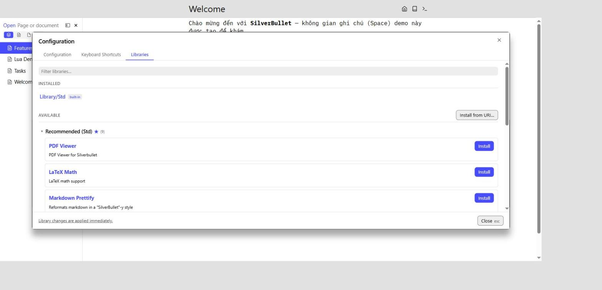

# Hướng dẫn: cài thêm "plugin" trong SilverBullet (so với Obsidian)

> Bổ sung cho [`2026-09-06-gioi-thieu-silverbullet.md`](./2026-09-06-gioi-thieu-silverbullet.md).
> Đã kiểm chứng trực tiếp trên server demo (`http://localhost:3737`) bằng lệnh thật trong
> Command Palette — không chỉ đọc tài liệu suông.

## 1. SilverBullet gọi plugin là gì?

SilverBullet gọi là **"Plug"** (không phải "plugin"), là mã TypeScript biên dịch thành một
file `.plug.js` chạy trong sandbox Web Worker của trình duyệt (`docs/Plugs.md`,
`docs/Architecture/Plugs.md`).

Đơn vị bạn thực sự **cài đặt** không phải là plug riêng lẻ, mà là **Library** — một trang
Markdown đặc biệt (gắn tag `meta/library`) có thể đi kèm một hoặc nhiều file `.plug.js`,
template trang, Space Lua script... Nói cách khác, "Library" ở SilverBullet rộng hơn khái
niệm "plugin" ở Obsidian — nó có thể chỉ là vài dòng Space Lua, không nhất thiết phải có code
TypeScript nào.

> **Lưu ý nếu bạn từng đọc hướng dẫn cũ trên mạng**: các bản SilverBullet v1 dùng file
> `PLUGS.md` để khai báo danh sách plug. Bản v2 (trong repo này) **không dùng cách đó nữa** —
> `docs/Migrate from v1.md` xác nhận: "Plug installation is now handled through the
> Configuration Manager... Legacy `plugs:` config entries are ignored."

## 2. Cách mở màn hình cài đặt — giống hệt "Community Plugins" của Obsidian

1. Mở **Command Palette** (`Ctrl-/` hoặc `Cmd-/`, hoặc bấm icon `>_` góc phải top bar).
2. Gõ **"Libraries"**, chọn lệnh **`Libraries: Manager`** (hoặc bấm `Ctrl-,`/`Cmd-,` — trên
   một số bản phím tắt này có thể trùng với bàn phím khác, dùng Command Palette là chắc ăn
   nhất).

Kết quả — hộp thoại **Configuration → tab Libraries**:

Cấu trúc y hệt Obsidian:

- **INSTALLED** — các Library đã cài (mặc định có sẵn `Library/Std`, đánh dấu `built-in`).
- **AVAILABLE** — danh sách Library có thể cài, nhóm theo Repository. Nhóm mặc định
  **"Recommended (Std)"** liệt kê 9 library đã được đội SilverBullet chọn lọc sẵn: PDF
  Viewer, LaTeX Math, Markdown Prettify, và (cuộn thêm) Git integration, Mermaid Diagrams,
  Excalidraw, Silversearch (full-text search), Document Explorer...
- Mỗi dòng có nút **Install** riêng — bấm là cài ngay, **không cần khởi động lại app**.
- Nút **"Install from URI…"** ở góc phải — dùng khi muốn cài một Library không có sẵn trong
  danh sách (dán link GitHub tới file Library `.md`, hoặc trực tiếp link `.plug.js`).

## 3. Cài một Library có sẵn trong danh sách

1. Mở Libraries Manager như bước 2.
2. Tìm Library muốn dùng trong mục "Available" (có thể gõ vào ô "Filter libraries…" ở đầu để
   lọc nhanh).
3. Bấm nút **Install** ở dòng đó.
4. Xong — Library chuyển sang mục "Installed", có hiệu lực ngay lập tức, không cần reload
   trang hay khởi động lại server.

## 4. Cài một Library/Plug từ bên ngoài (không có trong danh sách "Std")

1. Tìm địa chỉ Library muốn cài — thường là một URL GitHub tới file Markdown, ví dụ dạng:
   `https://github.com/<tác-giả>/<repo>/blob/main/<Tên>.md`, hoặc rút gọn kiểu
   `ghr:<tác-giả>/<repo>/PLUG.md`.
2. Trong Libraries Manager, bấm **"Install from URI…"**.
3. Dán URI vào ô hỏi (`Library or plug URI (https://… or github:…):`).
   - Nếu URI kết thúc bằng `.plug.js`, hệ thống sẽ hỏi thêm bạn muốn lưu file đó vào đường
     dẫn nào trong Space của bạn.
   - Nếu là link tới trang Library `.md`, hệ thống tự tải Library đó cùng mọi file đính kèm
     khai báo trong phần `files:` của nó.

## 5. Theo dõi thêm "kho" (Repository) khác ngoài Std — gần giống việc thêm nguồn plugin bên thứ ba

Khác với Obsidian (chỉ có một marketplace chính thức duy nhất), SilverBullet cho phép **bất
kỳ ai** tự host một Repository riêng (chỉ là một trang Markdown gắn tag `meta/repository`
chứa danh sách Library kèm `uri`), và bạn có thể "theo dõi" thêm các kho đó:

1. Command Palette → gõ **"Add Repository"** → chọn **`Library: Add Repository`**.
2. Dán URI của trang repository muốn theo dõi.
3. Đặt tên trang lưu lại (mặc định gợi ý dưới `Repositories/<tên>`).
4. Các Library trong kho đó sẽ xuất hiện thêm trong mục "Available" của Libraries Manager.

Nơi khám phá thêm Library/Plug do cộng đồng làm (không phải marketplace tích hợp sẵn trong
app, mà là diễn đàn bên ngoài): **https://community.silverbullet.md/c/plugs/14**.

## 6. Gỡ cài đặt / cập nhật

- Trong tab **Installed**, mỗi Library có nút **Update** / **Remove**.
- Nút **"Update all"** cập nhật toàn bộ Library đã cài cùng lúc.
- Lệnh `Library: Update All Repositories` (qua Command Palette) làm mới danh sách "Available"
  từ mọi Repository đang theo dõi.
- Mục **"Rogue Plugs"** (nếu có) liệt kê các file `.plug.js` nằm trong Space nhưng không gắn
  với Library nào (thường do copy tay lúc phát triển) — cũng gỡ được từ đây.

## 7. Khác biệt quan trọng so với Obsidian — tóm tắt nhanh

| | Obsidian | SilverBullet |
|---|---|---|
| Tên gọi | Plugin | Plug (đóng gói trong **Library**) |
| Nơi duyệt/cài | Settings → Community plugins → Browse | Command Palette → `Libraries: Manager` |
| Kho plugin | Một marketplace chính thức duy nhất | Kho `Std` chọn lọc sẵn + tự thêm Repository bất kỳ (không có duyệt tập trung) |
| Cài plugin ngoài kho chính thức | Phải bật "Community plugins" + cài thủ công qua thư mục | Dán URI trực tiếp qua "Install from URI…", không cần bật gì thêm |
| Cần khởi động lại? | Đôi khi cần reload Obsidian | Không — có hiệu lực ngay, tối đa chạy thêm lệnh `Plugs: Reload` |
| Duyệt bảo mật | Obsidian review trước khi lên marketplace | Không có quy trình review chính thức — kho "Std" chỉ là danh sách chọn lọc thủ công, kho khác do người dùng tự chịu trách nhiệm khi thêm |

## 8. Lưu ý an toàn khi tự thêm Library/Repository từ bên ngoài

Vì không có bước duyệt bảo mật tập trung như Obsidian, một Library cài vào chạy Space Lua/
Plug **có toàn quyền như bạn** trong Space đó (đọc/ghi mọi trang, gọi API). Chỉ cài từ nguồn
bạn tin tưởng — xem thêm `docs/Security.md` đã tóm tắt trong tài liệu giới thiệu chính.
