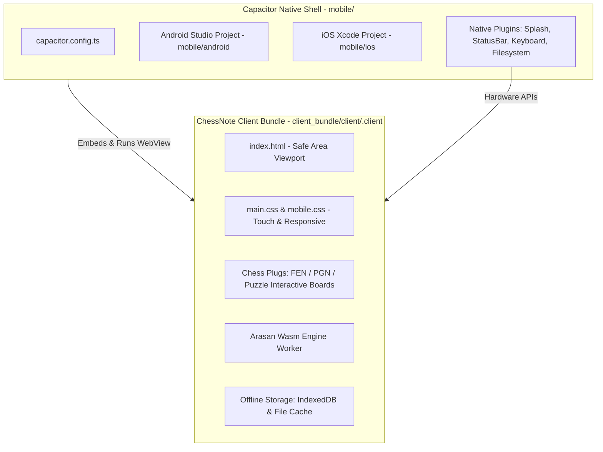

# 📱 KẾ HOẠCH TRIỂN KHAI CHESSNOTE MOBILE APP (CAPACITOR)
> **Mục tiêu**: Đóng gói và tối ưu hóa ứng dụng ChessNote cho nền tảng di động (iOS & Android) bằng Capacitor, đảm bảo trải nghiệm cảm ứng mượt mà, hỗ trợ 100% Offline-First và đồng bộ dữ liệu.  
> **Tài liệu tham chiếu**: [00-master-plan-chessnote.md](00-master-plan-chessnote.md), [04-phase-4-multi-platform-and-sync.md](04-phase-4-multi-platform-and-sync.md)

---

## 1. TỔNG QUAN & MỤC TIÊU CỐT LÕI
1. **Đóng gói Web Client thành Native App**:
   - Sử dụng **Capacitor** để nhúng toàn bộ Web Client (`client_bundle/client/.client`) vào Native WebView.
   - Dung lượng nhẹ, khởi động nhanh, hiệu năng cao trên cả Android và iOS.
2. **Tối ưu hóa Giao diện Cảm ứng (Touch-First & Responsive)**:
   - Thao tác kéo thả và chạm chọn quân cờ trên bàn cờ FEN, PGN, Puzzle nhạy bén (`touch-action: none` / `manipulation`).
   - Xử lý vùng an toàn (Safe Area Insets: tai thỏ, notch, thanh điều hướng).
   - Tối ưu hóa kích thước nút bấm và thanh công cụ di động.
3. **Hoạt động Offline-First 100%**:
   - Tích hợp lưu trữ dữ liệu cục bộ an toàn qua IndexedDB và Capacitor Filesystem/Preferences.
   - Splash Screen chuẩn màu thương hiệu (`#1e293b`), không giật trắng màn hình khi khởi động.
4. **Quy trình Build & Đồng bộ Tự động (Scripts & Tooling)**:
   - Các lệnh thuận tiện: `npm run mobile:build`, `npm run mobile:sync`, `npm run mobile:android`.

---

## 2. KIẾN TRÚC HỆ THỐNG MOBILE APP



---

## 3. CÁC HẠNG MỤC TRIỂN KHAI CHI TIẾT

### 3.1. Cấu hình & Thư viện Capacitor
- Thêm các thư viện Capacitor cần thiết vào `package.json`:
  - `@capacitor/core`
  - `@capacitor/cli`
  - `@capacitor/android`
  - `@capacitor/ios`
  - `@capacitor/splash-screen`
  - `@capacitor/status-bar`
  - `@capacitor/keyboard`
  - `@capacitor/filesystem`
  - `@capacitor/preferences`
- Bổ sung các npm scripts:
  - `"mobile:build"`: `npm run build && npx cap sync`
  - `"mobile:sync"`: `npx cap sync`
  - `"mobile:android"`: `npx cap open android`
  - `"mobile:run:android"`: `npx cap run android`
- Cập nhật cấu hình chuẩn trong `mobile/capacitor.config.ts`:
  - `webDir: '../client_bundle/client/.client'`
  - `appId: 'com.chessnote.app'`
  - `appName: 'ChessNote'`

### 3.2. Khởi tạo Dự Án Native Android & iOS
- Khởi tạo thư mục dự án `mobile/android/` với đầy đủ Gradle Wrapper, AndroidManifest.xml, MainActivity.
- Cấu hình quyền truy cập (Permissions), chế độ màn hình và tối ưu hóa WebView hardware acceleration.
- Chuẩn bị sẵn khung cấu hình cho iOS (`mobile/ios/`).

### 3.3. Tối ưu Giao diện Cảm ứng & Viewport Mobile
- Cập nhật `client/html/index.html`:
  - Thẻ viewport: `width=device-width, initial-scale=1.0, maximum-scale=1.0, user-scalable=no, viewport-fit=cover`.
  - Hỗ trợ web app meta tags cho iOS/Android.
- Tối ưu CSS Safe Area trong `client/styles/`:
  - Thiết lập biến `--sat`, `--sab`, `--sal`, `--sar` từ `env(safe-area-inset-*)`.
  - Tự động đệm an toàn cho top header và bottom command bar.
- Tinh chỉnh tương tác bàn cờ cờ vua trong `plugs/chess/`:
  - Ngăn chặn xung đột cuộn màn hình khi di chuyển quân cờ.
  - Hỗ trợ cơ chế chạm 2 lần (tap square start -> tap square target) tiện lợi cho màn hình nhỏ.

### 3.5. Cơ Chế Lưu Trữ Độc Lập Offline (IndexedDB Engine & Null Safety)
- Trong môi trường Mobile (Capacitor/WebView không có backend server HTTP):
  - Chuyển `EventedSpacePrimitives` sang sử dụng trực tiếp `DataStoreSpacePrimitives` (IndexedDB cục bộ) thay cho `HttpSpacePrimitives`.
  - Tự động nạp dữ liệu khởi tạo (`base_fs.json`) vào IndexedDB ngay lần đầu khởi động.
  - Tăng cường khả năng chịu lỗi (null-safety) cho toàn bộ quy trình lưu trang (`content_manager.ts`, `space.ts`, `http_space_primitives.ts`), ngăn ngừa triệt để lỗi `Cannot read properties of undefined (reading 'lastModified')`.

---

## 4. KẾ HOẠCH KIỂM THỬ & XÁC MINH (VERIFICATION)

1. **Kiểm tra cú pháp & Type Check**:
   ```bash
   npm run check
   ```
2. **Build Client & Plugs**:
   ```bash
   npm run build
   ```
3. **Đồng bộ mã nguồn sang Native Project**:
   ```bash
   npm run mobile:build
   ```
4. **Biên dịch APK Android**:
   ```bash
   cd android && .\gradlew.bat assembleDebug
   ```
   - Kết quả: File APK được tạo thành công tại `android/app/build/outputs/apk/debug/app-debug.apk`.
   - Trạng thái: 100% Offline-ready, không phát sinh lỗi lưu trang, không phụ thuộc backend server.
